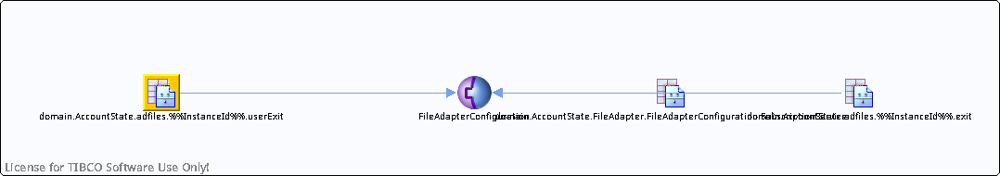

# domain.AccountState.adfiles.%%InstanceId%%.userExit {#destdomain.AccountState.adfiles.__InstanceId__.userExit .concept}

License for TIBCO Software Use Only!

Section contains list of middleware objects using “domain.AccountState.adfiles.%%InstanceId%%.userExit”

-   **Project:** [AccountState](../projs/AccountState.md)
    -   **Source:**  Adapter Service [/SharedResources/FileAdapterConfiguration](../../../projects/AccountState/SharedResources/FileAdapterConfiguration.adfiles.md)
        -   **Activity:** [UserExitClient](../projs/act_105.md)
        -   **Action Type:** Receive
        -   **Transport Type:**

**Parent topic:**[Rendezvous Messages](../../../crossref/dest/msgs/common/RendezvousMessages.md)

