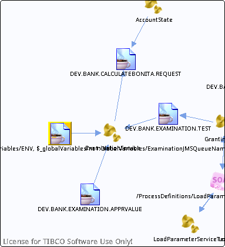

# concat\(\$\_globalVariables/ns1:GlobalVariables/ENV, \$\_globalVariables/ns1:GlobalVariables/ExaminationJMSQueueName\) {#destconcat___globalVariables_ns1_GlobalVariables_ENV____globalVariables_ns1_GlobalVariables_ExaminationJMSQueueName_ .concept}

License for TIBCO Software Use Only!

Section contains list of middleware objects using “concat\(\$\_globalVariables/ns1:GlobalVariables/ENV, \$\_globalVariables/ns1:GlobalVariables/ExaminationJMSQueueName\)”

-   **Project:** [GrantingCredit](../projs/GrantingCredit.md)
    -   **Source:**BW Process [/ProcessDefinitions/Examination/ExaminationService](../../../projects/GrantingCredit/ProcessDefinitions/Examination/ExaminationService.process.md)
        -   **Activity:** [Bonita JMSQueueRequestor](../projs/act_111.md)
        -   **Action Type:**ReceivedReply
        -   **Transport Type:**

**Parent topic:**[Queues](../../../crossref/dest/msgs/Group_Id152.md)

