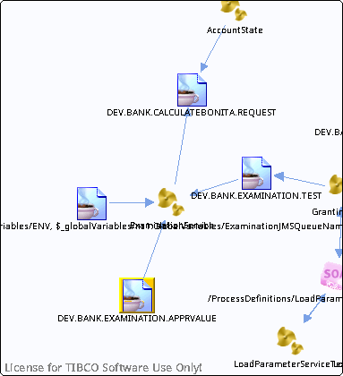

# DEV.BANK.EXAMINATION.APPRVALUE {#destDEV.BANK.EXAMINATION.APPRVALUE .concept}

License for TIBCO Software Use Only!

Section contains list of middleware objects using “DEV.BANK.EXAMINATION.APPRVALUE”

-   **Project:** [GrantingCredit](../projs/GrantingCredit.md)
    -   **Source:**BW Process [/ProcessDefinitions/Examination/ExaminationService](../../../projects/GrantingCredit/ProcessDefinitions/Examination/ExaminationService.process.md)
        -   **Activity:** [Appraisal WaitForJMSQueueMessage](../projs/act_117.md)
        -   **Action Type:**Receive
        -   **Transport Type:**

**Parent topic:**[Queues](../../../crossref/dest/msgs/Group_Id152.md)

