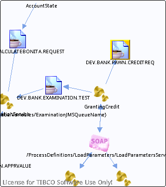

# DEV.BANK.PAWN.CREDITREQ {#destDEV.BANK.PAWN.CREDITREQ .concept}

License for TIBCO Software Use Only!

Section contains list of middleware objects using “DEV.BANK.PAWN.CREDITREQ”

-   **Project:** [GrantingCredit](../projs/GrantingCredit.md)
    -   **Source:**  BW Process [/ProcessDefinitions/GrantingCredit](../../../projects/GrantingCredit/ProcessDefinitions/GrantingCredit.process.md)
        -   **Activity:** [Appraisal JMSQueueSender](../projs/act_122.md)
        -   **Action Type:**Send
        -   **Transport Type:**

**Parent topic:**[Queues](../../../crossref/dest/msgs/Group_Id152.md)

