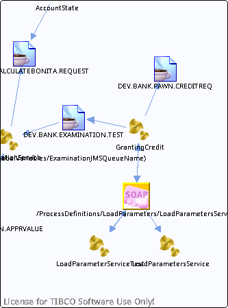

# /ProcessDefinitions/LoadParameters/LoadParametersService {#dest_ProcessDefinitions_LoadParameters_LoadParametersService .concept}

License for TIBCO Software Use Only!

Section contains list of middleware objects using “/ProcessDefinitions/LoadParameters/LoadParametersService”

-   **Project:** [GrantingCredit](../projs/GrantingCredit.md)
    -   **Source:** BW Process [/ProcessDefinitions/GrantingCredit](../../../projects/GrantingCredit/ProcessDefinitions/GrantingCredit.process.md)
        -   **Activity:** [InputParameters SOAPRequestReply](../projs/act_125.md)
        -   **Action Type:**RequestReply
        -   **Transport Type:**
    -   **Source:** BW Process [/ProcessDefinitions/LoadParameters/LoadParametersService](../../../projects/GrantingCredit/ProcessDefinitions/LoadParameters/LoadParametersService.process.md)
        -   **Activity:** [InputFileName from SOAPEventSource](../projs/act_127.md)
        -   **Action Type:**Receive
        -   **Transport Type:**
    -   **Source:** BW Process [/ProcessDefinitions/LoadParameters/LoadParametersService](../../../projects/GrantingCredit/ProcessDefinitions/LoadParameters/LoadParametersService.process.md)
        -   **Activity:** [InputParameters SOAPSendReply](../projs/act_129.md)
        -   **Action Type:**Reply
        -   **Transport Type:**
    -   **Source:** BW Process [/ProcessDefinitions/Tests/LoadParameterServiceTest](../../../projects/GrantingCredit/ProcessDefinitions/Tests/LoadParameterServiceTest.process.md)
        -   **Activity:** [SOAPRequestReply](../projs/act_133.md)
        -   **Action Type:**RequestReply
        -   **Transport Type:**

**Parent topic:**[SOAP URL](../../../crossref/dest/msgs/Group_Id153.md)

