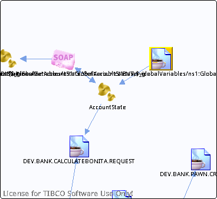

# concat\(\$\_globalVariables/ns1:GlobalVariables/ENV,\$\_globalVariables/ns1:GlobalVariables/AccountStateJMSQueueName\) {#destconcat___globalVariables_ns1_GlobalVariables_ENV___globalVariables_ns1_GlobalVariables_AccountStateJMSQueueName_ .concept}

License for TIBCO Software Use Only!

Section contains list of middleware objects using “concat\(\$\_globalVariables/ns1:GlobalVariables/ENV,\$\_globalVariables/ns1:GlobalVariables/AccountStateJMSQueueName\)”

-   **Project:** [AccountState](../projs/AccountState.md)
    -   **Source:** BW Process [/ProcessDefinitions/AccountState](../../../projects/AccountState/ProcessDefinitions/AccountState.process.md)
        -   **Activity:** [Bonita JMSQueueRequestor](../projs/act_88.md)
        -   **Action Type:**ReceivedReply
        -   **Transport Type:**

**Parent topic:**[Queues](../../../crossref/dest/msgs/Group_Id152.md)

