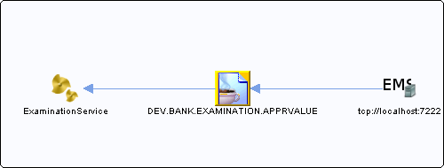

# DEV.BANK.EXAMINATION.APPRVALUE {#Destination .concept}

Section contains list of middleware objects using JMS Connection with provider URL="DEV.BANK.EXAMINATION.APPRVALUE"

-   **Project:** [ems](../../modules/emsdemo_Enterprise/dita/servers/ems/ems.server.md)
    -   **Source:**EMS Server [tcp://localhost:7222](../../modules/emsdemo_Enterprise/dita/servers/ems/ems.server.md)
        -   **Action Type:**Contains
        -   **Direction:**In
        -   **Direct Link:**[DEV.BANK.EXAMINATION.APPRVALUE](../../modules/emsdemo_Enterprise/dita/servers/ems/Queues/DEV.BANK.EXAMINATION.APPRVALUE.queue.md)

-   **Project:** [GrantingCredit](../../modules/demo_Enterprise/dita/projects/GrantingCredit/GrantingCredit.md)
    -   **Source:**BW Process [ExaminationService](../../modules/demo_Enterprise/dita/projects/GrantingCredit/ProcessDefinitions/Examination/ExaminationService.process.md)
        -   **Action Type:**Receive
        -   **Direction:**Out

**Parent topic:**[JMSQueues Documentation](../../crusader/JMSQueues/JMSQueues.md)

