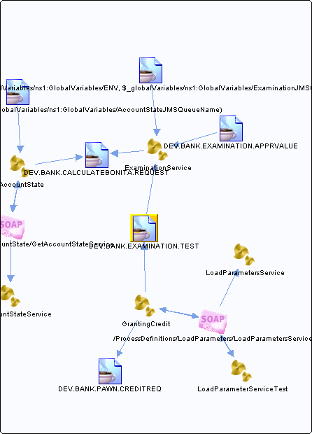

# DEV.BANK.EXAMINATION.TEST {#destDEV.BANK.EXAMINATION.TEST .concept}

Section contains list of middleware objects using “DEV.BANK.EXAMINATION.TEST”

-   **Project:** [GrantingCredit](../projs/GrantingCredit.md)
    -   **Source:**BW Process [/ProcessDefinitions/Examination/ExaminationService](../../../projects/GrantingCredit/ProcessDefinitions/Examination/ExaminationService.process.md)
        -   **Activity:** [InputParameters JMSQueueReceiver](../projs/act_102.md)
        -   **Action Type:**ReceiveRequest
        -   **Transport Type:**
    -   **Source:**BW Process [/ProcessDefinitions/Examination/ExaminationService](../../../projects/GrantingCredit/ProcessDefinitions/Examination/ExaminationService.process.md)
        -   **Activity:** [Result JMSQueueSender](../projs/act_107.md)
        -   **Action Type:**Send
        -   **Transport Type:**
    -   **Source:**BW Process [/ProcessDefinitions/GrantingCredit](../../../projects/GrantingCredit/ProcessDefinitions/GrantingCredit.process.md)
        -   **Activity:** [InputParameters JMSQueueSender](../projs/act_112.md)
        -   **Action Type:**Send
        -   **Transport Type:**

**Parent topic:**[Queues](../../../../../../modules/demo_Enterprise/dita/crossref/dest/msgs/Group_Id144.md)

