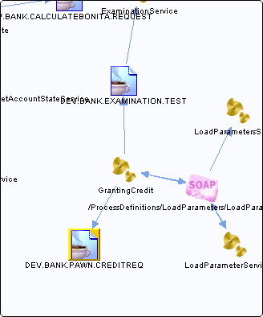

# DEV.BANK.PAWN.CREDITREQ {#destDEV.BANK.PAWN.CREDITREQ .concept}

Section contains list of middleware objects using “DEV.BANK.PAWN.CREDITREQ”

-   **Project:** [GrantingCredit](../projs/GrantingCredit.md)
    -   **Source:**BW Process [/ProcessDefinitions/GrantingCredit](../../../projects/GrantingCredit/ProcessDefinitions/GrantingCredit.process.md)
        -   **Activity:** [Appraisal JMSQueueSender](../projs/act_115.md)
        -   **Action Type:**Send
        -   **Transport Type:**

**Parent topic:**[Queues](../../../../../../modules/demo_Enterprise/dita/crossref/dest/msgs/Group_Id144.md)

