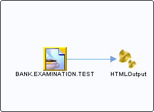

# BANK.EXAMINATION.TEST {#destBANK.EXAMINATION.TEST .concept}

Section contains list of middleware objects using “BANK.EXAMINATION.TEST”

-   **Project:** [GrantingCredit](../projs/GrantingCredit.md)
    -   **Source:**BW Process [/ProcessDefinitions/Output/HTMLOutput](../../../projects/GrantingCredit/ProcessDefinitions/Output/HTMLOutput.process.md)
        -   **Activity:** [Result JMSQueueReceiver](../projs/act_124.md)
        -   **Action Type:**ReceiveRequest
        -   **Transport Type:**

**Parent topic:**[Queues](../../../../../../modules/demo_Enterprise/dita/crossref/dest/msgs/Group_Id144.md)

