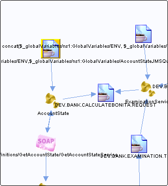

# concat\($\_globalVariables/ns1:GlobalVariables/ENV,$\_globalVariables/ns1:GlobalVariables/AccountStateJMSQueueName\) {#destconcat___globalVariables_ns1_GlobalVariables_ENV___globalVariables_ns1_GlobalVariables_AccountStateJMSQueueName_ .concept}

Section contains list of middleware objects using “concat\($\_globalVariables/ns1:GlobalVariables/ENV,$\_globalVariables/ns1:GlobalVariables/AccountStateJMSQueueName\)”

-   **Project:** [AccountState](../projs/AccountState.md)
    -   **Source:**BW Process [/ProcessDefinitions/AccountState](../../../projects/AccountState/ProcessDefinitions/AccountState.process.md)
        -   **Activity:** [Bonita JMSQueueRequestor](../projs/act_87.md)
        -   **Action Type:**ReceivedReply
        -   **Transport Type:**

**Parent topic:**[Queues](../../../../../../modules/demo_Enterprise/dita/crossref/dest/msgs/Group_Id144.md)

