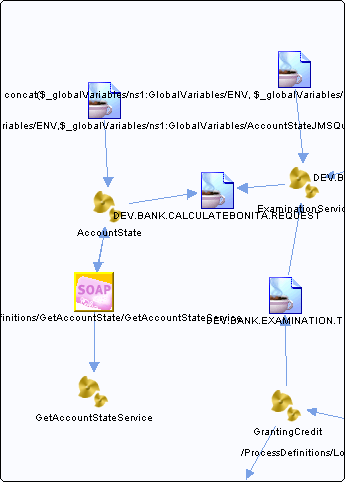

# /ProcessDefinitions/GetAccountState/GetAccountStateService {#dest_ProcessDefinitions_GetAccountState_GetAccountStateService .concept}

Section contains list of middleware objects using “/ProcessDefinitions/GetAccountState/GetAccountStateService”

-   **Project:** [AccountState](../projs/AccountState.md)
    -   **Source:**BW Process [/ProcessDefinitions/AccountState](../../../projects/AccountState/ProcessDefinitions/AccountState.process.md)
        -   **Activity:** [AccountState SOAPRequestReply](../projs/act_90.md)
        -   **Action Type:**RequestReply
        -   **Transport Type:**
    -   **Source:**BW Process [/ProcessDefinitions/GetAccountState/GetAccountStateService](../../../projects/AccountState/ProcessDefinitions/GetAccountState/GetAccountStateService.process.md)
        -   **Activity:** [UserName SOAPEventSource](../projs/act_96.md)
        -   **Action Type:**Receive
        -   **Transport Type:**
    -   **Source:**BW Process [/ProcessDefinitions/GetAccountState/GetAccountStateService](../../../projects/AccountState/ProcessDefinitions/GetAccountState/GetAccountStateService.process.md)
        -   **Activity:** [AccountState SOAPSendReply](../projs/act_98.md)
        -   **Action Type:**Reply
        -   **Transport Type:**

**Parent topic:**[SOAP URL](../../../../../../modules/demo_Enterprise/dita/crossref/dest/msgs/Group_Id145.md)

