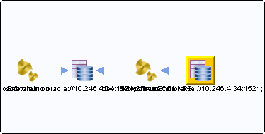

# jdbc:tibcosoftwareinc:oracle://10.246.4.34:1521;SID=TIBCO {#destjdbc_tibcosoftwareinc_oracle___10.246.4.34_1521_SID_TIBCO .concept}

Section contains list of middleware objects using “jdbc:tibcosoftwareinc:oracle://10.246.4.34:1521;SID=TIBCO”

-   **Project:** [AccountState](../projs/AccountState.md)
    -   **Source:**BW Process [/ProcessDefinitions/GetAccountState/GetAccountState](../../../projects/AccountState/ProcessDefinitions/GetAccountState/GetAccountState.process.md)
        -   **Activity:** [GetAccount](../projs/act_92.md)
        -   **Action Type:**JDBCQuery
        -   **JDBC Connection:** [/SharedConnections/Tibco.sharedjdbc](../../../projects/AccountState/SharedConnections/Tibco.sharedjdbc.md)
        -   **DB User:**%%jdbcTIBCO/database/user%%

**Parent topic:**[JDBC](../../../../../../modules/demo_Enterprise/dita/crossref/dest/msgs/Group_Id142.md)

