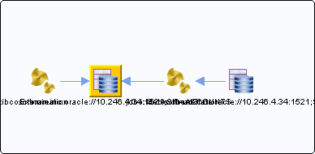

# jdbc:tibcosoftwareinc:oracle://10.246.4.34:1521;SID=ACCOUNTS {#destjdbc_tibcosoftwareinc_oracle___10.246.4.34_1521_SID_ACCOUNTS .concept}

Section contains list of middleware objects using “jdbc:tibcosoftwareinc:oracle://10.246.4.34:1521;SID=ACCOUNTS”

-   **Project:** [AccountState](../projs/AccountState.md)
    -   **Source:**BW Process [/ProcessDefinitions/GetAccountState/GetAccountState](../../../projects/AccountState/ProcessDefinitions/GetAccountState/GetAccountState.process.md)
        -   **Activity:** [UpdateCustomerDB](../projs/act_94.md)
        -   **Action Type:**JDBCUpdate
        -   **JDBC Connection:** [/SharedConnections/SharedTibco.sharedjdbc](../../../projects/AccountState/SharedConnections/SharedTibco.sharedjdbc.md)
        -   **DB User:**%%jdbc/user%%
-   **Project:** [GrantingCredit](../projs/GrantingCredit.md)
    -   **Source:**BW Process [/ProcessDefinitions/Examination/Examination](../../../projects/GrantingCredit/ProcessDefinitions/Examination/Examination.process.md)
        -   **Activity:** [UpdateCustomerDB](../projs/act_100.md)
        -   **Action Type:**JDBCUpdate
        -   **JDBC Connection:** [/SharedConnections/SharedTibco.sharedjdbc](../../../projects/GrantingCredit/SharedConnections/SharedTibco.sharedjdbc.md)
        -   **DB User:**%%jdbc/user%%

**Parent topic:**[JDBC](../../../../../../modules/demo_Enterprise/dita/crossref/dest/msgs/Group_Id142.md)

