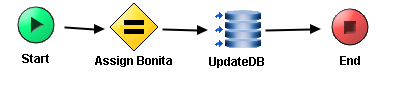

# CalculateBonita {#ProcessMain .concept}

Section contains description of Process " CalculateBonita.process " .

Source Library: " CalculateBonita "

**Parent topic:**[Processes](../../../../../../../modules/demo_Enterprise/dita/projects/AccountState/common/process.md)

## Folder description: {#FolderDescription}

|Folder|Description|
|------|-----------|
|AccountState|This application simulate get bank account state process which using rating of client bonita.|
|\\ProcessDefinitions|All process definitions|
|\\ProcessDefinitions\\CalculateBonita|Main CalculateBonita processes|

## Process description: {#ProcessDescription}

|Calculate pretender's bonita|

## Process definition: {#ProcessDefinition}

Full process path: ProcessDefinitions/CalculateBonita/CalculateBonita.process

## Diagram: {#Diagram}



## Process starter activity: {#Starter}

Name: Start

Description: *Start of process with InputParameters structure*

Input Parameters:

-   + InputParameters \(Complex Type, required \)
    -   - MonthIncrement\(xsd:long,required\)
    -   - Value\(xsd:long,required\)
    -   - RealtyValue\(xsd:long,required\)
    -   - Problem\(xsd:boolean,required\)
    -   - Loan\(xsd:long,required\)
    -   - Refund\(xsd:long,required\)

## Process end activity: {#EndActivity}

Name: End

Output Parameters:

-   - Bonita\(xsd:long,required\)

Return bindings:

-   Mapping table

    |Target|Source|
    |------|------|
    |**/Bonita**|$Schema0/Bonita + \(if\(\( $Start/InputParameters/Problem = 1\) and \($Schema0/Bonita \> 0\)\)then -1 else 0\) + \(if\($Start/InputParameters/Value \>= 1000000\)then floor\($Start/InputParameters/Value div 1000000\) else 0\)|

-   Mapping tree

    ```
    
    **Bonita** = $Schema0/Bonita +
    (if(( $Start/InputParameters/Problem = 1) and ($Schema0/Bonita > 0))then  -1 else 0)
    +
    (if($Start/InputParameters/Value >= 1000000)then floor($Start/InputParameters/Value div 1000000) else 0)
    ```

-   Source code

    ```
    
            <Bonita xmlns:pd="http://xmlns.tibco.com/bw/process/2003" xmlns:xsl="http://www.w3.org/1999/XSL/Transform" xmlns:xsd="http://www.w3.org/2001/XMLSchema">
                <xsl:value-of select="$Schema0/Bonita +&#10;(if(( $Start/InputParameters/Problem = 1) and ($Schema0/Bonita &gt; 0))then  -1 else 0)&#10;+&#10;(if($Start/InputParameters/Value &gt;= 1000000)then floor($Start/InputParameters/Value div 1000000) else 0)"/>
            </Bonita>
        
    ```


## Process variables: {#ProcessVariables}

Schema: Schema0

-   - Bonita\(xsd:long,required\)

## Activities: {#Activities}

### Name: ***Assign Bonita*** {#Assign_Bonita}

-   Type: *com.tibco.pe.core.AssignActivity*
-   Resource Type: *ae.activities.assignActivity*
-   Description: *Bonita calculation*
-   *Configuration:*
    -   variableName = Schema0
-   *Input bindings:*
    -   Mapping table

        |Target|Source|
        |------|------|
        |**/Bonita**|if\($Start/InputParameters/MonthIncrement < 10000\) then 0 else if\(\(\($Start/InputParameters/RealtyValue \* 0.7\)< \(-$Start/InputParameters/Value\)\)and \(\(\(-$Start/InputParameters/Value\) + $Start/InputParameters/Loan\)\> 300000\)\)then 0 else if\($Start/InputParameters/MonthIncrement - $Start/InputParameters/Refund < 7000\) then 0 else if\($Start/InputParameters/MonthIncrement - $Start/InputParameters/Refund < 15000\) then 1 else if\($Start/InputParameters/MonthIncrement - $Start/InputParameters/Refund < 30000\) then 2 else if\($Start/InputParameters/MonthIncrement - $Start/InputParameters/Refund < 100000\) then 3 else 4|

    -   Mapping tree

        ```
        
        **Bonita** = if($Start/InputParameters/MonthIncrement < 10000) then 0 else
        if((($Start/InputParameters/RealtyValue * 0.7)< (-$Start/InputParameters/Value))and
          (((-$Start/InputParameters/Value) + $Start/InputParameters/Loan)> 300000))then 0 else 
        if($Start/InputParameters/MonthIncrement - $Start/InputParameters/Refund < 7000) then 0 else
        if($Start/InputParameters/MonthIncrement - $Start/InputParameters/Refund < 15000) then 1 else
        if($Start/InputParameters/MonthIncrement - $Start/InputParameters/Refund < 30000) then 2 else
        if($Start/InputParameters/MonthIncrement - $Start/InputParameters/Refund < 100000) then 3 else 4
        ```

    -   Source code

        ```
        
                    <Bonita xmlns:pd="http://xmlns.tibco.com/bw/process/2003" xmlns:xsl="http://www.w3.org/1999/XSL/Transform" xmlns:xsd="http://www.w3.org/2001/XMLSchema">
                        <xsl:value-of select="if($Start/InputParameters/MonthIncrement &lt; 10000) then 0 else&#10;if((($Start/InputParameters/RealtyValue * 0.7)&lt; (-$Start/InputParameters/Value))and&#10;  (((-$Start/InputParameters/Value) + $Start/InputParameters/Loan)&gt; 300000))then 0 else &#10;if($Start/InputParameters/MonthIncrement - $Start/InputParameters/Refund &lt; 7000) then 0 else&#10;if($Start/InputParameters/MonthIncrement - $Start/InputParameters/Refund &lt; 15000) then 1 else&#10;if($Start/InputParameters/MonthIncrement - $Start/InputParameters/Refund &lt; 30000) then 2 else&#10;if($Start/InputParameters/MonthIncrement - $Start/InputParameters/Refund &lt; 100000) then 3 else 4"/>
                    </Bonita>
                
        ```


### Name: ***UpdateDB*** {#UpdateDB}

-   Type: *com.tibco.plugin.jdbc.JDBCUpdateActivity*
-   Resource Type: *ae.activities.JDBCUpdateActivity*
-   Description:
-   *Configuration:*
    -   timeout = 10
    -   commit = false
    -   emptyStrAsNil = false
    -   jdbcSharedConfig = [/SharedConnections/SharedTibco.sharedjdbc](../../SharedConnections/SharedTibco.sharedjdbc.md)
    -   statement = UPDATE STATES SET PROCESSED = 'Y' WHERE ID = ?
    -   Prepared\_Param\_DataType
        -   parameter
            -   parameterName = id
            -   dataType = NUMERIC

## Transitions: {#Transitions}

-   From: ***Assign Bonita*** -To: ***UpdateDB***
    -   Label:
    -   Condition: *Success*
    -   Description:

-   From: ***Start*** -To: ***Assign Bonita***
    -   Label:
    -   Condition: *Success*
    -   Description:

-   From: ***UpdateDB*** -To: ***End***
    -   Label:
    -   Condition: *Success*
    -   Description:

