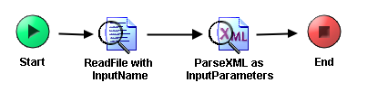

# LoadParameters {#ProcessMain .concept}

Section contains description of Process " LoadParameters.process " .

**Parent topic:**[Processes](../../../../../../../modules/demo_Enterprise/dita/projects/GrantingCredit/common/process.md)

## Folder description: {#FolderDescription}

|Folder|Description|
|------|-----------|
|GrantingCredit|The application Granting credit provides resolution whether a credit \(or mortgage\) can be granded to a user. Information about user is the input of the application.|
|\\ProcessDefinitions|All process definitions|

## Process description: {#ProcessDescription}

|No description|

## Process definition: {#ProcessDefinition}

Full process path: ProcessDefinitions/LoadParameters/LoadParameters.process

## Diagram: {#Diagram}



## Process starter activity: {#Starter}

Name: Start

Description:

Input Parameters:

-   - [InputFile](../../SharedResources/InputParametersXSD.xsd.md#) \(XML Element Reference, required \)

## Process end activity: {#EndActivity}

Name: End

Output Parameters:

-   - [InputParameters](../../SharedResources/InputParametersXSD.xsd.md#) \(XML Element Reference, required \)

Return bindings:

-   Mapping table

    |Target|Source|
    |------|------|
    | |*\[COPY-OF\] < $ParseXML-as-InputParameters/pfx:InputParameters \>*|

-   Mapping tree

    ```
    **
    InputParameters** = *\[COPY-OF\] *< $ParseXML-as-InputParameters/pfx:InputParameters >
    ```

-   Source code

    ```
    
            <xsl:copy-of xmlns:xsl="http://www.w3.org/1999/XSL/Transform" xmlns:pd="http://xmlns.tibco.com/bw/process/2003" xmlns:pfx="http://www.tibco.com/schemas/GrantingCredit/SharedConnections/Schema.xsd" xmlns:ns="http://www.tibco.com/namespaces/tnt/plugins/file" xmlns:ns1="http://www.tibco.com/pe/EngineTypes" xmlns:pfx2="http://www.tibco.com/namespaces/tnt/plugins/file/v2" xmlns:ns2="http://www.tibco.com/pe/WriteToLogActivitySchema" xmlns:ns3="http://www.tibco.com/pe/DeployedVarsType" select="$ParseXML-as-InputParameters/pfx:InputParameters"/>
        
    ```


## Activities: {#Activities}

### Name: ***ParseXML as InputParameters*** {#ParseXML_as_InputParameters}

-   Type: *com.tibco.plugin.xml.XMLParseActivity*
-   Resource Type: *ae.activities.XMLParseActivity*
-   Description:
-   *Configuration:*
    -   inputStyle = text
    -   xsdVersion = default
    -   validateOutput = true
    -   term
        -   - [InputParameters](../../SharedResources/InputParametersXSD.xsd.md#) \(XML Element Reference, required \)
-   *Input bindings:*
    -   Mapping table

        |Target|Source|
        |------|------|
        |**/xmlString**|$ReadFile-with-InputName/ns:ReadActivityOutputTextClass/fileContent/textContent|

    -   Mapping tree

        ```
        
        **xmlString** = $ReadFile-with-InputName/ns:ReadActivityOutputTextClass/fileContent/textContent
        ```

    -   Source code

        ```
        
                    <xmlString xmlns:pd="http://xmlns.tibco.com/bw/process/2003" xmlns:xsl="http://www.w3.org/1999/XSL/Transform" xmlns:pfx="http://www.tibco.com/schemas/GrantingCredit/SharedConnections/Schema.xsd" xmlns:ns="http://www.tibco.com/namespaces/tnt/plugins/file" xmlns:ns1="http://www.tibco.com/pe/EngineTypes" xmlns:pfx2="http://www.tibco.com/namespaces/tnt/plugins/file/v2" xmlns:ns2="http://www.tibco.com/pe/WriteToLogActivitySchema" xmlns:ns3="http://www.tibco.com/pe/DeployedVarsType">
                        <xsl:value-of select="$ReadFile-with-InputName/ns:ReadActivityOutputTextClass/fileContent/textContent"/>
                    </xmlString>
                
        ```


### Name: ***ReadFile with InputName*** {#ReadFile_with_InputName}

-   Type: *com.tibco.plugin.file.FileReadActivity*
-   Resource Type: *ae.activities.FileReadActivity*
-   Description:
-   *Configuration:*
    -   encoding = text
-   *Input bindings:*
    -   Mapping table

        |Target|Source|
        |------|------|
        |**/ReadActivityInputClass****/fileName**|if \($Start/pfx:InputFile/pfx:FileName=""\) then $\_globalVariables/ns3:GlobalVariables/DefaultInputParametersFile else $Start/pfx:InputFile/pfx:FileName|

    -   Mapping tree

        ```
        
        **ReadActivityInputClass**
         **fileName** = if ($Start/pfx:InputFile/pfx:FileName="") then $_globalVariables/ns3:GlobalVariables/DefaultInputParametersFile else $Start/pfx:InputFile/pfx:FileName
        ```

    -   Source code

        ```
        
                    <pfx2:ReadActivityInputClass xmlns:pfx2="http://www.tibco.com/namespaces/tnt/plugins/file/v2" xmlns:pd="http://xmlns.tibco.com/bw/process/2003" xmlns:xsl="http://www.w3.org/1999/XSL/Transform" xmlns:pfx="http://www.tibco.com/schemas/GrantingCredit/SharedConnections/Schema.xsd" xmlns:ns="http://www.tibco.com/namespaces/tnt/plugins/file" xmlns:ns1="http://www.tibco.com/pe/EngineTypes" xmlns:ns2="http://www.tibco.com/pe/WriteToLogActivitySchema" xmlns:ns3="http://www.tibco.com/pe/DeployedVarsType">
                        <fileName>
                            <xsl:value-of select="if ($Start/pfx:InputFile/pfx:FileName=&quot;&quot;) then $_globalVariables/ns3:GlobalVariables/DefaultInputParametersFile else $Start/pfx:InputFile/pfx:FileName"/>
                        </fileName>
                    </pfx2:ReadActivityInputClass>
                
        ```


## Transitions: {#Transitions}

-   From: ***ParseXML as InputParameters*** -To: ***End***
    -   Label:
    -   Condition: *Success*
    -   Description:

-   From: ***ReadFile with InputName*** -To: ***ParseXML as InputParameters***
    -   Label:
    -   Condition: *Success*
    -   Description:

-   From: ***Start*** -To: ***ReadFile with InputName***
    -   Label:
    -   Condition: *Success*
    -   Description:

