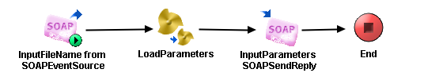

# LoadParametersService {#ProcessMain .concept}

Section contains description of Process " LoadParametersService.process " .

**Parent topic:**[Processes](../../../../../../../modules/demo_Enterprise/dita/projects/GrantingCredit/common/process.md)

## Folder description: {#FolderDescription}

|Folder|Description|
|------|-----------|
|GrantingCredit|The application Granting credit provides resolution whether a credit \(or mortgage\) can be granded to a user. Information about user is the input of the application.|
|\\ProcessDefinitions|All process definitions|

## Process description: {#ProcessDescription}

|No description|

## Process definition: {#ProcessDefinition}

Full process path: ProcessDefinitions/LoadParameters/LoadParametersService.process

## Diagram: {#Diagram}



## Process starter activity: {#Starter}

Name: InputFileName from SOAPEventSource

-   Property Name: ***InputFileName from SOAPEventSource***
    -   Type: *com.tibco.plugin.soap.SOAPEventSource*
    -   Resource Type: *ae.activities.SOAPEventSourceUI*
    -   Description:
    -   *Configuration:*
        -   service = pfx:LoadParametersServicePort
        -   wsdlNamespaceRoot = http://xmlns.example.com/1171295149828/LoadParametersServiceOperationImpl
        -   operation = LoadParametersServiceOperation
        -   portAddressPrefix =
        -   operationStyle = document
        -   soapUse = literal
        -   embedWsdlComponents = true
        -   embedSchemaComponents = true
        -   soapAction = /ProcessDefinitions/LoadParameters/LoadParametersService
        -   sharedChannel = [/SharedConnections/SOAPHTTPConnection.sharedhttp](../../SharedConnections/SOAPHTTPConnection.sharedhttp.md)
        -   inputAttachmentBindings =
        -   outputAttachmentBindings =

## Process end activity: {#EndActivity}

Name: End

## Activities: {#Activities}

### Name: ***InputParameters SOAPSendReply*** {#InputParameters_SOAPSendReply}

-   Type: *com.tibco.plugin.soap.SOAPSendReplyActivity*
-   Resource Type: *ae.activities.SOAPSendReplyUI*
-   Description:
-   *Configuration:*
    -   eventSource = InputFileName from SOAPEventSource
-   *Input bindings:*
    -   Mapping table

        |Target|Source|
        |------|------|
        |**/outputMessage**|*\[COPY-OF\] < $LoadParameters/ns:InputParameters \>*|

    -   Mapping tree

        ```
        
        **outputMessage****
         InputParameters** = *\[COPY-OF\] *< $LoadParameters/ns:InputParameters >
        ```

    -   Source code

        ```
        
                    <outputMessage xmlns:pd="http://xmlns.tibco.com/bw/process/2003" xmlns:xsl="http://www.w3.org/1999/XSL/Transform" xmlns:ns="http://www.tibco.com/schemas/GrantingCredit/SharedConnections/Schema.xsd" xmlns:pfx="http://xmlns.example.com/1171295149828" xmlns:wsdl="http://schemas.xmlsoap.org/wsdl/">
                        <xsl:copy-of select="$LoadParameters/ns:InputParameters"/>
                    </outputMessage>
                
        ```


### Name: ***LoadParameters*** {#LoadParameters}

-   Type: *com.tibco.pe.core.CallProcessActivity*
-   Resource Type: *ae.process.subprocess*
-   Description:
-   *Configuration:*
    -   processName = [/ProcessDefinitions/LoadParameters/LoadParameters.process](LoadParameters.process.md)
-   *Input bindings:*
    -   Mapping table

        |Target|Source|
        |------|------|
        | |*\[COPY-OF\] < $InputFileName-from-SOAPEventSource/inputMessage/ns:InputFile \>*|

    -   Mapping tree

        ```
        **
        InputFile** = *\[COPY-OF\] *< $InputFileName-from-SOAPEventSource/inputMessage/ns:InputFile >
        ```

    -   Source code

        ```
        
                    <xsl:copy-of xmlns:xsl="http://www.w3.org/1999/XSL/Transform" xmlns:pd="http://xmlns.tibco.com/bw/process/2003" xmlns:ns="http://www.tibco.com/schemas/GrantingCredit/SharedConnections/Schema.xsd" xmlns:pfx="http://xmlns.example.com/1171295149828" xmlns:wsdl="http://schemas.xmlsoap.org/wsdl/" select="$InputFileName-from-SOAPEventSource/inputMessage/ns:InputFile"/>
                
        ```


## Transitions: {#Transitions}

-   From: ***InputFileName from SOAPEventSource*** -To: ***LoadParameters***
    -   Label:
    -   Condition: *Success*
    -   Description:

-   From: ***InputParameters SOAPSendReply*** -To: ***End***
    -   Label:
    -   Condition: *Success*
    -   Description:

-   From: ***LoadParameters*** -To: ***InputParameters SOAPSendReply***
    -   Label:
    -   Condition: *Success*
    -   Description:

