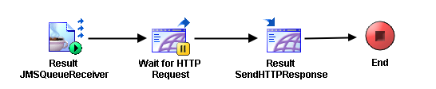

# HTMLOutput {#ProcessMain .concept}

Section contains description of Process " HTMLOutput.process " .

**Parent topic:**[Processes](../../../../../../../modules/demo_Enterprise/dita/projects/GrantingCredit/common/process.md)

## Folder description: {#FolderDescription}

|Folder|Description|
|------|-----------|
|GrantingCredit|The application Granting credit provides resolution whether a credit \(or mortgage\) can be granded to a user. Information about user is the input of the application.|
|\\ProcessDefinitions|All process definitions|

## Process description: {#ProcessDescription}

|No description|

## Process definition: {#ProcessDefinition}

Full process path: ProcessDefinitions/Output/HTMLOutput.process

## Diagram: {#Diagram}



## Process starter activity: {#Starter}

Name: Result JMSQueueReceiver

-   Property Name: ***Result JMSQueueReceiver***
    -   Type: *com.tibco.plugin.jms.JMSQueueEventSource*
    -   Resource Type: *ae.activities.JMSQueueEventSource*
    -   Description:
    -   *Configuration:*
        -   PermittedMessageType = XML Text
        -   SessionAttributes
            -   transacted = false
            -   acknowledgeMode = 1 \(Auto\)
            -   maxSessions = 1
            -   destination = %%JMSQueueName%%
            -   selector = Part='Result'
        -   ConfigurableHeaders
            -   JMSDeliveryMode = PERSISTENT
            -   JMSExpiration = 0
            -   JMSPriority = 4
        -   ConnectionReference = [/SharedConnections/EMSConnection.sharedjmscon](../../SharedConnections/EMSConnection.sharedjmscon.md)
        -   ApplicationProperties = /SharedResources/JMSApplicationProperties.sharedjmsapp
        -   OutDataxsdString
            -   - [GrantingCreditResult](../../AESchemas/EMS/GrantingCreditAESchema.aeschema.md#) \(XML Element Reference, required \)

## Process end activity: {#EndActivity}

Name: End

## Activities: {#Activities}

### Name: ***Result SendHTTPResponse*** {#Result_SendHTTPResponse}

-   Type: *com.tibco.plugin.http.HTTPResponseActivity*
-   Resource Type: *httppalette.httpWebResponse*
-   Description:
-   *Configuration:*
    -   closeConnection = true
    -   eventSource = Wait for HTTP Request
    -   Headers
        -   + root \(Complex Type, required \)
            -   - StatusLine\(xsd:string,optional\)
            -   - Content-Type\(xsd:string,optional\)
            -   - Set-Cookie\(xsd:string,optional\)
            -   - Pragma\(xsd:string,optional\)
            -   - Location\(xsd:string,optional\)
-   *Input bindings:*
    -   Mapping table

        |Target|Source|
        |------|------|
        |**/ResponseActivityInput****/asciiContent**|concat\("<H1\>Granting Credit Result</H1\><B\>Name: </B\>", $Result-JMSQueueReceiver/ns1:ActivityOutput/Body/pfx:GrantingCreditResult/Name, "<BR\><B\>Value: </B\>", $Result-JMSQueueReceiver/ns1:ActivityOutput/Body/pfx:GrantingCreditResult/Value, "<BR\><B\>Refund: </B\>", $Result-JMSQueueReceiver/ns1:ActivityOutput/Body/pfx:GrantingCreditResult/Refund, "<BR\><B\>Pawn: </B\>", $Result-JMSQueueReceiver/ns1:ActivityOutput/Body/pfx:GrantingCreditResult/Pawn, "<BR\><B\>Realty detail: </B\>", $Result-JMSQueueReceiver/ns1:ActivityOutput/Body/pfx:GrantingCreditResult/RealtyDetail, "<BR\><B\>Realty value: </B\>", $Result-JMSQueueReceiver/ns1:ActivityOutput/Body/pfx:GrantingCreditResult/RealtyValue, "<BR\><B\>Interest: </B\>", $Result-JMSQueueReceiver/ns1:ActivityOutput/Body/pfx:GrantingCreditResult/Interest, "<BR\><H2\>Result: <FONT COLOR=RED\>", $Result-JMSQueueReceiver/ns1:ActivityOutput/Body/pfx:GrantingCreditResult/State, "</H2\></FONT\>"\)|

    -   Mapping tree

        ```
        
        **ResponseActivityInput**
         **asciiContent** = concat("<H1>Granting Credit Result</H1><B>Name: </B>", $Result-JMSQueueReceiver/ns1:ActivityOutput/Body/pfx:GrantingCreditResult/Name, 
        "<BR><B>Value: </B>",  $Result-JMSQueueReceiver/ns1:ActivityOutput/Body/pfx:GrantingCreditResult/Value,
        "<BR><B>Refund: </B>",  $Result-JMSQueueReceiver/ns1:ActivityOutput/Body/pfx:GrantingCreditResult/Refund,
        "<BR><B>Pawn: </B>",  $Result-JMSQueueReceiver/ns1:ActivityOutput/Body/pfx:GrantingCreditResult/Pawn,
        "<BR><B>Realty detail: </B>",  $Result-JMSQueueReceiver/ns1:ActivityOutput/Body/pfx:GrantingCreditResult/RealtyDetail,
        "<BR><B>Realty value: </B>",  $Result-JMSQueueReceiver/ns1:ActivityOutput/Body/pfx:GrantingCreditResult/RealtyValue,
        "<BR><B>Interest: </B>",  $Result-JMSQueueReceiver/ns1:ActivityOutput/Body/pfx:GrantingCreditResult/Interest,
        "<BR><H2>Result: <FONT COLOR=RED>",  $Result-JMSQueueReceiver/ns1:ActivityOutput/Body/pfx:GrantingCreditResult/State, "</H2></FONT>")
        ```

    -   Source code

        ```
        
                    <ResponseActivityInput xmlns:pd="http://xmlns.tibco.com/bw/process/2003" xmlns:ns1="http://www.tibco.com/namespaces/tnt/plugins/jms" xmlns:xsl="http://www.w3.org/1999/XSL/Transform" xmlns:ns="http://www.tibco.com/pe/SignalInActivitySchema" xmlns:xsd="http://www.w3.org/2001/XMLSchema" xmlns:pfx="http://www.tibco.com/xmlns/ae2xsd/2002/05/EMS/GrantingCreditAESchema" xmlns:xsi="http://www.w3.org/2001/XMLSchema-instance">
                        <asciiContent>
                            <xsl:value-of select="concat(&quot;&lt;H1&gt;Granting Credit Result&lt;/H1&gt;&lt;B&gt;Name: &lt;/B&gt;&quot;, $Result-JMSQueueReceiver/ns1:ActivityOutput/Body/pfx:GrantingCreditResult/Name, &#10;&quot;&lt;BR&gt;&lt;B&gt;Value: &lt;/B&gt;&quot;,  $Result-JMSQueueReceiver/ns1:ActivityOutput/Body/pfx:GrantingCreditResult/Value,&#10;&quot;&lt;BR&gt;&lt;B&gt;Refund: &lt;/B&gt;&quot;,  $Result-JMSQueueReceiver/ns1:ActivityOutput/Body/pfx:GrantingCreditResult/Refund,&#10;&quot;&lt;BR&gt;&lt;B&gt;Pawn: &lt;/B&gt;&quot;,  $Result-JMSQueueReceiver/ns1:ActivityOutput/Body/pfx:GrantingCreditResult/Pawn,&#10;&quot;&lt;BR&gt;&lt;B&gt;Realty detail: &lt;/B&gt;&quot;,  $Result-JMSQueueReceiver/ns1:ActivityOutput/Body/pfx:GrantingCreditResult/RealtyDetail,&#10;&quot;&lt;BR&gt;&lt;B&gt;Realty value: &lt;/B&gt;&quot;,  $Result-JMSQueueReceiver/ns1:ActivityOutput/Body/pfx:GrantingCreditResult/RealtyValue,&#10;&quot;&lt;BR&gt;&lt;B&gt;Interest: &lt;/B&gt;&quot;,  $Result-JMSQueueReceiver/ns1:ActivityOutput/Body/pfx:GrantingCreditResult/Interest,&#10;&quot;&lt;BR&gt;&lt;H2&gt;Result: &lt;FONT COLOR=RED&gt;&quot;,  $Result-JMSQueueReceiver/ns1:ActivityOutput/Body/pfx:GrantingCreditResult/State, &quot;&lt;/H2&gt;&lt;/FONT&gt;&quot;)"/>
                        </asciiContent>
                    </ResponseActivityInput>
                
        ```


### Name: ***Wait for HTTP Request*** {#Wait_for_HTTP_Request}

-   Type: *com.tibco.plugin.http.HTTPSignalInActivity*
-   Resource Type: *httppalette.httpSignalIn*
-   Description:
-   *Configuration:*
    -   \_eventTimeout = 60000
    -   outputMode = String
    -   defaultEncoding = ISO8859\_1
    -   inputOutputVersion = 5.3.0
    -   newMimeSupport = true
    -   sharedChannel = [/SharedConnections/OutputHTTPConnection.sharedhttp](../../SharedConnections/OutputHTTPConnection.sharedhttp.md)
    -   Headers
        -   + root \(Complex Type, required \)
            -   - Accept\(xsd:string,optional\)
            -   - Accept-Charset\(xsd:string,optional\)
            -   - Accept-Encoding\(xsd:string,optional\)
            -   - Content-Type\(xsd:string,optional\)
            -   - Content-Length\(xsd:string,optional\)
            -   - Connection\(xsd:string,optional\)
            -   - Cookie\(xsd:string,optional\)
            -   - Pragma\(xsd:string,optional\)

## Transitions: {#Transitions}

-   From: ***Result JMSQueueReceiver*** -To: ***Wait for HTTP Request***
    -   Label:
    -   Condition: *Success*
    -   Description:

-   From: ***Result SendHTTPResponse*** -To: ***End***
    -   Label:
    -   Condition: *Success*
    -   Description:

-   From: ***Wait for HTTP Request*** -To: ***Result SendHTTPResponse***
    -   Label:
    -   Condition: *Success*
    -   Description:

