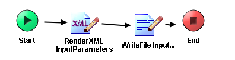

# CreateInputFile {#ProcessMain .concept}

Section contains description of Process " CreateInputFile.process " .

**Parent topic:**[Processes](../../../../../../../modules/demo_Enterprise/dita/projects/GrantingCredit/common/process.md)

## Folder description: {#FolderDescription}

|Folder|Description|
|------|-----------|
|GrantingCredit|The application Granting credit provides resolution whether a credit \(or mortgage\) can be granded to a user. Information about user is the input of the application.|
|\\ProcessDefinitions|All process definitions|

## Process description: {#ProcessDescription}

|No description|

## Process definition: {#ProcessDefinition}

Full process path: ProcessDefinitions/XMLCreator/CreateInputFile.process

## Diagram: {#Diagram}



## Process starter activity: {#Starter}

Name: Start

Description:

## Process end activity: {#EndActivity}

Name: End

## Activities: {#Activities}

### Name: ***RenderXML InputParameters*** {#RenderXML_InputParameters}

-   Type: *com.tibco.plugin.xml.XMLRendererActivity*
-   Resource Type: *ae.activities.XMLRendererActivity*
-   Description:
-   *Configuration:*
    -   renderAsText = text
    -   validateInput = true
    -   textEncoding = UTF-8
    -   renderDefaultPrefix = true
    -   term
        -   - [InputParameters](../../SharedResources/InputParametersXSD.xsd.md#) \(XML Element Reference, required \)
-   *Input bindings:*
    -   Mapping table

        |Target|Source|
        |------|------|
        |**/InputParameters****/Name**|"Jan Novak"|
        |**/InputParameters****/Value**|750000|
        |**/InputParameters****/Refund**|5000|
        |**/InputParameters****/Salary**|20000|
        |**/InputParameters****/Pawn**|1|
        |**/InputParameters****/RealtyDetail**|"Realty no: 1587649"|
        |**/InputParameters****/RealtyValue**|1500000|

    -   Mapping tree

        ```
        
        **InputParameters**
         **Name** = "Jan Novak"
         **Value** = 750000
         **Refund** = 5000
         **Salary** = 20000
         **Pawn** = 1
         **RealtyDetail** = "Realty no: 1587649"
         **RealtyValue** = 1500000
        ```

    -   Source code

        ```
        
                    <pfx:InputParameters xmlns:pfx="http://www.tibco.com/schemas/GrantingCredit/SharedConnections/Schema.xsd" xmlns:pd="http://xmlns.tibco.com/bw/process/2003" xmlns:xsl="http://www.w3.org/1999/XSL/Transform" xmlns:ns="http://www.tibco.com/pe/DeployedVarsType" xmlns:ns2="http://www.tibco.com/namespaces/tnt/plugins/file">
                        <pfx:Name>
                            <xsl:value-of select="&quot;Jan Novak&quot;"/>
                        </pfx:Name>
                        <pfx:Value>
                            <xsl:value-of select="750000"/>
                        </pfx:Value>
                        <pfx:Refund>
                            <xsl:value-of select="5000"/>
                        </pfx:Refund>
                        <pfx:Salary>
                            <xsl:value-of select="20000"/>
                        </pfx:Salary>
                        <pfx:Pawn>
                            <xsl:value-of select="1"/>
                        </pfx:Pawn>
                        <pfx:RealtyDetail>
                            <xsl:value-of select="&quot;Realty no: 1587649&quot;"/>
                        </pfx:RealtyDetail>
                        <pfx:RealtyValue>
                            <xsl:value-of select="1500000"/>
                        </pfx:RealtyValue>
                    </pfx:InputParameters>
                
        ```


### Name: ***WriteFile InputFile*** {#WriteFile_InputFile}

-   Type: *com.tibco.plugin.file.FileWriteActivity*
-   Resource Type: *ae.activities.FileWriteActivity*
-   Description:
-   *Configuration:*
    -   encoding = text
    -   compressFile = None
-   *Input bindings:*
    -   Mapping table

        |Target|Source|
        |------|------|
        |**/WriteActivityInputTextClass****/fileName**|$\_globalVariables/ns:GlobalVariables/DefaultInputParametersFile|
        |**/WriteActivityInputTextClass****/textContent**|$RenderXML-InputParameters/xmlString|

    -   Mapping tree

        ```
        
        **WriteActivityInputTextClass**
         **fileName** = $_globalVariables/ns:GlobalVariables/DefaultInputParametersFile
         **textContent** = $RenderXML-InputParameters/xmlString
        ```

    -   Source code

        ```
        
                    <ns2:WriteActivityInputTextClass xmlns:ns2="http://www.tibco.com/namespaces/tnt/plugins/file" xmlns:pd="http://xmlns.tibco.com/bw/process/2003" xmlns:xsl="http://www.w3.org/1999/XSL/Transform" xmlns:pfx="http://www.tibco.com/schemas/GrantingCredit/SharedConnections/Schema.xsd" xmlns:ns="http://www.tibco.com/pe/DeployedVarsType">
                        <fileName>
                            <xsl:value-of select="$_globalVariables/ns:GlobalVariables/DefaultInputParametersFile"/>
                        </fileName>
                        <textContent>
                            <xsl:value-of select="$RenderXML-InputParameters/xmlString"/>
                        </textContent>
                    </ns2:WriteActivityInputTextClass>
                
        ```


## Transitions: {#Transitions}

-   From: ***RenderXML InputParameters*** -To: ***WriteFile InputFile***
    -   Label:
    -   Condition: *Success*
    -   Description:

-   From: ***Start*** -To: ***RenderXML InputParameters***
    -   Label:
    -   Condition: *Success*
    -   Description:

-   From: ***WriteFile InputFile*** -To: ***End***
    -   Label:
    -   Condition: *Success*
    -   Description:

