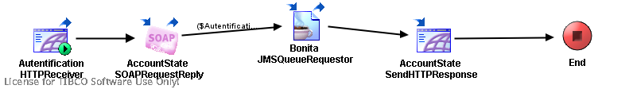

# AccountState {#ProcessMain .concept}

License for TIBCO Software Use Only!

Section contains description of Process " AccountState.process " .

**Parent topic:**[Processes](../../../projects/AccountState/common/process.md)

## Folder description: {#FolderDescription}

|Folder|Description|
|------|-----------|
|AccountState|This application simulate get bank account state process which using rating of client bonita.|
|/ProcessDefinitions|All process definitions|

## Process description: {#ProcessDescription}

|Main communication process. Receive input parameters. Call CalculateBonita process and at the end send result.|

## Process definition: {#ProcessDefinition}

Full process path: ProcessDefinitions/AccountState.process

## Diagram: {#Diagram}



## Process starter activity: {#Starter}

Name: Autentification HTTPReceiver

-   Property Name: ***Autentification HTTPReceiver***
    -   Type: *com.tibco.plugin.http.HTTPEventSource*
    -   Resource Type: *httppalette.httpEventSource*
    -   Description: *Receive input client autentification information from HTTP*
    -   *Configuration:*
        -   outputMode = String
        -   defaultEncoding = ISO8859\_1
        -   inputOutputVersion = 5.3.0
        -   newMimeSupport = true
        -   sharedChannel = [/SharedConnections/IOHTTPConnection.sharedhttp](../SharedConnections/IOHTTPConnection.sharedhttp.md)
        -   customField
            -   row
                -   attribute = Name
                -   attributeType = string
                -   attributeCard = required
            -   row
                -   attribute = Password
                -   attributeType = string
                -   attributeCard = required
        -   Headers
            -   + root \(Complex Type, required \)
                -   - Accept\(xsd:string,optional\)
                -   - Accept-Charset\(xsd:string,optional\)
                -   - Accept-Encoding\(xsd:string,optional\)
                -   - Content-Type\(xsd:string,optional\)
                -   - Content-Length\(xsd:string,optional\)
                -   - Connection\(xsd:string,optional\)
                -   - Cookie\(xsd:string,optional\)
                -   - Pragma\(xsd:string,optional\)

## Process end activity: {#EndActivity}

Name: End

## Activities: {#Activities}

### Name: ***AccountState SendHTTPResponse*** {#AccountState_SendHTTPResponse}

-   Type: *com.tibco.plugin.http.HTTPResponseActivity*
-   Resource Type: *httppalette.httpWebResponse*
-   Description: *Send result as HTTP*
-   *Configuration:*
    -   closeConnection = true
    -   eventSource = Autentification HTTPReceiver
    -   Headers
        -   + root \(Complex Type, required \)
            -   - StatusLine\(xsd:string,optional\)
            -   - Content-Type\(xsd:string,optional\)
            -   - Set-Cookie\(xsd:string,optional\)
            -   - Pragma\(xsd:string,optional\)
            -   - Location\(xsd:string,optional\)
-   *Input bindings:*
    -   Mapping table

        |Target|Source|
        |------|------|
        |/**ResponseActivityInput**/**asciiContent**| |

    -   Mapping tree

        ```
        
        **ResponseActivityInput**
         **asciiContent** = concat("<H1>Account state</H1><B>Account no: </B>",$AccountState-SOAPRequestReply/outputMessage/ns:Account/ns:Number,
        "<BR><B>Name: </B>", $AccountState-SOAPRequestReply/outputMessage/ns:Account/ns:Name,
        "<BR><B>Value: </B>", $AccountState-SOAPRequestReply/outputMessage/ns:Account/ns:Value,
        "<BR><B>Account status: </B>",
        (if($Bonita-JMSQueueRequestor/ns2:ActivityOutput/Body/pfx2:PretenderBonita/Bonita <= 0) then "Basic" else
        if($Bonita-JMSQueueRequestor/ns2:ActivityOutput/Body/pfx2:PretenderBonita/Bonita = 1) then "Normal" else
        if($Bonita-JMSQueueRequestor/ns2:ActivityOutput/Body/pfx2:PretenderBonita/Bonita = 2) then "Bronze" else
        if($Bonita-JMSQueueRequestor/ns2:ActivityOutput/Body/pfx2:PretenderBonita/Bonita = 3) then "Silver" else
        "Gold"))
        ```

    -   Source code

        ```
        
                    <ResponseActivityInput xmlns:ns2="http://www.tibco.com/namespaces/tnt/plugins/jms" xmlns:pd="http://xmlns.tibco.com/bw/process/2003" xmlns:ns1="http://www.tibco.com/pe/DeployedVarsType" xmlns:xsl="http://www.w3.org/1999/XSL/Transform" xmlns:ns="http://www.tibco.com/schemas/AccountState/SharedResources/Schema.xsd" xmlns:wsdl="http://schemas.xmlsoap.org/wsdl/" xmlns:xsd="http://www.w3.org/2001/XMLSchema" xmlns:pfx3="http://xmlns.example.com/1171360277608/GetObligatorServiceOperationImpl" xmlns:pfx2="http://www.tibco.com/xmlns/ae2xsd/2002/05/EMS/CalculateBonitaAESchema" xmlns:pfx="http://xmlns.example.com/1171610171437/GetAccountStateOperationImpl" xmlns:xsi="http://www.w3.org/2001/XMLSchema-instance">
                        <asciiContent>
                            <xsl:value-of select="concat(&quot;&lt;H1&gt;Account state&lt;/H1&gt;&lt;B&gt;Account no: &lt;/B&gt;&quot;,$AccountState-SOAPRequestReply/outputMessage/ns:Account/ns:Number,&#10;&quot;&lt;BR&gt;&lt;B&gt;Name: &lt;/B&gt;&quot;, $AccountState-SOAPRequestReply/outputMessage/ns:Account/ns:Name,&#10;&quot;&lt;BR&gt;&lt;B&gt;Value: &lt;/B&gt;&quot;, $AccountState-SOAPRequestReply/outputMessage/ns:Account/ns:Value,&#10;&quot;&lt;BR&gt;&lt;B&gt;Account status: &lt;/B&gt;&quot;,&#10;(if($Bonita-JMSQueueRequestor/ns2:ActivityOutput/Body/pfx2:PretenderBonita/Bonita &lt;= 0) then &quot;Basic&quot; else&#10;if($Bonita-JMSQueueRequestor/ns2:ActivityOutput/Body/pfx2:PretenderBonita/Bonita = 1) then &quot;Normal&quot; else&#10;if($Bonita-JMSQueueRequestor/ns2:ActivityOutput/Body/pfx2:PretenderBonita/Bonita = 2) then &quot;Bronze&quot; else&#10;if($Bonita-JMSQueueRequestor/ns2:ActivityOutput/Body/pfx2:PretenderBonita/Bonita = 3) then &quot;Silver&quot; else&#10;&quot;Gold&quot;))"/>
                        </asciiContent>
                    </ResponseActivityInput>
                
        ```


### Name: ***AccountState SOAPRequestReply*** {#AccountState_SOAPRequestReply}

-   Type: *com.tibco.plugin.soap.SOAPSendReceiveActivity*
-   Resource Type: *ae.activities.SOAPSendReceiveUI*
-   Description: *SOAPRequest on GetAccountState process and get reply with result*
-   *Configuration:*
    -   timeout = 0
    -   service = pfx:GetAccountStateService
    -   servicePort = UserName\_sp\_SOAPEventSource
    -   operation = GetAccountStateOperation
    -   soapAction = /ProcessDefinitions/GetAccountState/GetAccountStateService
    -   endpointURL = %%AccountStateServiceEndpointURL%%
-   *Input bindings:*
    -   Mapping table

        |Target|Source|
        |------|------|
        |/**inputMessage**/**Name**| |

    -   Mapping tree

        ```
        
        **inputMessage**
         **Name** = $Autentification-HTTPReceiver/ProcessStarterOutput/parameters/Name
        ```

    -   Source code

        ```
        
                    <inputMessage xmlns:ns2="http://www.tibco.com/namespaces/tnt/plugins/jms" xmlns:pd="http://xmlns.tibco.com/bw/process/2003" xmlns:ns1="http://www.tibco.com/pe/DeployedVarsType" xmlns:xsl="http://www.w3.org/1999/XSL/Transform" xmlns:ns="http://www.tibco.com/schemas/AccountState/SharedResources/Schema.xsd" xmlns:wsdl="http://schemas.xmlsoap.org/wsdl/" xmlns:xsd="http://www.w3.org/2001/XMLSchema" xmlns:pfx3="http://xmlns.example.com/1171360277608/GetObligatorServiceOperationImpl" xmlns:pfx2="http://www.tibco.com/xmlns/ae2xsd/2002/05/EMS/CalculateBonitaAESchema" xmlns:pfx="http://xmlns.example.com/1171610171437/GetAccountStateOperationImpl" xmlns:xsi="http://www.w3.org/2001/XMLSchema-instance">
                        <ns:Name>
                            <xsl:value-of select="$Autentification-HTTPReceiver/ProcessStarterOutput/parameters/Name"/>
                        </ns:Name>
                    </inputMessage>
                
        ```


### Name: ***Bonita JMSQueueRequestor*** {#Bonita_JMSQueueRequestor}

-   Type: *com.tibco.plugin.jms.JMSQueueRequestReplyActivity*
-   Resource Type: *ae.activities.JMSQueueRequestReplyActivity*
-   Description: *JMS request on CalculateBonita process and get reply with result*
-   *Configuration:*
    -   PermittedMessageType = XML Text
    -   SessionAttributes
        -   transacted = false
        -   acknowledgeMode = 1
        -   maxSessions = 1
        -   destination = %%ENV%%.%%CalculateBonitaJMSQueueName%%
    -   ConfigurableHeaders
        -   JMSDeliveryMode = PERSISTENT
        -   JMSExpiration = 0
        -   JMSPriority = 4
    -   ConnectionReference = [/SharedConnections/CalculateBonitaEMSConnection.sharedjmscon](../SharedConnections/CalculateBonitaEMSConnection.sharedjmscon.md)
    -   ApplicationProperties = /SharedResources/JMSApplicationProperties.sharedjmsapp
    -   InDataxsdString
        -   - InputParameters \(XML Element Reference, required \)
    -   OutDataxsdString
        -   - PretenderBonita \(XML Element Reference, required \)
-   *Input bindings:*
    -   Mapping table

        |Target|Source|
        |------|------|
        |/**ActivityInput**/**replyToQueue**| |
        |/**ActivityInput**/**OtherProperties**/**Part**|CalculateBonita|
        |/**ActivityInput**/**Body**/**InputParameters**/**Name**| |
        |/**ActivityInput**/**Body**/**InputParameters**/**Value**| |
        |/**ActivityInput**/**Body**/**InputParameters**/**MonthIncrement**| |
        |/**ActivityInput**/**Body**/**InputParameters**/**RealtyValue**|0|
        |/**ActivityInput**/**Body**/**InputParameters**/**Refund**|0|

    -   Mapping tree

        ```
        
        **ActivityInput**
         **replyToQueue** = concat($_globalVariables/ns1:GlobalVariables/ENV,$_globalVariables/ns1:GlobalVariables/AccountStateJMSQueueName)
         **OtherProperties**
          **Part** = "CalculateBonita"
         **Body**
          **InputParameters**
           **Name** = $AccountState-SOAPRequestReply/outputMessage/ns:Account/ns:Name
           **Value** = $AccountState-SOAPRequestReply/outputMessage/ns:Account/ns:Value
           **MonthIncrement** = $AccountState-SOAPRequestReply/outputMessage/ns:Account/ns:MonthIncrement
           **RealtyValue** = 0
           **Refund** = 0
        ```

    -   Source code

        ```
        
                    <ns2:ActivityInput xmlns:ns2="http://www.tibco.com/namespaces/tnt/plugins/jms" xmlns:pd="http://xmlns.tibco.com/bw/process/2003" xmlns:ns1="http://www.tibco.com/pe/DeployedVarsType" xmlns:xsl="http://www.w3.org/1999/XSL/Transform" xmlns:ns="http://www.tibco.com/schemas/AccountState/SharedResources/Schema.xsd" xmlns:wsdl="http://schemas.xmlsoap.org/wsdl/" xmlns:xsd="http://www.w3.org/2001/XMLSchema" xmlns:pfx3="http://xmlns.example.com/1171360277608/GetObligatorServiceOperationImpl" xmlns:pfx2="http://www.tibco.com/xmlns/ae2xsd/2002/05/EMS/CalculateBonitaAESchema" xmlns:pfx="http://xmlns.example.com/1171610171437/GetAccountStateOperationImpl" xmlns:xsi="http://www.w3.org/2001/XMLSchema-instance">
                        <replyToQueue>
                            <xsl:value-of select="concat($_globalVariables/ns1:GlobalVariables/ENV,$_globalVariables/ns1:GlobalVariables/AccountStateJMSQueueName)"/>
                        </replyToQueue>
                        <OtherProperties>
                            <Part>
                                <xsl:value-of select="&quot;CalculateBonita&quot;"/>
                            </Part>
                        </OtherProperties>
                        <Body>
                            <pfx2:InputParameters>
                                <Name>
                                    <xsl:value-of select="$AccountState-SOAPRequestReply/outputMessage/ns:Account/ns:Name"/>
                                </Name>
                                <Value>
                                    <xsl:value-of select="$AccountState-SOAPRequestReply/outputMessage/ns:Account/ns:Value"/>
                                </Value>
                                <MonthIncrement>
                                    <xsl:value-of select="$AccountState-SOAPRequestReply/outputMessage/ns:Account/ns:MonthIncrement"/>
                                </MonthIncrement>
                                <RealtyValue>
                                    <xsl:value-of select="0"/>
                                </RealtyValue>
                                <Refund>
                                    <xsl:value-of select="0"/>
                                </Refund>
                            </pfx2:InputParameters>
                        </Body>
                    </ns2:ActivityInput>
                
        ```


## Transitions: {#Transitions}

-   From: ***AccountState SendHTTPResponse*** -To: ***End***
    -   Label:
    -   Condition: *Success*
    -   Description:

-   From: ***AccountState SOAPRequestReply*** -To: ***Bonita JMSQueueRequestor***
    -   Label:
    -   Condition: *\($Autentification-HTTPReceiver/ProcessStarterOutput/parameters/Name = $AccountState-SOAPRequestReply/outputMessage/ns:Account/ns:Name\) and \($Autentification-HTTPReceiver/ProcessStarterOutput/parameters/Password = $AccountState-SOAPRequestReply/outputMessage/ns:Account/ns:Password\)*
    -   Description:

-   From: ***Autentification HTTPReceiver*** -To: ***AccountState SOAPRequestReply***
    -   Label:
    -   Condition: *Success*
    -   Description:

-   From: ***Bonita JMSQueueRequestor*** -To: ***AccountState SendHTTPResponse***
    -   Label:
    -   Condition: *Success*
    -   Description:

