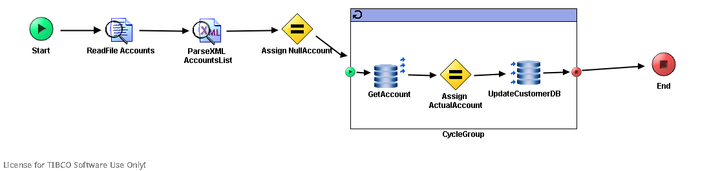

# GetAccountState {#ProcessMain .concept}

License for TIBCO Software Use Only!

Section contains description of Process " GetAccountState.process " .

**Parent topic:**[Processes](../../../../projects/AccountState/common/process.md)

## Folder description: {#FolderDescription}

|Folder|Description|
|------|-----------|
|AccountState|This application simulate get bank account state process which using rating of client bonita.|
|/ProcessDefinitions|All process definitions|
|/ProcessDefinitions/GetAccountState|Main AccountState processes|

## Process description: {#ProcessDescription}

|Load AccountState of concrete user's account from xml file|

## Process definition: {#ProcessDefinition}

Full process path: ProcessDefinitions/GetAccountState/GetAccountState.process

## Diagram: {#Diagram}



## Process starter activity: {#Starter}

Name: Start

Description: *Start process with account owner name.*

Input Parameters:

-   + root \(Complex Type, required \)
    -   - Name \(XML Element Reference, required \)
    -   - ID\(xsd:int,required\)

## Process end activity: {#EndActivity}

Name: End

Output Parameters:

-   - Account \(XML Element Reference, required \)

Return bindings:

-   Mapping table

    |Target|Source|
    |------|------|
    | |*\[COPY-OF\] < $Schema0/pfx:Account \>*|

-   Mapping tree

    ```
    **
    Account** = *\[COPY-OF\] *< $Schema0/pfx:Account >
    ```

-   Source code

    ```
    
            <xsl:copy-of xmlns:xsl="http://www.w3.org/1999/XSL/Transform" xmlns:ns2="http://www.tibco.com/namespaces/tnt/plugins/file/v2" xmlns:pd="http://xmlns.tibco.com/bw/process/2003" xmlns:ns1="http://www.tibco.com/namespaces/tnt/plugins/file" xmlns:ns="http://www.tibco.com/pe/DeployedVarsType" xmlns:xsd="http://www.w3.org/2001/XMLSchema" xmlns:pfx="http://www.tibco.com/schemas/AccountState/SharedResources/Schema.xsd" select="$Schema0/pfx:Account"/>
        
    ```


## Process variables: {#ProcessVariables}

Schema: Schema0

## Activities: {#Activities}

### Name: ***Assign ActualAccount*** {#Assign_ActualAccount}

-   Type: *com.tibco.pe.core.AssignActivity*
-   Resource Type: *ae.activities.assignActivity*
-   Description: *Assign Account data when the owner name and input name are same*
-   *Configuration:*
    -   variableName = Schema0
-   *Input bindings:*
    -   Mapping table

        |Target|Source|
        |------|------|
        | |*\[COPY-OF\] < $ParseXML-AccountsList/pfx:AccountsList\[$AccountIndex\]/pfx:Account \>*|

    -   Mapping tree

        ```
        **
        Account** = *\[COPY-OF\] *< $ParseXML-AccountsList/pfx:AccountsList[$AccountIndex]/pfx:Account >
        ```

    -   Source code

        ```
        
                        <xsl:copy-of xmlns:xsl="http://www.w3.org/1999/XSL/Transform" xmlns:ns2="http://www.tibco.com/namespaces/tnt/plugins/file/v2" xmlns:pd="http://xmlns.tibco.com/bw/process/2003" xmlns:ns1="http://www.tibco.com/namespaces/tnt/plugins/file" xmlns:ns="http://www.tibco.com/pe/DeployedVarsType" xmlns:xsd="http://www.w3.org/2001/XMLSchema" xmlns:pfx="http://www.tibco.com/schemas/AccountState/SharedResources/Schema.xsd" select="$ParseXML-AccountsList/pfx:AccountsList[$AccountIndex]/pfx:Account"/>
                    
        ```


### Name: ***Assign NullAccount*** {#Assign_NullAccount}

-   Type: *com.tibco.pe.core.AssignActivity*
-   Resource Type: *ae.activities.assignActivity*
-   Description: *Set default result as null Account structure*
-   *Configuration:*
    -   variableName = Schema0
-   *Input bindings:*
    -   Mapping table

        |Target|Source|
        |------|------|
        |/**Account**/**Number**| |
        |/**Account**/**Name**| |
        |/**Account**/**Value**|0|
        |/**Account**/**MonthIncrement**|0|
        |/**Account**/**Password**| |

    -   Mapping tree

        ```
        
        **Account**
         **Number** = ""
         **Name** = ""
         **Value** = 0
         **MonthIncrement** = 0
         **Password** = ""
        ```

    -   Source code

        ```
        
                    <pfx:Account xmlns:pfx="http://www.tibco.com/schemas/AccountState/SharedResources/Schema.xsd" xmlns:ns2="http://www.tibco.com/namespaces/tnt/plugins/file/v2" xmlns:pd="http://xmlns.tibco.com/bw/process/2003" xmlns:ns1="http://www.tibco.com/namespaces/tnt/plugins/file" xmlns:xsl="http://www.w3.org/1999/XSL/Transform" xmlns:ns="http://www.tibco.com/pe/DeployedVarsType" xmlns:xsd="http://www.w3.org/2001/XMLSchema">
                        <pfx:Number>
                            <xsl:value-of select="&quot;&quot;"/>
                        </pfx:Number>
                        <pfx:Name>
                            <xsl:value-of select="&quot;&quot;"/>
                        </pfx:Name>
                        <pfx:Value>
                            <xsl:value-of select="0"/>
                        </pfx:Value>
                        <pfx:MonthIncrement>
                            <xsl:value-of select="0"/>
                        </pfx:MonthIncrement>
                        <pfx:Password>
                            <xsl:value-of select="&quot;&quot;"/>
                        </pfx:Password>
                    </pfx:Account>
                
        ```


### Name: ***GetAccount*** {#GetAccount}

-   Type: *com.tibco.plugin.jdbc.JDBCQueryActivity*
-   Resource Type: *ae.activities.JDBCQueryActivity*
-   Description:
-   *Configuration:*
    -   timeout = 10
    -   commit = false
    -   maxRows = 100
    -   emptyStrAsNil = false
    -   jdbcSharedConfig = [/SharedConnections/Tibco.sharedjdbc](../../SharedConnections/Tibco.sharedjdbc.md)
    -   statement = SELECT ID, NAME, VALUE, MONTH\_INCREMENT FROM ACCOUNTS WHERE ID = ?
    -   processInSubsets = true
    -   Prepared\_Param\_DataType
        -   parameter
            -   parameterName = id
            -   dataType = INTEGER
-   *Input bindings:*
    -   Mapping table

        |Target|Source|
        |------|------|
        |/**jdbcQueryActivityInput**/**subsetSize**|1|

    -   Mapping tree

        ```
        
        **jdbcQueryActivityInput**
         **subsetSize** = 1
        ```

    -   Source code

        ```
        
                        <jdbcQueryActivityInput xmlns:ns2="http://www.tibco.com/namespaces/tnt/plugins/file/v2" xmlns:pd="http://xmlns.tibco.com/bw/process/2003" xmlns:ns1="http://www.tibco.com/namespaces/tnt/plugins/file" xmlns:xsl="http://www.w3.org/1999/XSL/Transform" xmlns:ns="http://www.tibco.com/pe/DeployedVarsType" xmlns:xsd="http://www.w3.org/2001/XMLSchema" xmlns:pfx="http://www.tibco.com/schemas/AccountState/SharedResources/Schema.xsd">
                            <subsetSize>
                                <xsl:value-of select="1"/>
                            </subsetSize>
                        </jdbcQueryActivityInput>
                    
        ```


### Name: ***ParseXML AccountsList*** {#ParseXML_AccountsList}

-   Type: *com.tibco.plugin.xml.XMLParseActivity*
-   Resource Type: *ae.activities.XMLParseActivity*
-   Description: *Parse text input to xml according to Accounts xsd schema*
-   *Configuration:*
    -   inputStyle = text
    -   xsdVersion = default
    -   validateOutput = true
    -   term
        -   - AccountsList \(XML Element Reference, required \)
-   *Input bindings:*
    -   Mapping table

        |Target|Source|
        |------|------|
        |/**xmlString**| |

    -   Mapping tree

        ```
        
        **xmlString** = $ReadFile-Accounts/ns1:ReadActivityOutputTextClass/fileContent/textContent
        ```

    -   Source code

        ```
        
                    <xmlString xmlns:ns2="http://www.tibco.com/namespaces/tnt/plugins/file/v2" xmlns:pd="http://xmlns.tibco.com/bw/process/2003" xmlns:ns1="http://www.tibco.com/namespaces/tnt/plugins/file" xmlns:xsl="http://www.w3.org/1999/XSL/Transform" xmlns:ns="http://www.tibco.com/pe/DeployedVarsType" xmlns:xsd="http://www.w3.org/2001/XMLSchema" xmlns:pfx="http://www.tibco.com/schemas/AccountState/SharedResources/Schema.xsd">
                        <xsl:value-of select="$ReadFile-Accounts/ns1:ReadActivityOutputTextClass/fileContent/textContent"/>
                    </xmlString>
                
        ```


### Name: ***ReadFile Accounts*** {#ReadFile_Accounts}

-   Type: *com.tibco.plugin.file.FileReadActivity*
-   Resource Type: *ae.activities.FileReadActivity*
-   Description: *Read file as text*
-   *Configuration:*
    -   encoding = text
-   *Input bindings:*
    -   Mapping table

        |Target|Source|
        |------|------|
        |/**ReadActivityInputClass**/**fileName**| |

    -   Mapping tree

        ```
        
        **ReadActivityInputClass**
         **fileName** = $_globalVariables/ns:GlobalVariables/DefaultAccountsFile
        ```

    -   Source code

        ```
        
                    <ns2:ReadActivityInputClass xmlns:ns2="http://www.tibco.com/namespaces/tnt/plugins/file/v2" xmlns:pd="http://xmlns.tibco.com/bw/process/2003" xmlns:ns1="http://www.tibco.com/namespaces/tnt/plugins/file" xmlns:xsl="http://www.w3.org/1999/XSL/Transform" xmlns:ns="http://www.tibco.com/pe/DeployedVarsType" xmlns:xsd="http://www.w3.org/2001/XMLSchema" xmlns:pfx="http://www.tibco.com/schemas/AccountState/SharedResources/Schema.xsd">
                        <fileName>
                            <xsl:value-of select="$_globalVariables/ns:GlobalVariables/DefaultAccountsFile"/>
                        </fileName>
                    </ns2:ReadActivityInputClass>
                
        ```


### Name: ***UpdateCustomerDB*** {#UpdateCustomerDB}

-   Type: *com.tibco.plugin.jdbc.JDBCUpdateActivity*
-   Resource Type: *ae.activities.JDBCUpdateActivity*
-   Description:
-   *Configuration:*
    -   timeout = 10
    -   commit = false
    -   emptyStrAsNil = false
    -   jdbcSharedConfig = [/SharedConnections/SharedTibco.sharedjdbc](../../SharedConnections/SharedTibco.sharedjdbc.md)
    -   statement = UPDATE CUSTOMER SET DATE = ? WHERE ID = ?
    -   Prepared\_Param\_DataType
        -   parameter
            -   parameterName = date\_now
            -   dataType = VARCHAR
        -   parameter
            -   parameterName = id
            -   dataType = INTEGER
-   *Input bindings:*
    -   Mapping table

        |Target|Source|
        |------|------|
        |/**jdbcUpdateActivityInput**/**date\_now**| |
        |/**jdbcUpdateActivityInput**/**id**| |

    -   Mapping tree

        ```
        
        **jdbcUpdateActivityInput**
         **date\_now** = current-dateTime()
         **id** = $Start/root/ID
        ```

    -   Source code

        ```
        
                        <jdbcUpdateActivityInput xmlns:ns2="http://www.tibco.com/namespaces/tnt/plugins/file/v2" xmlns:pd="http://xmlns.tibco.com/bw/process/2003" xmlns:ns1="http://www.tibco.com/namespaces/tnt/plugins/file" xmlns:xsl="http://www.w3.org/1999/XSL/Transform" xmlns:ns="http://www.tibco.com/pe/DeployedVarsType" xmlns:xsd="http://www.w3.org/2001/XMLSchema" xmlns:pfx="http://www.tibco.com/schemas/AccountState/SharedResources/Schema.xsd">
                            <date_now>
                                <xsl:value-of select="current-dateTime()"/>
                            </date_now>
                            <id>
                                <xsl:value-of select="$Start/root/ID"/>
                            </id>
                        </jdbcUpdateActivityInput>
                    
        ```


## Transitions: {#Transitions}

-   From: ***Assign ActualAccount*** -To: ***UpdateCustomerDB***
    -   Label:
    -   Condition: *Success*
    -   Description:

-   From: ***Assign NullAccount*** -To: ***CycleGroup***
    -   Label:
    -   Condition: *Success*
    -   Description:

-   From: ***CycleGroup*** -To: ***End***
    -   Label:
    -   Condition: *Success*
    -   Description:

-   From: ***GetAccount*** -To: ***Assign ActualAccount***
    -   Label:
    -   Condition: *Success*
    -   Description:

-   From: ***ParseXML AccountsList*** -To: ***Assign NullAccount***
    -   Label:
    -   Condition: *Success*
    -   Description:

-   From: ***ReadFile Accounts*** -To: ***ParseXML AccountsList***
    -   Label:
    -   Condition: *Success*
    -   Description:

-   From: ***start*** -To: ***GetAccount***
    -   Label:
    -   Condition: *Success*
    -   Description:

-   From: ***Start*** -To: ***ReadFile Accounts***
    -   Label:
    -   Condition: *Success*
    -   Description:

-   From: ***UpdateCustomerDB*** -To: ***end***
    -   Label:
    -   Condition: *Success*
    -   Description:

## Groups: {#Groups}

-   Name: ***CycleGroup***
    -   Type: *com.tibco.pe.core.LoopGroup*
    -   Resource Type: *ae.process.group*
    -   *Configuration:*
        -   groupType = repeat
        -   serializable = false
        -   indexSlot = AccountIndex
        -   activityOutputName =
        -   repeatCondition = \($AccountIndex \>= $ParseXML-AccountsList/pfx:AccountsList/@Count\) or \($ParseXML-AccountsList/pfx:AccountsList/pfx:Account\[$AccountIndex\]/pfx:Name =$Start/pfx:Name\)
        -   accumulateOutput = false

