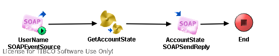

# GetAccountStateService {#ProcessMain .concept}

License for TIBCO Software Use Only!

Section contains description of Process " GetAccountStateService.process " .

**Parent topic:**[Processes](../../../../projects/AccountState/common/process.md)

## Folder description: {#FolderDescription}

|Folder|Description|
|------|-----------|
|AccountState|This application simulate get bank account state process which using rating of client bonita.|
|/ProcessDefinitions|All process definitions|
|/ProcessDefinitions/GetAccountState|Main AccountState processes|

## Process description: {#ProcessDescription}

|Get and prepare input parameters for process GetAccountState. Them send request with AccountState.|

## Process definition: {#ProcessDefinition}

Full process path: ProcessDefinitions/GetAccountState/GetAccountStateService.process

## Diagram: {#Diagram}



## Process starter activity: {#Starter}

Name: UserName SOAPEventSource

-   Property Name: ***UserName SOAPEventSource***
    -   Type: *com.tibco.plugin.soap.SOAPEventSource*
    -   Resource Type: *ae.activities.SOAPEventSourceUI*
    -   Description: *Get input parameters from SOAP for GetAccountState process*
    -   *Configuration:*
        -   service = pfx:GetAccountStateServicePort
        -   wsdlNamespaceRoot = http://xmlns.example.com/1171610171437/GetAccountStateOperationImpl
        -   operation = GetAccountStateOperation
        -   portAddressPrefix =
        -   operationStyle = document
        -   soapUse = literal
        -   embedWsdlComponents = true
        -   embedSchemaComponents = true
        -   soapAction = /ProcessDefinitions/GetAccountState/GetAccountStateService
        -   sharedChannel = [/SharedConnections/SOAPHTTPConnection.sharedhttp](../../SharedConnections/SOAPHTTPConnection.sharedhttp.md)

## Process end activity: {#EndActivity}

Name: End

## Activities: {#Activities}

### Name: ***AccountState SOAPSendReply*** {#AccountState_SOAPSendReply}

-   Type: *com.tibco.plugin.soap.SOAPSendReplyActivity*
-   Resource Type: *ae.activities.SOAPSendReplyUI*
-   Description: *Send SOAP reply with GetAccountState result*
-   *Configuration:*
    -   eventSource = UserName SOAPEventSource
-   *Input bindings:*
    -   Mapping table

        |Target|Source|
        |------|------|
        |/**outputMessage**|*\[COPY-OF\] < \$GetAccountState/ns:Account \>*|

    -   Mapping tree

        ```
        
        outputMessage
         Account = *\[COPY-OF\] *< $GetAccountState/ns:Account >
        ```

    -   Source code

        ```
        
                    <outputMessage xmlns:pd="http://xmlns.tibco.com/bw/process/2003" xmlns:xsl="http://www.w3.org/1999/XSL/Transform" xmlns:ns="http://www.tibco.com/schemas/AccountState/SharedResources/Schema.xsd" xmlns:wsdl="http://schemas.xmlsoap.org/wsdl/" xmlns:pfx="http://xmlns.example.com/1171610171437">
                        <xsl:copy-of select="$GetAccountState/ns:Account"/>
                    </outputMessage>
                
        ```


### Name: ***GetAccountState*** {#GetAccountState}

-   Type: *com.tibco.pe.core.CallProcessActivity*
-   Resource Type: *ae.process.subprocess*
-   Description: *Read informations about account from xml file*
-   *Configuration:*
    -   processName = [/ProcessDefinitions/GetAccountState/GetAccountState.process](GetAccountState.process.md)
-   *Input bindings:*
    -   Mapping table

        |Target|Source|
        |------|------|
        |/**Name**| |

    -   Mapping tree

        ```
        
        Name = $UserName-SOAPEventSource/inputMessage/ns:Name
        ```

    -   Source code

        ```
        
                    <ns:Name xmlns:ns="http://www.tibco.com/schemas/AccountState/SharedResources/Schema.xsd" xmlns:pd="http://xmlns.tibco.com/bw/process/2003" xmlns:xsl="http://www.w3.org/1999/XSL/Transform" xmlns:wsdl="http://schemas.xmlsoap.org/wsdl/" xmlns:pfx="http://xmlns.example.com/1171610171437">
                        <xsl:value-of select="$UserName-SOAPEventSource/inputMessage/ns:Name"/>
                    </ns:Name>
                
        ```


## Transitions: {#Transitions}

-   From: ***AccountState SOAPSendReply*** -To: ***End***
    -   Label:
    -   Condition: *Success*
    -   Description:

-   From: ***GetAccountState*** -To: ***AccountState SOAPSendReply***
    -   Label:
    -   Condition: *Success*
    -   Description:

-   From: ***UserName SOAPEventSource*** -To: ***GetAccountState***
    -   Label:
    -   Condition: *Success*
    -   Description:

