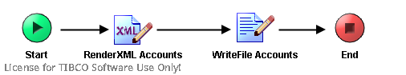

# CreateAccounts {#ProcessMain .concept}

License for TIBCO Software Use Only!

Section contains description of Process " CreateAccounts.process " .

**Parent topic:**[Processes](../../../../projects/AccountState/common/process.md)

## Folder description: {#FolderDescription}

|Folder|Description|
|------|-----------|
|AccountState|This application simulate get bank account state process which using rating of client bonita.|
|/ProcessDefinitions|All process definitions|
|/ProcessDefinitions/XMLCreator|Processes for creating default xml files|

## Process description: {#ProcessDescription}

|Create default basic Accounts xml file|

## Process definition: {#ProcessDefinition}

Full process path: ProcessDefinitions/XMLCreator/CreateAccounts.process

## Diagram: {#Diagram}



## Process starter activity: {#Starter}

Name: Start

Description:

## Process end activity: {#EndActivity}

Name: End

## Activities: {#Activities}

### Name: ***RenderXML Accounts*** {#RenderXML_Accounts}

-   Type: *com.tibco.plugin.xml.XMLRendererActivity*
-   Resource Type: *ae.activities.XMLRendererActivity*
-   Description:
-   *Configuration:*
    -   renderAsText = text
    -   validateInput = true
    -   renderDefaultPrefix = true
    -   textEncoding = UTF-8
    -   term
        -   - AccountsList \(XML Element Reference, required \)
-   *Input bindings:*
    -   Mapping table

        |Target|Source|
        |------|------|
        |/**AccountsList**/**@Count**|1|
        |/**AccountsList**/**Account**/**Number**|123456789|
        |/**AccountsList**/**Account**/**Name**|Jan Novak|
        |/**AccountsList**/**Account**/**Value**|1545738|
        |/**AccountsList**/**Account**/**MonthIncrement**|75000|
        |/**AccountsList**/**Account**/**Password**|key|

    -   Mapping tree

        ```
        
        **AccountsList**
         **@Count** = 1
         **Account**
          **Number** = 123456789
          **Name** = "Jan Novak"
          **Value** = 1545738
          **MonthIncrement** = 75000
          **Password** = "key"
        ```

    -   Source code

        ```
        
                    <pfx:AccountsList xmlns:pfx="http://www.tibco.com/schemas/AccountState/SharedResources/Schema.xsd" xmlns:ns2="http://www.tibco.com/namespaces/tnt/plugins/file" xmlns:pd="http://xmlns.tibco.com/bw/process/2003" xmlns:xsl="http://www.w3.org/1999/XSL/Transform" xmlns:ns="http://www.tibco.com/pe/DeployedVarsType" xmlns:xsd="http://www.w3.org/2001/XMLSchema">
                        <xsl:attribute name="Count">
                            <xsl:value-of select="1"/>
                        </xsl:attribute>
                        <pfx:Account>
                            <pfx:Number>
                                <xsl:value-of select="123456789"/>
                            </pfx:Number>
                            <pfx:Name>
                                <xsl:value-of select="&quot;Jan Novak&quot;"/>
                            </pfx:Name>
                            <pfx:Value>
                                <xsl:value-of select="1545738"/>
                            </pfx:Value>
                            <pfx:MonthIncrement>
                                <xsl:value-of select="75000"/>
                            </pfx:MonthIncrement>
                            <pfx:Password>
                                <xsl:value-of select="&quot;key&quot;"/>
                            </pfx:Password>
                        </pfx:Account>
                    </pfx:AccountsList>
                
        ```


### Name: ***WriteFile Accounts*** {#WriteFile_Accounts}

-   Type: *com.tibco.plugin.file.FileWriteActivity*
-   Resource Type: *ae.activities.FileWriteActivity*
-   Description:
-   *Configuration:*
    -   encoding = text
    -   compressFile = None
-   *Input bindings:*
    -   Mapping table

        |Target|Source|
        |------|------|
        |/**WriteActivityInputTextClass**/**fileName**| |
        |/**WriteActivityInputTextClass**/**textContent**| |

    -   Mapping tree

        ```
        
        **WriteActivityInputTextClass**
         **fileName** = $_globalVariables/ns:GlobalVariables/DefaultAccountsFile
         **textContent** = $RenderXML-Accounts/xmlString
        ```

    -   Source code

        ```
        
                    <ns2:WriteActivityInputTextClass xmlns:ns2="http://www.tibco.com/namespaces/tnt/plugins/file" xmlns:pd="http://xmlns.tibco.com/bw/process/2003" xmlns:xsl="http://www.w3.org/1999/XSL/Transform" xmlns:ns="http://www.tibco.com/pe/DeployedVarsType" xmlns:xsd="http://www.w3.org/2001/XMLSchema" xmlns:pfx="http://www.tibco.com/schemas/AccountState/SharedResources/Schema.xsd">
                        <fileName>
                            <xsl:value-of select="$_globalVariables/ns:GlobalVariables/DefaultAccountsFile"/>
                        </fileName>
                        <textContent>
                            <xsl:value-of select="$RenderXML-Accounts/xmlString"/>
                        </textContent>
                    </ns2:WriteActivityInputTextClass>
                
        ```


## Transitions: {#Transitions}

-   From: ***RenderXML Accounts*** -To: ***WriteFile Accounts***
    -   Label:
    -   Condition: *Success*
    -   Description:

-   From: ***Start*** -To: ***RenderXML Accounts***
    -   Label:
    -   Condition: *Success*
    -   Description:

-   From: ***WriteFile Accounts*** -To: ***End***
    -   Label:
    -   Condition: *Success*
    -   Description:

