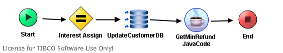

# Examination {#ProcessMain .concept}

License for TIBCO Software Use Only!

Section contains description of Process " Examination.process " .

**Parent topic:**[Processes](../../../../projects/GrantingCredit/common/process.md)

## Folder description: {#FolderDescription}

|Folder|Description|
|------|-----------|
|GrantingCredit|The application Granting credit provides resolution whether a credit \(or mortgage\) can be granded to a user. Information about user is the input of the application.|
|/ProcessDefinitions|All process definitions|
|/ProcessDefinitions/Examination|Processes for result examination about GrantingCredit|

## Process description: {#ProcessDescription}

|No description|

## Process definition: {#ProcessDefinition}

Full process path: ProcessDefinitions/Examination/Examination.process

## Diagram: {#Diagram}



## Process starter activity: {#Starter}

Name: Start

Description:

Input Parameters:

-   + InputParameters \(Complex Type, required \)
    -   - Refund\(xsd:long,required\)
    -   - Salary\(xsd:long,required\)
    -   - Value\(xsd:long,required\)
    -   - Bonita\(xsd:short,required\)
    -   - Pawn\(xsd:boolean,required\)
    -   - ID\(xsd:int,required\)

## Process end activity: {#EndActivity}

Name: End

Output Parameters:

-   + ExaminationResult \(Complex Type, required \)
    -   - State\(xsd:boolean,required\)
    -   - Interest\(xsd:double,required\)

Return bindings:

-   Mapping table

    |Target|Source|
    |------|------|
    |/**ExaminationResult**/**State**| |
    |/**ExaminationResult**/**Interest**| |

-   Mapping tree

    ```
    
    **ExaminationResult**
     **State** = if(($GetMinRefund-JavaCode/javaCodeActivityOutput/MinRefund <= $Start/InputParameters/Refund) and  ($Schema0/Interest > 0))then 1 else 0
     **Interest** = $Schema0/Interest
    ```

-   Source code

    ```
    
            <ExaminationResult xmlns:pd="http://xmlns.tibco.com/bw/process/2003" xmlns:xsl="http://www.w3.org/1999/XSL/Transform" xmlns:xsd="http://www.w3.org/2001/XMLSchema">
                <State>
                    <xsl:value-of select="if(($GetMinRefund-JavaCode/javaCodeActivityOutput/MinRefund &lt;= $Start/InputParameters/Refund) and  ($Schema0/Interest &gt; 0))then 1 else 0"/>
                </State>
                <Interest>
                    <xsl:value-of select="$Schema0/Interest"/>
                </Interest>
            </ExaminationResult>
        
    ```


## Process variables: {#ProcessVariables}

Schema: Schema0

-   - Interest\(xsd:double,required\)

## Activities: {#Activities}

### Name: ***GetMinRefund JavaCode*** {#GetMinRefund_JavaCode}

-   Type: *com.tibco.plugin.java.JavaActivity*
-   Resource Type: *ae.javapalette.javaActivity*
-   Description:
-   *Configuration:*
    -   fileName = ExaminationGetMinRefundJavaCode
    -   packageName = ProcessDefinitions.Examination.Examination
    -   fullsource = package ProcessDefinitions.Examination.Examination; import java.util.\*; import java.io.\*; import java.lang.Math; public class ExaminationGetMinRefundJavaCode\{ /\*\*\*\*\*\* START SET/GET METHOD, DO NOT MODIFY \*\*\*\*\*/ protected long Years = 0; protected double Interest = 0.0d; protected long Value = 0; protected long MinRefund = 0; public long getYears\(\) \{ return Years; \} public void setYears\(long val\) \{ Years = val; \} public double getInterest\(\) \{ return Interest; \} public void setInterest\(double val\) \{ Interest = val; \} public long getValue\(\) \{ return Value; \} public void setValue\(long val\) \{ Value = val; \} public long getMinRefund\(\) \{ return MinRefund; \} public void setMinRefund\(long val\) \{ MinRefund = val; \} /\*\*\*\*\*\* END SET/GET METHOD, DO NOT MODIFY \*\*\*\*\*/ private double power\(double x, long y\) \{ double result = x; for\(long i = 0; i < y-1; i++\) \{ result = result \* x; \} return result; \} public ExaminationGetMinRefundJavaCode\(\) \{ double temp = power\(\(1 + 0.10/12\),\(getYears\(\)\*12\)\); setMinRefund\(\(long\)Math.round\(\(getValue\(\) \* getInterest\(\) /12 \*temp\) / \(temp-1\)\)\); \} public void invoke\(\) throws Exception \{ /\* Available Variables: DO NOT MODIFY In : long Years In : double Interest In : long Value Out : long MinRefund \* Available Variables: DO NOT MODIFY \*\*\*\*\*/ \} \}
    -   inputData
        -   row
            -   fieldName = Years
            -   fieldType = long
            -   fieldRequired = required
        -   row
            -   fieldName = Interest
            -   fieldType = double
            -   fieldRequired = required
        -   row
            -   fieldName = Value
            -   fieldType = long
            -   fieldRequired = required
    -   outputData
        -   row
            -   fieldName = MinRefund
            -   fieldType = long
            -   fieldRequired = required
    -   byteCode
        -   class
            -   name = ExaminationGetMinRefundJavaCode
            -   byteCode \(Java bytecode is ignored in this documentation\)
-   *Input bindings:*
    -   Mapping table

        |Target|Source|
        |------|------|
        |/**javaCodeActivityInput**/**Years**|20|
        |/**javaCodeActivityInput**/**Interest**| |
        |/**javaCodeActivityInput**/**Value**| |

    -   Mapping tree

        ```
        
        **javaCodeActivityInput**
         **Years** = 20
         **Interest** = $Schema0/Interest * 0.01
         **Value** = $Start/InputParameters/Value
        ```

    -   Source code

        ```
        
                    <javaCodeActivityInput xmlns:pd="http://xmlns.tibco.com/bw/process/2003" xmlns:xsl="http://www.w3.org/1999/XSL/Transform" xmlns:xsd="http://www.w3.org/2001/XMLSchema">
                        <Years>
                            <xsl:value-of select="20"/>
                        </Years>
                        <Interest>
                            <xsl:value-of select="$Schema0/Interest * 0.01"/>
                        </Interest>
                        <Value>
                            <xsl:value-of select="$Start/InputParameters/Value"/>
                        </Value>
                    </javaCodeActivityInput>
                
        ```


### Name: ***Interest Assign*** {#Interest_Assign}

-   Type: *com.tibco.pe.core.AssignActivity*
-   Resource Type: *ae.activities.assignActivity*
-   Description:
-   *Configuration:*
    -   variableName = Schema0
-   *Input bindings:*
    -   Mapping table

        |Target|Source|
        |------|------|
        |/**Interest**| |

    -   Mapping tree

        ```
        
        **Interest** = if($Start/InputParameters/Bonita >= 4) then 3 else
        if($Start/InputParameters/Bonita >= 3) then 3.5 else
        if($Start/InputParameters/Bonita >= 2) then 4 else
        if($Start/InputParameters/Bonita >= 1) then 4.5 else 0
        ```

    -   Source code

        ```
        
                    <Interest xmlns:pd="http://xmlns.tibco.com/bw/process/2003" xmlns:xsl="http://www.w3.org/1999/XSL/Transform" xmlns:xsd="http://www.w3.org/2001/XMLSchema">
                        <xsl:value-of select="if($Start/InputParameters/Bonita &gt;= 4) then 3 else&#10;if($Start/InputParameters/Bonita &gt;= 3) then 3.5 else&#10;if($Start/InputParameters/Bonita &gt;= 2) then 4 else&#10;if($Start/InputParameters/Bonita &gt;= 1) then 4.5 else 0"/>
                    </Interest>
                
        ```


### Name: ***UpdateCustomerDB*** {#UpdateCustomerDB}

-   Type: *com.tibco.plugin.jdbc.JDBCUpdateActivity*
-   Resource Type: *ae.activities.JDBCUpdateActivity*
-   Description:
-   *Configuration:*
    -   timeout = 10
    -   commit = false
    -   emptyStrAsNil = false
    -   jdbcSharedConfig = [/SharedConnections/SharedTibco.sharedjdbc](../../SharedConnections/SharedTibco.sharedjdbc.md)
    -   statement = UPDATE STATES SET INTEREST = ? WHERE ID = ?
    -   Prepared\_Param\_DataType
        -   parameter
            -   parameterName = interest
            -   dataType = DECIMAL
        -   parameter
            -   parameterName = customer\_id
            -   dataType = INTEGER
-   *Input bindings:*
    -   Mapping table

        |Target|Source|
        |------|------|
        |/**jdbcUpdateActivityInput**/**interest**| |
        |/**jdbcUpdateActivityInput**/**customer\_id**| |

    -   Mapping tree

        ```
        
        **jdbcUpdateActivityInput**
         **interest** = $Schema0/Interest
         **customer\_id** = $Start/InputParameters/ID
        ```

    -   Source code

        ```
        
                    <jdbcUpdateActivityInput xmlns:pd="http://xmlns.tibco.com/bw/process/2003" xmlns:xsl="http://www.w3.org/1999/XSL/Transform" xmlns:xsd="http://www.w3.org/2001/XMLSchema">
                        <interest>
                            <xsl:value-of select="$Schema0/Interest"/>
                        </interest>
                        <customer_id>
                            <xsl:value-of select="$Start/InputParameters/ID"/>
                        </customer_id>
                    </jdbcUpdateActivityInput>
                
        ```


## Transitions: {#Transitions}

-   From: ***GetMinRefund JavaCode*** -To: ***End***
    -   Label:
    -   Condition: *Success*
    -   Description:

-   From: ***Interest Assign*** -To: ***UpdateCustomerDB***
    -   Label:
    -   Condition: *Success*
    -   Description:

-   From: ***Start*** -To: ***Interest Assign***
    -   Label:
    -   Condition: *Success*
    -   Description:

-   From: ***UpdateCustomerDB*** -To: ***GetMinRefund JavaCode***
    -   Label:
    -   Condition: *Success*
    -   Description:

