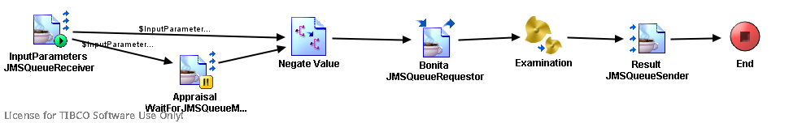

# ExaminationService {#ProcessMain .concept}

License for TIBCO Software Use Only!

Section contains description of Process " ExaminationService.process " .

**Parent topic:**[Processes](../../../../projects/GrantingCredit/common/process.md)

## Folder description: {#FolderDescription}

|Folder|Description|
|------|-----------|
|GrantingCredit|The application Granting credit provides resolution whether a credit \(or mortgage\) can be granded to a user. Information about user is the input of the application.|
|/ProcessDefinitions|All process definitions|
|/ProcessDefinitions/Examination|Processes for result examination about GrantingCredit|

## Process description: {#ProcessDescription}

|No description|

## Process definition: {#ProcessDefinition}

Full process path: ProcessDefinitions/Examination/ExaminationService.process

## Diagram: {#Diagram}



## Process starter activity: {#Starter}

Name: InputParameters JMSQueueReceiver

-   Property Name: ***InputParameters JMSQueueReceiver***
    -   Type: *com.tibco.plugin.jms.JMSQueueEventSource*
    -   Resource Type: *ae.activities.JMSQueueEventSource*
    -   Description:
    -   *Configuration:*
        -   PermittedMessageType = XML Text
        -   SessionAttributes
            -   transacted = false
            -   acknowledgeMode = 1 \(Auto\)
            -   maxSessions = 1
            -   destination = %%ENV%%.%%JMSQueueName%%
            -   selector = Part='InputParameters'
        -   ConfigurableHeaders
            -   JMSDeliveryMode = PERSISTENT
            -   JMSExpiration = 0
            -   JMSPriority = 4
        -   ConnectionReference = [/SharedConnections/EMSConnection.sharedjmscon](../../SharedConnections/EMSConnection.sharedjmscon.md)
        -   OutDataxsdString
            -   - InputParameters \(XML Element Reference, required \)

## Process end activity: {#EndActivity}

Name: End

## Activities: {#Activities}

### Name: ***Appraisal WaitForJMSQueueMessage*** {#Appraisal_WaitForJMSQueueMessage}

-   Type: *com.tibco.plugin.jms.JMSQueueSignalInActivity*
-   Resource Type: *ae.activities.JMSQueueSignalInActivity*
-   Description:
-   *Configuration:*
    -   \_eventTimeout = 60000
    -   PermittedMessageType = XML Text
    -   SessionAttributes
        -   transacted = false
        -   acknowledgeMode = 1 \(Auto\)
        -   maxSessions = -1
        -   destination = %%ENV%%.%%AppraisalJMSQueueResultName%%
    -   ConfigurableHeaders
        -   JMSDeliveryMode = PERSISTENT
        -   JMSExpiration = 0
        -   JMSPriority = 4
    -   ConnectionReference = [/SharedConnections/EMSConnection.sharedjmscon](../../SharedConnections/EMSConnection.sharedjmscon.md)
    -   ApplicationProperties =
    -   OutDataxsdString
        -   - AppraisalResult \(XML Element Reference, required \)

### Name: ***Bonita JMSQueueRequestor*** {#Bonita_JMSQueueRequestor}

-   Type: *com.tibco.plugin.jms.JMSQueueRequestReplyActivity*
-   Resource Type: *ae.activities.JMSQueueRequestReplyActivity*
-   Description:
-   *Configuration:*
    -   PermittedMessageType = XML Text
    -   SessionAttributes
        -   transacted = false
        -   acknowledgeMode = 1
        -   maxSessions = 1
        -   destination = %%ENV%%.%%CalculateBonitaJMSQueueName%%
    -   ConfigurableHeaders
        -   JMSDeliveryMode = PERSISTENT
        -   JMSExpiration = 0
        -   JMSPriority = 4
    -   ConnectionReference = [/SharedConnections/CalculateBonitaEMSConnection.sharedjmscon](../../SharedConnections/CalculateBonitaEMSConnection.sharedjmscon.md)
    -   ApplicationProperties = /SharedResources/JMSApplicationProperties.sharedjmsapp
    -   InDataxsdString
        -   - InputParameters \(XML Element Reference, required \)
    -   OutDataxsdString
        -   - PretenderBonita \(XML Element Reference, required \)
-   *Input bindings:*
    -   Mapping table

        |Target|Source|
        |------|------|
        |/**ActivityInput**/**replyToQueue**| |
        |/**ActivityInput**/**OtherProperties**/**Part**|CalculateBonita|
        |/**ActivityInput**/**Body**/**InputParameters**/*\[IF\]<\$InputParameters-JMSQueueReceiver/ns:ActivityOutput/Body/pfx:InputParameters/Name\>*/**Name**|*\[COPY-OF\] < \$InputParameters-JMSQueueReceiver/ns:ActivityOutput/Body/pfx:InputParameters/Name/@xsi:nil \>*|
        |/**ActivityInput**/**Body**/**InputParameters**/*\[IF\]<\$InputParameters-JMSQueueReceiver/ns:ActivityOutput/Body/pfx:InputParameters/Name\>*/**Name**| |
        |/**ActivityInput**/**Body**/**InputParameters**/**Value**| |
        |/**ActivityInput**/**Body**/**InputParameters**/*\[IF\]<\$InputParameters-JMSQueueReceiver/ns:ActivityOutput/Body/pfx:InputParameters/Salary\>*/**MonthIncrement**|*\[COPY-OF\] < \$InputParameters-JMSQueueReceiver/ns:ActivityOutput/Body/pfx:InputParameters/Salary/@xsi:nil \>*|
        |/**ActivityInput**/**Body**/**InputParameters**/*\[IF\]<\$InputParameters-JMSQueueReceiver/ns:ActivityOutput/Body/pfx:InputParameters/Salary\>*/**MonthIncrement**| |
        |/**ActivityInput**/**Body**/**InputParameters**/**RealtyValue**/*\[WHEN\]<exists\(if\(\$Appraisal-WaitForJMSQueueMessage/ns:ActivityOutput/Body/pfx4:AppraisalResult/customerName = \$InputParameters-JMSQueueReceiver/ns:ActivityOutput/Body/pfx:InputParameters/Name\) then \$Appraisal-WaitForJMSQueueMessage/ns:ActivityOutput/Body/pfx4:AppraisalResult/realtyValue else \$InputParameters-JMSQueueReceiver/ns:ActivityOutput/Body/pfx:InputParameters/RealtyValue\)\>*| |
        |/**ActivityInput**/**Body**/**InputParameters**/**RealtyValue**/*\[OTHERWISE\]*|*\[NIL\]*|
        |/**ActivityInput**/**Body**/**InputParameters**/*\[IF\]<\$InputParameters-JMSQueueReceiver/ns:ActivityOutput/Body/pfx:InputParameters/Refund\>*/**Refund**|*\[COPY-OF\] < \$InputParameters-JMSQueueReceiver/ns:ActivityOutput/Body/pfx:InputParameters/Refund/@xsi:nil \>*|
        |/**ActivityInput**/**Body**/**InputParameters**/*\[IF\]<\$InputParameters-JMSQueueReceiver/ns:ActivityOutput/Body/pfx:InputParameters/Refund\>*/**Refund**| |

    -   Mapping tree

        ```
        
        ActivityInput
         replyToQueue = concat($_globalVariables/ns1:GlobalVariables/ENV, $_globalVariables/ns1:GlobalVariables/ExaminationJMSQueueName)
         OtherProperties
          Part = "CalculateBonita"
         Body
          InputParameters
           *\[IF\] *< $InputParameters-JMSQueueReceiver/ns:ActivityOutput/Body/pfx:InputParameters/Name >
            Name = $InputParameters-JMSQueueReceiver/ns:ActivityOutput/Body/pfx:InputParameters/Name
             nil = *\[COPY-OF\] *< $InputParameters-JMSQueueReceiver/ns:ActivityOutput/Body/pfx:InputParameters/Name/@xsi:nil >
           Value = $Negate-Value/Value
           *\[IF\] *< $InputParameters-JMSQueueReceiver/ns:ActivityOutput/Body/pfx:InputParameters/Salary >
            MonthIncrement = $InputParameters-JMSQueueReceiver/ns:ActivityOutput/Body/pfx:InputParameters/Salary
             nil = *\[COPY-OF\] *< $InputParameters-JMSQueueReceiver/ns:ActivityOutput/Body/pfx:InputParameters/Salary/@xsi:nil >
           RealtyValue
            *\[CHOOSE\] *
             *\[WHEN\] *< exists(if($Appraisal-WaitForJMSQueueMessage/ns:ActivityOutput/Body/pfx4:AppraisalResult/customerName =   $InputParameters-JMSQueueReceiver/ns:ActivityOutput/Body/pfx:InputParameters/Name) then $Appraisal-WaitForJMSQueueMessage/ns:ActivityOutput/Body/pfx4:AppraisalResult/realtyValue else $InputParameters-JMSQueueReceiver/ns:ActivityOutput/Body/pfx:InputParameters/RealtyValue) > = if($Appraisal-WaitForJMSQueueMessage/ns:ActivityOutput/Body/pfx4:AppraisalResult/customerName =   $InputParameters-JMSQueueReceiver/ns:ActivityOutput/Body/pfx:InputParameters/Name) then $Appraisal-WaitForJMSQueueMessage/ns:ActivityOutput/Body/pfx4:AppraisalResult/realtyValue else $InputParameters-JMSQueueReceiver/ns:ActivityOutput/Body/pfx:InputParameters/RealtyValue
             *\[OTHERWISE\] *
              @xsi:nil = true
           *\[IF\] *< $InputParameters-JMSQueueReceiver/ns:ActivityOutput/Body/pfx:InputParameters/Refund >
            Refund = $InputParameters-JMSQueueReceiver/ns:ActivityOutput/Body/pfx:InputParameters/Refund
             nil = *\[COPY-OF\] *< $InputParameters-JMSQueueReceiver/ns:ActivityOutput/Body/pfx:InputParameters/Refund/@xsi:nil >
        ```

    -   Source code

        ```
        
                    <ns:ActivityInput xmlns:ns="http://www.tibco.com/namespaces/tnt/plugins/jms" xmlns:pd="http://xmlns.tibco.com/bw/process/2003" xmlns:xsl="http://www.w3.org/1999/XSL/Transform" xmlns:pfx="http://www.tibco.com/xmlns/ae2xsd/2002/05/EMS/GrantingCreditAESchema" xmlns:xsd="http://www.w3.org/2001/XMLSchema" xmlns:pfx2="http://www.tibco.com/xmlns/ae2xsd/2002/05/EMS/CalculateBonitaAESchema" xmlns:xsi="http://www.w3.org/2001/XMLSchema-instance" xmlns:ns1="http://www.tibco.com/pe/DeployedVarsType" xmlns:pfx3="http://www.tibco.com/pe/SignalInActivitySchema" xmlns:pfx4="http://www.tibco.com/xmlns/ae2xsd/2002/05/Appraisal/AppraisalAESchema">
                        <replyToQueue>
                            <xsl:value-of select="concat($_globalVariables/ns1:GlobalVariables/ENV, $_globalVariables/ns1:GlobalVariables/ExaminationJMSQueueName)"/>
                        </replyToQueue>
                        <OtherProperties>
                            <Part>
                                <xsl:value-of select="&quot;CalculateBonita&quot;"/>
                            </Part>
                        </OtherProperties>
                        <Body>
                            <pfx2:InputParameters>
                                <xsl:if test="$InputParameters-JMSQueueReceiver/ns:ActivityOutput/Body/pfx:InputParameters/Name">
                                    <Name>
                                        <xsl:copy-of select="$InputParameters-JMSQueueReceiver/ns:ActivityOutput/Body/pfx:InputParameters/Name/@xsi:nil"/>
                                        <xsl:value-of select="$InputParameters-JMSQueueReceiver/ns:ActivityOutput/Body/pfx:InputParameters/Name"/>
                                    </Name>
                                </xsl:if>
                                <Value>
                                    <xsl:value-of select="$Negate-Value/Value"/>
                                </Value>
                                <xsl:if test="$InputParameters-JMSQueueReceiver/ns:ActivityOutput/Body/pfx:InputParameters/Salary">
                                    <MonthIncrement>
                                        <xsl:copy-of select="$InputParameters-JMSQueueReceiver/ns:ActivityOutput/Body/pfx:InputParameters/Salary/@xsi:nil"/>
                                        <xsl:value-of select="$InputParameters-JMSQueueReceiver/ns:ActivityOutput/Body/pfx:InputParameters/Salary"/>
                                    </MonthIncrement>
                                </xsl:if>
                                <RealtyValue>
                                    <xsl:choose>
                                        <xsl:when test="exists(if($Appraisal-WaitForJMSQueueMessage/ns:ActivityOutput/Body/pfx4:AppraisalResult/customerName =   $InputParameters-JMSQueueReceiver/ns:ActivityOutput/Body/pfx:InputParameters/Name) then $Appraisal-WaitForJMSQueueMessage/ns:ActivityOutput/Body/pfx4:AppraisalResult/realtyValue else $InputParameters-JMSQueueReceiver/ns:ActivityOutput/Body/pfx:InputParameters/RealtyValue)">
                                            <xsl:value-of select="if($Appraisal-WaitForJMSQueueMessage/ns:ActivityOutput/Body/pfx4:AppraisalResult/customerName =   $InputParameters-JMSQueueReceiver/ns:ActivityOutput/Body/pfx:InputParameters/Name) then $Appraisal-WaitForJMSQueueMessage/ns:ActivityOutput/Body/pfx4:AppraisalResult/realtyValue else $InputParameters-JMSQueueReceiver/ns:ActivityOutput/Body/pfx:InputParameters/RealtyValue"/>
                                        </xsl:when>
                                        <xsl:otherwise>
                                            <xsl:attribute name="xsi:nil">true</xsl:attribute>
                                        </xsl:otherwise>
                                    </xsl:choose>
                                </RealtyValue>
                                <xsl:if test="$InputParameters-JMSQueueReceiver/ns:ActivityOutput/Body/pfx:InputParameters/Refund">
                                    <Refund>
                                        <xsl:copy-of select="$InputParameters-JMSQueueReceiver/ns:ActivityOutput/Body/pfx:InputParameters/Refund/@xsi:nil"/>
                                        <xsl:value-of select="$InputParameters-JMSQueueReceiver/ns:ActivityOutput/Body/pfx:InputParameters/Refund"/>
                                    </Refund>
                                </xsl:if>
                            </pfx2:InputParameters>
                        </Body>
                    </ns:ActivityInput>
                
        ```


### Name: ***Examination*** {#Examination}

-   Type: *com.tibco.pe.core.CallProcessActivity*
-   Resource Type: *ae.process.subprocess*
-   Description:
-   *Configuration:*
    -   processName = [/ProcessDefinitions/Examination/Examination.process](Examination.process.md)
-   *Input bindings:*
    -   Mapping table

        |Target|Source|
        |------|------|
        |/**InputParameters**/**Refund**| |
        |/**InputParameters**/**Salary**| |
        |/**InputParameters**/**Value**| |
        |/**InputParameters**/**Bonita**| |
        |/**InputParameters**/**Pawn**| |

    -   Mapping tree

        ```
        
        InputParameters
         Refund = $InputParameters-JMSQueueReceiver/ns:ActivityOutput/Body/pfx:InputParameters/Refund
         Salary = $InputParameters-JMSQueueReceiver/ns:ActivityOutput/Body/pfx:InputParameters/Salary
         Value = $InputParameters-JMSQueueReceiver/ns:ActivityOutput/Body/pfx:InputParameters/Value
         Bonita = $Bonita-JMSQueueRequestor/ns:ActivityOutput/Body/pfx2:PretenderBonita/Bonita
         Pawn = $InputParameters-JMSQueueReceiver/ns:ActivityOutput/Body/pfx:InputParameters/Pawn
        ```

    -   Source code

        ```
        
                    <InputParameters xmlns:pd="http://xmlns.tibco.com/bw/process/2003" xmlns:xsl="http://www.w3.org/1999/XSL/Transform" xmlns:pfx="http://www.tibco.com/xmlns/ae2xsd/2002/05/EMS/GrantingCreditAESchema" xmlns:xsd="http://www.w3.org/2001/XMLSchema" xmlns:pfx2="http://www.tibco.com/xmlns/ae2xsd/2002/05/EMS/CalculateBonitaAESchema" xmlns:ns="http://www.tibco.com/namespaces/tnt/plugins/jms" xmlns:xsi="http://www.w3.org/2001/XMLSchema-instance" xmlns:ns1="http://www.tibco.com/pe/DeployedVarsType" xmlns:pfx3="http://www.tibco.com/pe/SignalInActivitySchema" xmlns:pfx4="http://www.tibco.com/xmlns/ae2xsd/2002/05/Appraisal/AppraisalAESchema">
                        <Refund>
                            <xsl:value-of select="$InputParameters-JMSQueueReceiver/ns:ActivityOutput/Body/pfx:InputParameters/Refund"/>
                        </Refund>
                        <Salary>
                            <xsl:value-of select="$InputParameters-JMSQueueReceiver/ns:ActivityOutput/Body/pfx:InputParameters/Salary"/>
                        </Salary>
                        <Value>
                            <xsl:value-of select="$InputParameters-JMSQueueReceiver/ns:ActivityOutput/Body/pfx:InputParameters/Value"/>
                        </Value>
                        <Bonita>
                            <xsl:value-of select="$Bonita-JMSQueueRequestor/ns:ActivityOutput/Body/pfx2:PretenderBonita/Bonita"/>
                        </Bonita>
                        <Pawn>
                            <xsl:value-of select="$InputParameters-JMSQueueReceiver/ns:ActivityOutput/Body/pfx:InputParameters/Pawn"/>
                        </Pawn>
                    </InputParameters>
                
        ```


### Name: ***Negate Value*** {#Negate_Value}

-   Type: *com.tibco.plugin.mapper.MapperActivity*
-   Resource Type: *ae.activities.MapperActivity*
-   Description:
-   *Configuration:*
    -   - Value\(xsd:long,required\)
-   *Input bindings:*
    -   Mapping table

        |Target|Source|
        |------|------|
        |/**Value**| |

    -   Mapping tree

        ```
        
        Value = -  $InputParameters-JMSQueueReceiver/ns:ActivityOutput/Body/pfx:InputParameters/Value
        ```

    -   Source code

        ```
        
                    <Value xmlns:pd="http://xmlns.tibco.com/bw/process/2003" xmlns:xsl="http://www.w3.org/1999/XSL/Transform" xmlns:pfx="http://www.tibco.com/xmlns/ae2xsd/2002/05/EMS/GrantingCreditAESchema" xmlns:xsd="http://www.w3.org/2001/XMLSchema" xmlns:pfx2="http://www.tibco.com/xmlns/ae2xsd/2002/05/EMS/CalculateBonitaAESchema" xmlns:ns="http://www.tibco.com/namespaces/tnt/plugins/jms" xmlns:xsi="http://www.w3.org/2001/XMLSchema-instance" xmlns:ns1="http://www.tibco.com/pe/DeployedVarsType" xmlns:pfx3="http://www.tibco.com/pe/SignalInActivitySchema" xmlns:pfx4="http://www.tibco.com/xmlns/ae2xsd/2002/05/Appraisal/AppraisalAESchema">
                        <xsl:value-of select="-  $InputParameters-JMSQueueReceiver/ns:ActivityOutput/Body/pfx:InputParameters/Value"/>
                    </Value>
                
        ```


### Name: ***Result JMSQueueSender*** {#Result_JMSQueueSender}

-   Type: *com.tibco.plugin.jms.JMSQueueSendActivity*
-   Resource Type: *ae.activities.JMSQueueSendActivity*
-   Description:
-   *Configuration:*
    -   PermittedMessageType = XML Text
    -   SessionAttributes
        -   transacted = false
        -   acknowledgeMode = 1
        -   maxSessions = 1
        -   destination = %%ENV%%.%%JMSQueueName%%
    -   ConfigurableHeaders
        -   JMSDeliveryMode = PERSISTENT
        -   JMSExpiration = 0
        -   JMSPriority = 4
    -   ConnectionReference = [/SharedConnections/EMSConnection.sharedjmscon](../../SharedConnections/EMSConnection.sharedjmscon.md)
    -   ApplicationProperties = /SharedResources/JMSApplicationProperties.sharedjmsapp
    -   InDataxsdString
        -   - GrantingCreditResult \(XML Element Reference, required \)
-   *Input bindings:*
    -   Mapping table

        |Target|Source|
        |------|------|
        |/**ActivityInput**/**OtherProperties**/**Part**|Result|
        |/**ActivityInput**/**Body**/**GrantingCreditResult**/*\[IF\]<\$InputParameters-JMSQueueReceiver/ns:ActivityOutput/Body/pfx:InputParameters/Name\>*/**Name**|*\[COPY-OF\] < \$InputParameters-JMSQueueReceiver/ns:ActivityOutput/Body/pfx:InputParameters/Name/@xsi:nil \>*|
        |/**ActivityInput**/**Body**/**GrantingCreditResult**/*\[IF\]<\$InputParameters-JMSQueueReceiver/ns:ActivityOutput/Body/pfx:InputParameters/Name\>*/**Name**| |
        |/**ActivityInput**/**Body**/**GrantingCreditResult**/*\[IF\]<\$InputParameters-JMSQueueReceiver/ns:ActivityOutput/Body/pfx:InputParameters/Value\>*/**Value**|*\[COPY-OF\] < \$InputParameters-JMSQueueReceiver/ns:ActivityOutput/Body/pfx:InputParameters/Value/@xsi:nil \>*|
        |/**ActivityInput**/**Body**/**GrantingCreditResult**/*\[IF\]<\$InputParameters-JMSQueueReceiver/ns:ActivityOutput/Body/pfx:InputParameters/Value\>*/**Value**| |
        |/**ActivityInput**/**Body**/**GrantingCreditResult**/*\[IF\]<\$InputParameters-JMSQueueReceiver/ns:ActivityOutput/Body/pfx:InputParameters/Refund\>*/**Refund**|*\[COPY-OF\] < \$InputParameters-JMSQueueReceiver/ns:ActivityOutput/Body/pfx:InputParameters/Refund/@xsi:nil \>*|
        |/**ActivityInput**/**Body**/**GrantingCreditResult**/*\[IF\]<\$InputParameters-JMSQueueReceiver/ns:ActivityOutput/Body/pfx:InputParameters/Refund\>*/**Refund**| |
        |/**ActivityInput**/**Body**/**GrantingCreditResult**/*\[IF\]<\$InputParameters-JMSQueueReceiver/ns:ActivityOutput/Body/pfx:InputParameters/Pawn\>*/**Pawn**|*\[COPY-OF\] < \$InputParameters-JMSQueueReceiver/ns:ActivityOutput/Body/pfx:InputParameters/Pawn/@xsi:nil \>*|
        |/**ActivityInput**/**Body**/**GrantingCreditResult**/*\[IF\]<\$InputParameters-JMSQueueReceiver/ns:ActivityOutput/Body/pfx:InputParameters/Pawn\>*/**Pawn**| |
        |/**ActivityInput**/**Body**/**GrantingCreditResult**/**Interest**| |
        |/**ActivityInput**/**Body**/**GrantingCreditResult**/**State**| |
        |/**ActivityInput**/**Body**/**GrantingCreditResult**/**RealtyValue**|*\[COPY-OF\] < \$Appraisal-WaitForJMSQueueMessage/ns:ActivityOutput/Body/pfx4:AppraisalResult/realtyValue/@xsi:nil \>*|
        |/**ActivityInput**/**Body**/**GrantingCreditResult**/**RealtyValue**| |
        |/**ActivityInput**/**Body**/**GrantingCreditResult**/*\[IF\]<\$InputParameters-JMSQueueReceiver/ns:ActivityOutput/Body/pfx:InputParameters/RealtyDetail\>*/**RealtyDetail**|*\[COPY-OF\] < \$InputParameters-JMSQueueReceiver/ns:ActivityOutput/Body/pfx:InputParameters/RealtyDetail/@xsi:nil \>*|
        |/**ActivityInput**/**Body**/**GrantingCreditResult**/*\[IF\]<\$InputParameters-JMSQueueReceiver/ns:ActivityOutput/Body/pfx:InputParameters/RealtyDetail\>*/**RealtyDetail**| |

    -   Mapping tree

        ```
        
        ActivityInput
         OtherProperties
          Part = "Result"
         Body
          GrantingCreditResult
           *\[IF\] *< $InputParameters-JMSQueueReceiver/ns:ActivityOutput/Body/pfx:InputParameters/Name >
            Name = $InputParameters-JMSQueueReceiver/ns:ActivityOutput/Body/pfx:InputParameters/Name
             nil = *\[COPY-OF\] *< $InputParameters-JMSQueueReceiver/ns:ActivityOutput/Body/pfx:InputParameters/Name/@xsi:nil >
           *\[IF\] *< $InputParameters-JMSQueueReceiver/ns:ActivityOutput/Body/pfx:InputParameters/Value >
            Value = $InputParameters-JMSQueueReceiver/ns:ActivityOutput/Body/pfx:InputParameters/Value
             nil = *\[COPY-OF\] *< $InputParameters-JMSQueueReceiver/ns:ActivityOutput/Body/pfx:InputParameters/Value/@xsi:nil >
           *\[IF\] *< $InputParameters-JMSQueueReceiver/ns:ActivityOutput/Body/pfx:InputParameters/Refund >
            Refund = $InputParameters-JMSQueueReceiver/ns:ActivityOutput/Body/pfx:InputParameters/Refund
             nil = *\[COPY-OF\] *< $InputParameters-JMSQueueReceiver/ns:ActivityOutput/Body/pfx:InputParameters/Refund/@xsi:nil >
           *\[IF\] *< $InputParameters-JMSQueueReceiver/ns:ActivityOutput/Body/pfx:InputParameters/Pawn >
            Pawn = $InputParameters-JMSQueueReceiver/ns:ActivityOutput/Body/pfx:InputParameters/Pawn
             nil = *\[COPY-OF\] *< $InputParameters-JMSQueueReceiver/ns:ActivityOutput/Body/pfx:InputParameters/Pawn/@xsi:nil >
           Interest = $Examination/ExaminationResult/Interest
           State = $Examination/ExaminationResult/State
           RealtyValue = $Appraisal-WaitForJMSQueueMessage/ns:ActivityOutput/Body/pfx4:AppraisalResult/realtyValue
            nil = *\[COPY-OF\] *< $Appraisal-WaitForJMSQueueMessage/ns:ActivityOutput/Body/pfx4:AppraisalResult/realtyValue/@xsi:nil >
           *\[IF\] *< $InputParameters-JMSQueueReceiver/ns:ActivityOutput/Body/pfx:InputParameters/RealtyDetail >
            RealtyDetail = $InputParameters-JMSQueueReceiver/ns:ActivityOutput/Body/pfx:InputParameters/RealtyDetail
             nil = *\[COPY-OF\] *< $InputParameters-JMSQueueReceiver/ns:ActivityOutput/Body/pfx:InputParameters/RealtyDetail/@xsi:nil >
        ```

    -   Source code

        ```
        
                    <ns:ActivityInput xmlns:ns="http://www.tibco.com/namespaces/tnt/plugins/jms" xmlns:pd="http://xmlns.tibco.com/bw/process/2003" xmlns:xsl="http://www.w3.org/1999/XSL/Transform" xmlns:pfx="http://www.tibco.com/xmlns/ae2xsd/2002/05/EMS/GrantingCreditAESchema" xmlns:xsd="http://www.w3.org/2001/XMLSchema" xmlns:pfx2="http://www.tibco.com/xmlns/ae2xsd/2002/05/EMS/CalculateBonitaAESchema" xmlns:xsi="http://www.w3.org/2001/XMLSchema-instance" xmlns:ns1="http://www.tibco.com/pe/DeployedVarsType" xmlns:pfx3="http://www.tibco.com/pe/SignalInActivitySchema" xmlns:pfx4="http://www.tibco.com/xmlns/ae2xsd/2002/05/Appraisal/AppraisalAESchema">
                        <OtherProperties>
                            <Part>
                                <xsl:value-of select="&quot;Result&quot;"/>
                            </Part>
                        </OtherProperties>
                        <Body>
                            <pfx:GrantingCreditResult>
                                <xsl:if test="$InputParameters-JMSQueueReceiver/ns:ActivityOutput/Body/pfx:InputParameters/Name">
                                    <Name>
                                        <xsl:copy-of select="$InputParameters-JMSQueueReceiver/ns:ActivityOutput/Body/pfx:InputParameters/Name/@xsi:nil"/>
                                        <xsl:value-of select="$InputParameters-JMSQueueReceiver/ns:ActivityOutput/Body/pfx:InputParameters/Name"/>
                                    </Name>
                                </xsl:if>
                                <xsl:if test="$InputParameters-JMSQueueReceiver/ns:ActivityOutput/Body/pfx:InputParameters/Value">
                                    <Value>
                                        <xsl:copy-of select="$InputParameters-JMSQueueReceiver/ns:ActivityOutput/Body/pfx:InputParameters/Value/@xsi:nil"/>
                                        <xsl:value-of select="$InputParameters-JMSQueueReceiver/ns:ActivityOutput/Body/pfx:InputParameters/Value"/>
                                    </Value>
                                </xsl:if>
                                <xsl:if test="$InputParameters-JMSQueueReceiver/ns:ActivityOutput/Body/pfx:InputParameters/Refund">
                                    <Refund>
                                        <xsl:copy-of select="$InputParameters-JMSQueueReceiver/ns:ActivityOutput/Body/pfx:InputParameters/Refund/@xsi:nil"/>
                                        <xsl:value-of select="$InputParameters-JMSQueueReceiver/ns:ActivityOutput/Body/pfx:InputParameters/Refund"/>
                                    </Refund>
                                </xsl:if>
                                <xsl:if test="$InputParameters-JMSQueueReceiver/ns:ActivityOutput/Body/pfx:InputParameters/Pawn">
                                    <Pawn>
                                        <xsl:copy-of select="$InputParameters-JMSQueueReceiver/ns:ActivityOutput/Body/pfx:InputParameters/Pawn/@xsi:nil"/>
                                        <xsl:value-of select="$InputParameters-JMSQueueReceiver/ns:ActivityOutput/Body/pfx:InputParameters/Pawn"/>
                                    </Pawn>
                                </xsl:if>
                                <Interest>
                                    <xsl:value-of select="$Examination/ExaminationResult/Interest"/>
                                </Interest>
                                <State>
                                    <xsl:value-of select="$Examination/ExaminationResult/State"/>
                                </State>
                                <RealtyValue>
                                    <xsl:copy-of select="$Appraisal-WaitForJMSQueueMessage/ns:ActivityOutput/Body/pfx4:AppraisalResult/realtyValue/@xsi:nil"/>
                                    <xsl:value-of select="$Appraisal-WaitForJMSQueueMessage/ns:ActivityOutput/Body/pfx4:AppraisalResult/realtyValue"/>
                                </RealtyValue>
                                <xsl:if test="$InputParameters-JMSQueueReceiver/ns:ActivityOutput/Body/pfx:InputParameters/RealtyDetail">
                                    <RealtyDetail>
                                        <xsl:copy-of select="$InputParameters-JMSQueueReceiver/ns:ActivityOutput/Body/pfx:InputParameters/RealtyDetail/@xsi:nil"/>
                                        <xsl:value-of select="$InputParameters-JMSQueueReceiver/ns:ActivityOutput/Body/pfx:InputParameters/RealtyDetail"/>
                                    </RealtyDetail>
                                </xsl:if>
                            </pfx:GrantingCreditResult>
                        </Body>
                    </ns:ActivityInput>
                
        ```


## Transitions: {#Transitions}

-   From: ***Appraisal WaitForJMSQueueMessage*** -To: ***Negate Value***
    -   Label:
    -   Condition: *Success*
    -   Description:

-   From: ***Bonita JMSQueueRequestor*** -To: ***Examination***
    -   Label:
    -   Condition: *Success*
    -   Description:

-   From: ***Examination*** -To: ***Result JMSQueueSender***
    -   Label:
    -   Condition: *Success*
    -   Description:

-   From: ***InputParameters JMSQueueReceiver*** -To: ***Appraisal WaitForJMSQueueMessage***
    -   Label:
    -   Condition: *\$InputParameters-JMSQueueReceiver/ns:ActivityOutput/Body/pfx:InputParameters/Pawn = "true"*
    -   Description:

-   From: ***InputParameters JMSQueueReceiver*** -To: ***Negate Value***
    -   Label:
    -   Condition: *\$InputParameters-JMSQueueReceiver/ns:ActivityOutput/Body/pfx:InputParameters/Pawn = "false"*
    -   Description:

-   From: ***Negate Value*** -To: ***Bonita JMSQueueRequestor***
    -   Label:
    -   Condition: *Success*
    -   Description:

-   From: ***Result JMSQueueSender*** -To: ***End***
    -   Label:
    -   Condition: *Success*
    -   Description:

