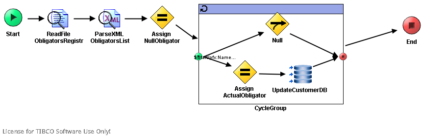

# GetObligator {#ProcessMain .concept}

License for TIBCO Software Use Only!

Section contains description of Process " GetObligator.process " .

Source Library: " CalculateBonita "

**Parent topic:**[Processes](../../../../projects/GrantingCredit/common/process.md)

## Folder description: {#FolderDescription}

|Folder|Description|
|------|-----------|
|GrantingCredit|The application Granting credit provides resolution whether a credit \(or mortgage\) can be granded to a user. Information about user is the input of the application.|
|/ProcessDefinitions|All process definitions|
|/ProcessDefinitions/GetObligator|Processes for obtaining informations about loan of obligator.|

## Process description: {#ProcessDescription}

|Read informations about obligator loan from xml file|

## Process definition: {#ProcessDefinition}

Full process path: ProcessDefinitions/GetObligator/GetObligator.process

## Diagram: {#Diagram}



## Process starter activity: {#Starter}

Name: Start

Description: *Start process with parameter Name \(Pretender's name\)*

Input Parameters:

-   + root \(Complex Type, required \)
    -   - cust\_id\(xsd:int,required\)
    -   - Name \(XML Element Reference, required \)

## Process end activity: {#EndActivity}

Name: End

Output Parameters:

-   - Obligator \(XML Element Reference, required \)

Return bindings:

-   Mapping table

    |Target|Source|
    |------|------|
    | |*\[COPY-OF\] < $Schema0/pfx:Obligator \>*|

-   Mapping tree

    ```
    **
    Obligator** = *\[COPY-OF\] *< $Schema0/pfx:Obligator >
    ```

-   Source code

    ```
    
            <xsl:copy-of xmlns:xsl="http://www.w3.org/1999/XSL/Transform" xmlns:pd="http://xmlns.tibco.com/bw/process/2003" xmlns:ns="http://www.tibco.com/pe/DeployedVarsType" xmlns:ns1="http://www.tibco.com/namespaces/tnt/plugins/file" xmlns:pfx="http://www.tibco.com/schemas/GrantingCredit/SharedConnections/Schema1.xsd" xmlns:ns2="http://www.tibco.com/namespaces/tnt/plugins/file/v2" xmlns:xsd="http://www.w3.org/2001/XMLSchema" select="$Schema0/pfx:Obligator"/>
        
    ```


## Process variables: {#ProcessVariables}

Schema: Schema0

## Activities: {#Activities}

### Name: ***Assign ActualObligator*** {#Assign_ActualObligator}

-   Type: *com.tibco.pe.core.AssignActivity*
-   Resource Type: *ae.activities.assignActivity*
-   Description: *Assign Obligator data when the Obligator name and input name are same*
-   *Configuration:*
    -   variableName = Schema0
-   *Input bindings:*
    -   Mapping table

        |Target|Source|
        |------|------|
        | |*\[COPY-OF\] < $ParseXML-ObligatorsList/pfx:ObligatorsList/pfx:Obligator\[$ObligatorIndex\] \>*|

    -   Mapping tree

        ```
        **
        Obligator\[$ObligatorIndex\]** = *\[COPY-OF\] *< $ParseXML-ObligatorsList/pfx:ObligatorsList/pfx:Obligator[$ObligatorIndex] >
        ```

    -   Source code

        ```
        
                        <xsl:copy-of xmlns:xsl="http://www.w3.org/1999/XSL/Transform" xmlns:pd="http://xmlns.tibco.com/bw/process/2003" xmlns:ns="http://www.tibco.com/pe/DeployedVarsType" xmlns:ns1="http://www.tibco.com/namespaces/tnt/plugins/file" xmlns:pfx="http://www.tibco.com/schemas/GrantingCredit/SharedConnections/Schema1.xsd" xmlns:ns2="http://www.tibco.com/namespaces/tnt/plugins/file/v2" xmlns:xsd="http://www.w3.org/2001/XMLSchema" select="$ParseXML-ObligatorsList/pfx:ObligatorsList/pfx:Obligator[$ObligatorIndex]"/>
                    
        ```


### Name: ***Assign NullObligator*** {#Assign_NullObligator}

-   Type: *com.tibco.pe.core.AssignActivity*
-   Resource Type: *ae.activities.assignActivity*
-   Description: *Set default result as null Obligator strucure*
-   *Configuration:*
    -   variableName = Schema0
-   *Input bindings:*
    -   Mapping table

        |Target|Source|
        |------|------|
        |/**Obligator**/**Name**| |
        |/**Obligator**/**Value**|0|
        |/**Obligator**/**Problem**|0|
        |/**Obligator**/**Refund**|0|

    -   Mapping tree

        ```
        
        **Obligator**
         **Name** = ""
         **Value** = 0
         **Problem** = 0
         **Refund** = 0
        ```

    -   Source code

        ```
        
                    <pfx:Obligator xmlns:pfx="http://www.tibco.com/schemas/GrantingCredit/SharedConnections/Schema1.xsd" xmlns:pd="http://xmlns.tibco.com/bw/process/2003" xmlns:xsl="http://www.w3.org/1999/XSL/Transform" xmlns:ns="http://www.tibco.com/pe/DeployedVarsType" xmlns:ns1="http://www.tibco.com/namespaces/tnt/plugins/file" xmlns:ns2="http://www.tibco.com/namespaces/tnt/plugins/file/v2" xmlns:xsd="http://www.w3.org/2001/XMLSchema">
                        <pfx:Name>
                            <xsl:value-of select="&quot;&quot;"/>
                        </pfx:Name>
                        <pfx:Value>
                            <xsl:value-of select="0"/>
                        </pfx:Value>
                        <pfx:Problem>
                            <xsl:value-of select="0"/>
                        </pfx:Problem>
                        <pfx:Refund>
                            <xsl:value-of select="0"/>
                        </pfx:Refund>
                    </pfx:Obligator>
                
        ```


### Name: ***Null*** {#Null}

-   Type: *com.tibco.plugin.timer.NullActivity*
-   Resource Type: *ae.activities.null*
-   Description: *Do nothing*

### Name: ***ParseXML ObligatorsList*** {#ParseXML_ObligatorsList}

-   Type: *com.tibco.plugin.xml.XMLParseActivity*
-   Resource Type: *ae.activities.XMLParseActivity*
-   Description: *Parse text input to xml according to ObligatorRegistr xsd schema*
-   *Configuration:*
    -   inputStyle = text
    -   xsdVersion = default
    -   validateOutput = true
    -   term
        -   - ObligatorsList \(XML Element Reference, required \)
-   *Input bindings:*
    -   Mapping table

        |Target|Source|
        |------|------|
        |/**xmlString**| |

    -   Mapping tree

        ```
        
        **xmlString** = $ReadFile-ObligatorsRegistr/ns1:ReadActivityOutputTextClass/fileContent/textContent
        ```

    -   Source code

        ```
        
                    <xmlString xmlns:pd="http://xmlns.tibco.com/bw/process/2003" xmlns:xsl="http://www.w3.org/1999/XSL/Transform" xmlns:ns="http://www.tibco.com/pe/DeployedVarsType" xmlns:ns1="http://www.tibco.com/namespaces/tnt/plugins/file" xmlns:pfx="http://www.tibco.com/schemas/GrantingCredit/SharedConnections/Schema1.xsd" xmlns:ns2="http://www.tibco.com/namespaces/tnt/plugins/file/v2" xmlns:xsd="http://www.w3.org/2001/XMLSchema">
                        <xsl:value-of select="$ReadFile-ObligatorsRegistr/ns1:ReadActivityOutputTextClass/fileContent/textContent"/>
                    </xmlString>
                
        ```


### Name: ***ReadFile ObligatorsRegistr*** {#ReadFile_ObligatorsRegistr}

-   Type: *com.tibco.plugin.file.FileReadActivity*
-   Resource Type: *ae.activities.FileReadActivity*
-   Description: *Read file as text.*
-   *Configuration:*
    -   encoding = text
-   *Input bindings:*
    -   Mapping table

        |Target|Source|
        |------|------|
        |/**ReadActivityInputClass**/**fileName**| |

    -   Mapping tree

        ```
        
        **ReadActivityInputClass**
         **fileName** = $_globalVariables/ns:GlobalVariables/DefaultObligatorsRegistrFile
        ```

    -   Source code

        ```
        
                    <ns2:ReadActivityInputClass xmlns:ns2="http://www.tibco.com/namespaces/tnt/plugins/file/v2" xmlns:pd="http://xmlns.tibco.com/bw/process/2003" xmlns:xsl="http://www.w3.org/1999/XSL/Transform" xmlns:ns="http://www.tibco.com/pe/DeployedVarsType" xmlns:ns1="http://www.tibco.com/namespaces/tnt/plugins/file" xmlns:pfx="http://www.tibco.com/schemas/GrantingCredit/SharedConnections/Schema1.xsd" xmlns:xsd="http://www.w3.org/2001/XMLSchema">
                        <fileName>
                            <xsl:value-of select="$_globalVariables/ns:GlobalVariables/DefaultObligatorsRegistrFile"/>
                        </fileName>
                    </ns2:ReadActivityInputClass>
                
        ```


### Name: ***UpdateCustomerDB*** {#UpdateCustomerDB}

-   Type: *com.tibco.plugin.jdbc.JDBCUpdateActivity*
-   Resource Type: *ae.activities.JDBCUpdateActivity*
-   Description:
-   *Configuration:*
    -   timeout = 10
    -   commit = false
    -   emptyStrAsNil = false
    -   jdbcSharedConfig = [/SharedConnections/SharedTibco.sharedjdbc](../../SharedConnections/SharedTibco.sharedjdbc.md)
    -   statement = UPDATE CUSTOMER SET OBLIGATOR = ? WHERE CUST\_ID = ?
    -   Prepared\_Param\_DataType
        -   parameter
            -   parameterName = obligator\_name
            -   dataType = VARCHAR
        -   parameter
            -   parameterName = customer\_id
            -   dataType = INTEGER
-   *Input bindings:*
    -   Mapping table

        |Target|Source|
        |------|------|
        |/**jdbcUpdateActivityInput**/**obligator\_name**| |
        |/**jdbcUpdateActivityInput**/**customer\_id**| |

    -   Mapping tree

        ```
        
        **jdbcUpdateActivityInput**
         **obligator\_name** = $ParseXML-ObligatorsList/pfx:ObligatorsList/pfx:Obligator[$ObligatorIndex]/pfx:Name
         **customer\_id** = $Start/root/cust_id
        ```

    -   Source code

        ```
        
                        <jdbcUpdateActivityInput xmlns:pd="http://xmlns.tibco.com/bw/process/2003" xmlns:xsl="http://www.w3.org/1999/XSL/Transform" xmlns:ns="http://www.tibco.com/pe/DeployedVarsType" xmlns:ns1="http://www.tibco.com/namespaces/tnt/plugins/file" xmlns:pfx="http://www.tibco.com/schemas/GrantingCredit/SharedConnections/Schema1.xsd" xmlns:ns2="http://www.tibco.com/namespaces/tnt/plugins/file/v2" xmlns:xsd="http://www.w3.org/2001/XMLSchema">
                            <obligator_name>
                                <xsl:value-of select="$ParseXML-ObligatorsList/pfx:ObligatorsList/pfx:Obligator[$ObligatorIndex]/pfx:Name"/>
                            </obligator_name>
                            <customer_id>
                                <xsl:value-of select="$Start/root/cust_id"/>
                            </customer_id>
                        </jdbcUpdateActivityInput>
                    
        ```


## Transitions: {#Transitions}

-   From: ***Assign ActualObligator*** -To: ***UpdateCustomerDB***
    -   Label:
    -   Condition: *Success*
    -   Description:

-   From: ***Assign NullObligator*** -To: ***CycleGroup***
    -   Label:
    -   Condition: *Success*
    -   Description:

-   From: ***CycleGroup*** -To: ***End***
    -   Label:
    -   Condition: *Success*
    -   Description:

-   From: ***Null*** -To: ***end***
    -   Label:
    -   Condition: *Success*
    -   Description:

-   From: ***ParseXML ObligatorsList*** -To: ***Assign NullObligator***
    -   Label:
    -   Condition: *Success*
    -   Description:

-   From: ***ReadFile ObligatorsRegistr*** -To: ***ParseXML ObligatorsList***
    -   Label:
    -   Condition: *Success*
    -   Description:

-   From: ***start*** -To: ***Assign ActualObligator***
    -   Label:
    -   Condition: *$Start/pfx:Name = $ParseXML-ObligatorsList/pfx:ObligatorsList/pfx:Obligator\[$ObligatorIndex\]/pfx:Name*
    -   Description:

-   From: ***start*** -To: ***Null***
    -   Label:
    -   Condition: *Success*
    -   Description:

-   From: ***Start*** -To: ***ReadFile ObligatorsRegistr***
    -   Label:
    -   Condition: *Success*
    -   Description:

-   From: ***UpdateCustomerDB*** -To: ***end***
    -   Label:
    -   Condition: *Success*
    -   Description:

## Groups: {#Groups}

-   Name: ***CycleGroup***
    -   Type: *com.tibco.pe.core.LoopGroup*
    -   Resource Type: *ae.process.group*
    -   *Configuration:*
        -   groupType = repeat
        -   serializable = false
        -   indexSlot = ObligatorIndex
        -   activityOutputName =
        -   repeatCondition = \($ObligatorIndex \>= $ParseXML-ObligatorsList/pfx:ObligatorsList/@Count\) or \($ParseXML-ObligatorsList/pfx:ObligatorsList/pfx:Obligator\[$ObligatorIndex\]/pfx:Name =$Start/pfx:Name\)
        -   accumulateOutput = false

