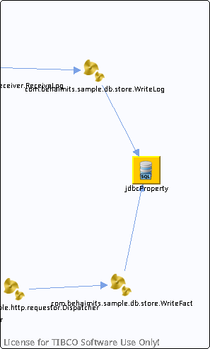

# jdbcProperty {#jdbcProperty .concept}

Chapter contains jdbcProperty crossreferences documentation.

-   Reference from process /com.behaimits.sample.http.requestor/Processes/com/behaimits/sample/db/store/WriteLog.bwp via activity [JDBCUpdate](../../../projects/com.behaimits.sample.http.requestor/Processes/com/behaimits/sample/db/store/WriteLog.bwp.md#)
-   Reference from process /com.behaimits.sample.http.requestor/Processes/com/behaimits/sample/db/store/WriteFact.bwp via activity [JDBCUpdate](../../../projects/com.behaimits.sample.http.requestor/Processes/com/behaimits/sample/db/store/WriteFact.bwp.md#)

**Parent topic:**[Database objects](../../../cross/dataflow/databaseobjects/databaseobjects.md)

