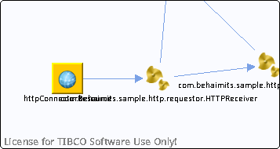

# httpConnectorResource {#httpConnectorResource .concept}

Chapter contains httpConnectorResource crossreferences documentation.

-   Reference from process /com.behaimits.sample.http.requestor/Processes/com/behaimits/sample/http/requestor/HTTPReceiver.bwp via activity [HTTPReceiver](../../../projects/com.behaimits.sample.http.requestor/Processes/com/behaimits/sample/http/requestor/HTTPReceiver.bwp.md#)

**Parent topic:**[Http](../../../cross/dataflow/http/http.md)

