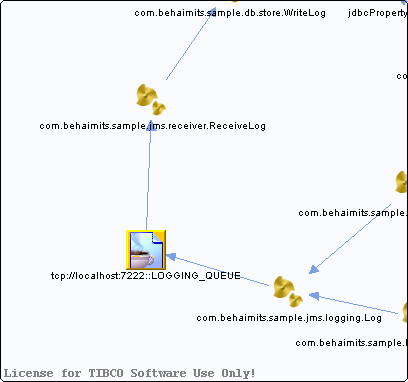

# tcp\_\_\_localhost\_7222\_\_LOGGING\_QUEUE {#tcp___localhost_7222__LOGGING_QUEUE .concept}

Chapter contains tcp\_\_\_localhost\_7222\_\_LOGGING\_QUEUE crossreferences documentation.

-   Reference from process /com.behaimits.sample.http.requestor/Processes/com/behaimits/sample/jms/receiver/ReceiveLog.bwp via activity [JMSReceiveMessage](../../../projects/com.behaimits.sample.http.requestor/Processes/com/behaimits/sample/jms/receiver/ReceiveLog.bwp.md#)
-   Reference from process /com.behaimits.sample.http.requestor/Processes/com/behaimits/sample/jms/logging/Log.bwp via activity [log](../../../projects/com.behaimits.sample.http.requestor/Processes/com/behaimits/sample/jms/logging/Log.bwp.md#)

**Parent topic:**[JMS Messages](../../../cross/dataflow/jmsmessages/jmsmessages.md)

