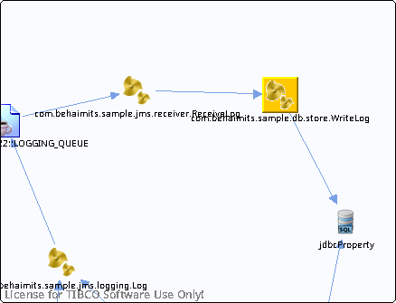

# com.behaimits.sample.db.store.WriteLog {#com.behaimits.sample.db.store.WriteLog .concept}

Chapter contains com.behaimits.sample.db.store.WriteLog crossreferences documentation.

Resolved references

-   Reference from process /com.behaimits.sample.http.requestor/Processes/com/behaimits/sample/db/store/WriteLog.bwp via activity [JDBCUpdate](../../../projects/com.behaimits.sample.http.requestor/Processes/com/behaimits/sample/db/store/WriteLog.bwp.md#)

Unresolved references

-   None

**Parent topic:**[Processes](../../../cross/dataflow/processes/processes.md)

