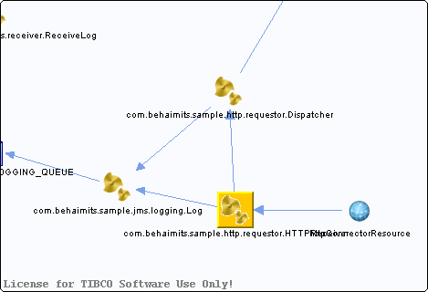

# com.behaimits.sample.http.requestor.HTTPReceiver {#com.behaimits.sample.http.requestor.HTTPReceiver .concept}

Chapter contains com.behaimits.sample.http.requestor.HTTPReceiver crossreferences documentation.

Resolved references

-   Reference from process /com.behaimits.sample.http.requestor/Processes/com/behaimits/sample/http/requestor/HTTPReceiver.bwp via activity [HTTPReceiver](../../../projects/com.behaimits.sample.http.requestor/Processes/com/behaimits/sample/http/requestor/HTTPReceiver.bwp.md#)

Unresolved references

-   Unresolved reference from /com.behaimits.sample.http.requestor/Processes/com/behaimits/sample/http/requestor/HTTPReceiver.bwp via activity [LogRequest](../../../projects/com.behaimits.sample.http.requestor/Processes/com/behaimits/sample/http/requestor/HTTPReceiver.bwp.md#)
-   Unresolved reference from /com.behaimits.sample.http.requestor/Processes/com/behaimits/sample/http/requestor/HTTPReceiver.bwp via activity [Dispatcher](../../../projects/com.behaimits.sample.http.requestor/Processes/com/behaimits/sample/http/requestor/HTTPReceiver.bwp.md#)
-   Unresolved reference from /com.behaimits.sample.http.requestor/Processes/com/behaimits/sample/http/requestor/HTTPReceiver.bwp via activity [LogResponse](../../../projects/com.behaimits.sample.http.requestor/Processes/com/behaimits/sample/http/requestor/HTTPReceiver.bwp.md#)

**Parent topic:**[Processes](../../../cross/dataflow/processes/processes.md)

