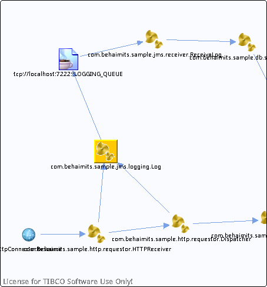

# com.behaimits.sample.jms.logging.Log {#com.behaimits.sample.jms.logging.Log .concept}

Chapter contains com.behaimits.sample.jms.logging.Log crossreferences documentation.

Resolved references

-   Reference from process /com.behaimits.sample.http.requestor/Processes/com/behaimits/sample/jms/logging/Log.bwp via activity [log](../../../projects/com.behaimits.sample.http.requestor/Processes/com/behaimits/sample/jms/logging/Log.bwp.md#)

Unresolved references

-   None

**Parent topic:**[Processes](../../../cross/dataflow/processes/processes.md)

