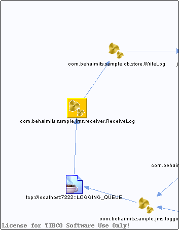

# com.behaimits.sample.jms.receiver.ReceiveLog {#com.behaimits.sample.jms.receiver.ReceiveLog .concept}

Chapter contains com.behaimits.sample.jms.receiver.ReceiveLog crossreferences documentation.

Resolved references

-   Reference from process /com.behaimits.sample.http.requestor/Processes/com/behaimits/sample/jms/receiver/ReceiveLog.bwp via activity [JMSReceiveMessage](../../../projects/com.behaimits.sample.http.requestor/Processes/com/behaimits/sample/jms/receiver/ReceiveLog.bwp.md#)

Unresolved references

-   Unresolved reference from /com.behaimits.sample.http.requestor/Processes/com/behaimits/sample/jms/receiver/ReceiveLog.bwp via activity [StoreLog](../../../projects/com.behaimits.sample.http.requestor/Processes/com/behaimits/sample/jms/receiver/ReceiveLog.bwp.md#)

**Parent topic:**[Processes](../../../cross/dataflow/processes/processes.md)

