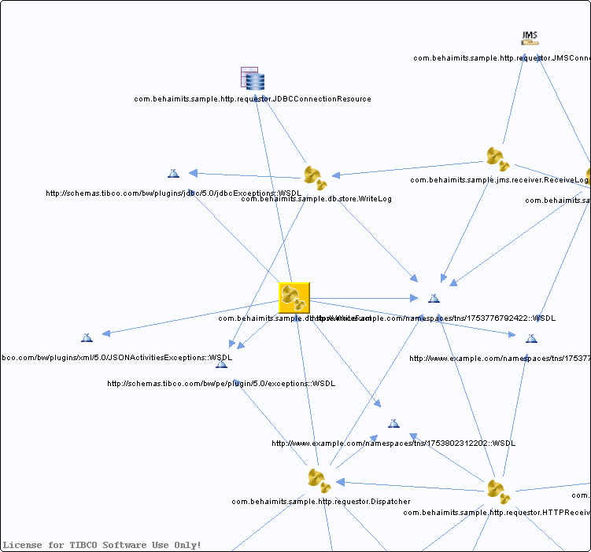

# WriteFact.bwp {#WriteFact.bwp .concept}

Chapter contains WriteFact.bwp crossreferences documentation.

Referenced From:

-   [com.behaimits.sample.http.requestor.Dispatcher](../../../projects/com.behaimits.sample.http.requestor/Processes/com/behaimits/sample/http/requestor/Dispatcher.bwp.md)

References To:

-   http://schemas.tibco.com/bw/pe/plugin/5.0/exceptions::WSDL
-   http://schemas.tibco.com/bw/plugins/jdbc/5.0/jdbcExceptions::WSDL
-   http://schemas.tibco.com/bw/plugins/xml/5.0/JSONActivitiesExceptions::WSDL
-   http://www.example.com/namespaces/tns/1753776792422::WSDL
-   http://www.example.com/namespaces/tns/1753776435241::WSDL
-   http://www.example.com/namespaces/tns/1753802312202::WSDL
-   [com.behaimits.sample.http.requestor.JDBCConnectionResource](../../../projects/com.behaimits.sample.http.requestor/Resources/com/behaimits/sample/http/requestor/JDBCConnectionResource.jdbcResource.md)

**Parent topic:**[Processes](../../../cross/dependencies/processes/processes.md)

