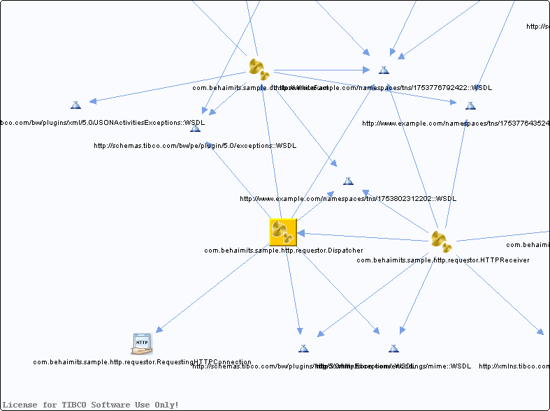

# Dispatcher.bwp {#Dispatcher.bwp .concept}

Chapter contains Dispatcher.bwp crossreferences documentation.

Referenced From:

-   [com.behaimits.sample.http.requestor.HTTPReceiver](../../../projects/com.behaimits.sample.http.requestor/Processes/com/behaimits/sample/http/requestor/HTTPReceiver.bwp.md)

References To:

-   http://xmlns.tibco.com/encodings/mime::WSDL
-   http://schemas.tibco.com/bw/pe/plugin/5.0/exceptions::WSDL
-   http://schemas.tibco.com/bw/plugins/http/5.0/httpExceptions::WSDL
-   http://www.example.com/namespaces/tns/1753802312202::WSDL
-   http://www.example.com/namespaces/tns/1753776792422::WSDL
-   [com.behaimits.sample.http.requestor.RequestingHTTPConnection](../../../projects/com.behaimits.sample.http.requestor/Resources/com/behaimits/sample/http/requestor/RequestingHTTPConnection.httpClientResource.md)
-   [com.behaimits.sample.db.store.WriteFact](../../../projects/com.behaimits.sample.http.requestor/Processes/com/behaimits/sample/db/store/WriteFact.bwp.md)

**Parent topic:**[Processes](../../../cross/dependencies/processes/processes.md)

