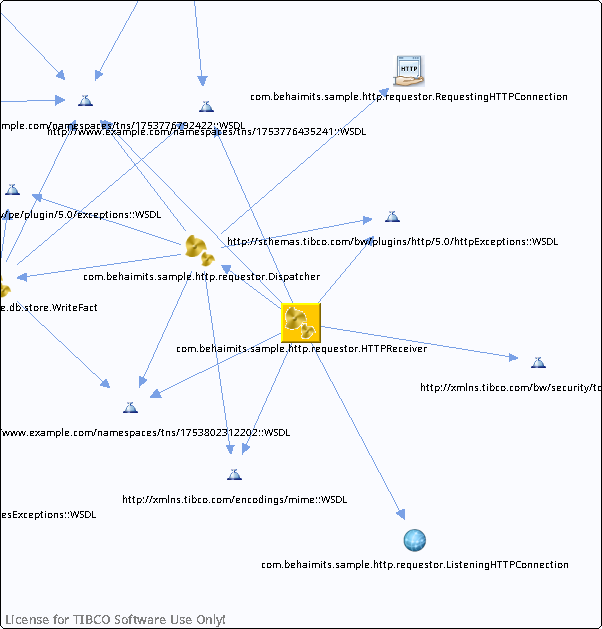

# HTTPReceiver.bwp {#HTTPReceiver.bwp .concept}

Chapter contains HTTPReceiver.bwp crossreferences documentation.

References To:

-   http://xmlns.tibco.com/encodings/mime::WSDL
-   http://xmlns.tibco.com/bw/security/tokens::WSDL
-   http://schemas.tibco.com/bw/plugins/http/5.0/httpExceptions::WSDL
-   http://www.example.com/namespaces/tns/1753776435241::WSDL
-   http://www.example.com/namespaces/tns/1753776792422::WSDL
-   http://www.example.com/namespaces/tns/1753802312202::WSDL
-   [com.behaimits.sample.http.requestor.ListeningHTTPConnection](../../../projects/com.behaimits.sample.http.requestor/Resources/com/behaimits/sample/http/requestor/ListeningHTTPConnection.httpConnResource.md)
-   [com.behaimits.sample.http.requestor.Dispatcher](../../../projects/com.behaimits.sample.http.requestor/Processes/com/behaimits/sample/http/requestor/Dispatcher.bwp.md)

**Parent topic:**[Processes](../../../cross/dependencies/processes/processes.md)

