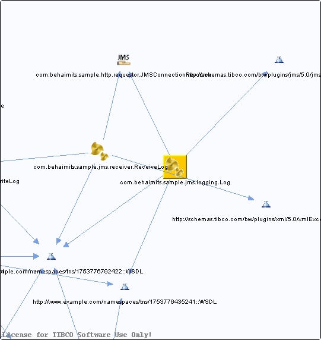

# Log.bwp {#Log.bwp .concept}

Chapter contains Log.bwp crossreferences documentation.

References To:

-   http://schemas.tibco.com/bw/plugins/jms/5.0/jmsExceptions::WSDL
-   http://www.example.com/namespaces/tns/1753776435241::WSDL
-   http://www.example.com/namespaces/tns/1753776792422::WSDL
-   [com.behaimits.sample.http.requestor.JMSConnectionResource](../../../projects/com.behaimits.sample.http.requestor/Resources/com/behaimits/sample/http/requestor/JMSConnectionResource.jmsConnResource.md)

**Parent topic:**[Processes](../../../cross/dependencies/processes/processes.md)

