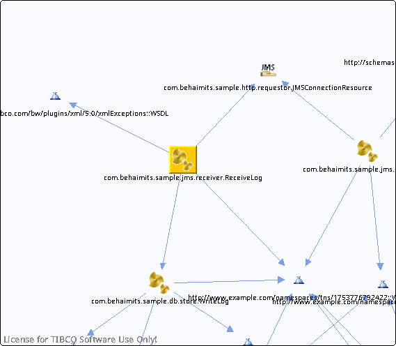

# ReceiveLog.bwp {#ReceiveLog.bwp .concept}

Chapter contains ReceiveLog.bwp crossreferences documentation.

References To:

-   http://schemas.tibco.com/bw/plugins/xml/5.0/xmlExceptions::WSDL
-   http://www.example.com/namespaces/tns/1753776792422::WSDL
-   [com.behaimits.sample.http.requestor.JMSConnectionResource](../../../projects/com.behaimits.sample.http.requestor/Resources/com/behaimits/sample/http/requestor/JMSConnectionResource.jmsConnResource.md)
-   [com.behaimits.sample.db.store.WriteLog](../../../projects/com.behaimits.sample.http.requestor/Processes/com/behaimits/sample/db/store/WriteLog.bwp.md)

**Parent topic:**[Processes](../../../cross/dependencies/processes/processes.md)

