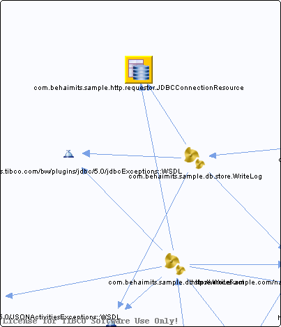

# JDBCConnectionResource.jdbcResource {#JDBCConnectionResource.jdbcResource .concept}

Chapter contains JDBCConnectionResource.jdbcResource crossreferences documentation.

Referenced From:

-   [com.behaimits.sample.db.store.WriteFact](../../../projects/com.behaimits.sample.http.requestor/Processes/com/behaimits/sample/db/store/WriteFact.bwp.md)
-   [com.behaimits.sample.db.store.WriteLog](../../../projects/com.behaimits.sample.http.requestor/Processes/com/behaimits/sample/db/store/WriteLog.bwp.md)

**Parent topic:**[Resources](../../../cross/dependencies/resources/resources.md)

