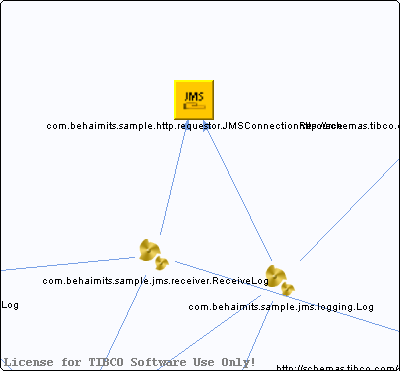

# JMSConnectionResource.jmsConnResource {#JMSConnectionResource.jmsConnResource .concept}

Chapter contains JMSConnectionResource.jmsConnResource crossreferences documentation.

Referenced From:

-   [com.behaimits.sample.jms.logging.Log](../../../projects/com.behaimits.sample.http.requestor/Processes/com/behaimits/sample/jms/logging/Log.bwp.md)
-   [com.behaimits.sample.jms.receiver.ReceiveLog](../../../projects/com.behaimits.sample.http.requestor/Processes/com/behaimits/sample/jms/receiver/ReceiveLog.bwp.md)

**Parent topic:**[Resources](../../../cross/dependencies/resources/resources.md)

