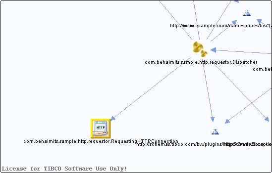

# RequestingHTTPConnection.httpClientResource {#RequestingHTTPConnection.httpClientResource .concept}

Chapter contains RequestingHTTPConnection.httpClientResource crossreferences documentation.

Referenced From:

-   [com.behaimits.sample.http.requestor.Dispatcher](../../../projects/com.behaimits.sample.http.requestor/Processes/com/behaimits/sample/http/requestor/Dispatcher.bwp.md)

**Parent topic:**[Resources](../../../cross/dependencies/resources/resources.md)

