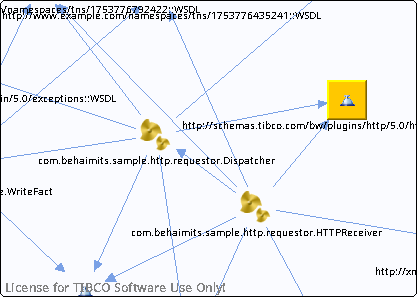

# http\_\_\_schemas.tibco.com\_bw\_plugins\_http\_5.0\_httpExceptions\_\_WSDL\_\_unresolved {#http___schemas.tibco.com_bw_plugins_http_5.0_httpExceptions__WSDL__unresolved .concept}

Chapter contains http\_\_\_schemas.tibco.com\_bw\_plugins\_http\_5.0\_httpExceptions\_\_WSDL\_\_unresolved crossreferences documentation.

Referenced From:

-   [com.behaimits.sample.http.requestor.Dispatcher](../../../projects/com.behaimits.sample.http.requestor/Processes/com/behaimits/sample/http/requestor/Dispatcher.bwp.md)
-   [com.behaimits.sample.http.requestor.HTTPReceiver](../../../projects/com.behaimits.sample.http.requestor/Processes/com/behaimits/sample/http/requestor/HTTPReceiver.bwp.md)

**Parent topic:**[WSDLs](../../../cross/dependencies/wsdls/wsdls.md)

