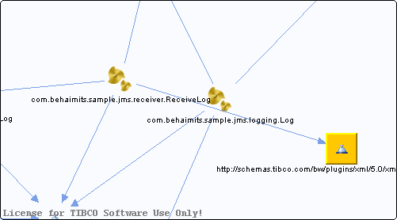

# http\_\_\_schemas.tibco.com\_bw\_plugins\_xml\_5.0\_xmlExceptions\_\_WSDL\_\_unresolved {#http___schemas.tibco.com_bw_plugins_xml_5.0_xmlExceptions__WSDL__unresolved .concept}

Chapter contains http\_\_\_schemas.tibco.com\_bw\_plugins\_xml\_5.0\_xmlExceptions\_\_WSDL\_\_unresolved crossreferences documentation.

Referenced From:

-   [com.behaimits.sample.jms.receiver.ReceiveLog](../../../projects/com.behaimits.sample.http.requestor/Processes/com/behaimits/sample/jms/receiver/ReceiveLog.bwp.md)

**Parent topic:**[WSDLs](../../../cross/dependencies/wsdls/wsdls.md)

