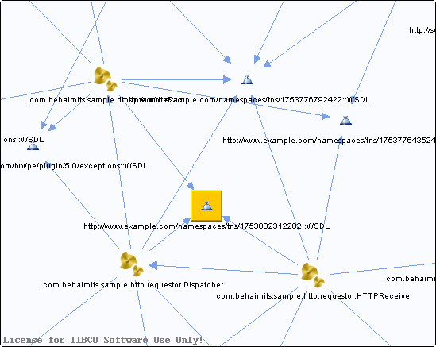

# http\_\_\_www.example.com\_namespaces\_tns\_1753802312202\_\_WSDL\_\_unresolved {#http___www.example.com_namespaces_tns_1753802312202__WSDL__unresolved .concept}

Chapter contains http\_\_\_www.example.com\_namespaces\_tns\_1753802312202\_\_WSDL\_\_unresolved crossreferences documentation.

Referenced From:

-   [com.behaimits.sample.db.store.WriteFact](../../../projects/com.behaimits.sample.http.requestor/Processes/com/behaimits/sample/db/store/WriteFact.bwp.md)
-   [com.behaimits.sample.http.requestor.Dispatcher](../../../projects/com.behaimits.sample.http.requestor/Processes/com/behaimits/sample/http/requestor/Dispatcher.bwp.md)
-   [com.behaimits.sample.http.requestor.HTTPReceiver](../../../projects/com.behaimits.sample.http.requestor/Processes/com/behaimits/sample/http/requestor/HTTPReceiver.bwp.md)

**Parent topic:**[WSDLs](../../../cross/dependencies/wsdls/wsdls.md)

