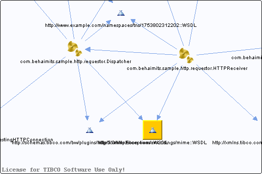

# http\_\_\_xmlns.tibco.com\_encodings\_mime\_\_WSDL\_\_unresolved {#http___xmlns.tibco.com_encodings_mime__WSDL__unresolved .concept}

Chapter contains http\_\_\_xmlns.tibco.com\_encodings\_mime\_\_WSDL\_\_unresolved crossreferences documentation.

Referenced From:

-   [com.behaimits.sample.http.requestor.Dispatcher](../../../projects/com.behaimits.sample.http.requestor/Processes/com/behaimits/sample/http/requestor/Dispatcher.bwp.md)
-   [com.behaimits.sample.http.requestor.HTTPReceiver](../../../projects/com.behaimits.sample.http.requestor/Processes/com/behaimits/sample/http/requestor/HTTPReceiver.bwp.md)

**Parent topic:**[WSDLs](../../../cross/dependencies/wsdls/wsdls.md)

