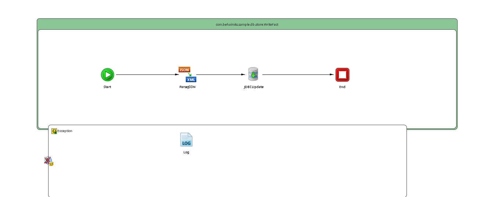

# WriteFact {#ProcessMain .concept}

License for TIBCO Software Use Only!

Section contains description of Process " WriteFact.bwp " .

**Parent topic:**[Processes](../../../../../../../../projects/com.behaimits.sample.http.requestor/common/process.md)

## Folder description: {#FolderDescription}

|Folder|Description|
|------|-----------|
| |No description|

## Process description: {#ProcessDescription}

|No description|

## Process definition: {#ProcessDefinition}

Full process path: com.behaimits.sample.db.store.WriteFact

## Diagram: {#Diagram}



## Process starter activity: {#Starter}

### Name: ***Start*** {#Start}

-   Create Instance: yes
-   Description:

## Process properties and variables {#ProcessVariables}

|Name|Type|Property Source|Default Value|
|----|----|---------------|-------------|
|\_processContext| | | |
|\_error| | | |
|jdbcProperty|xsd:string|JDBC\_CONNECTOR| |
|JDBC\_TIMEOUT|xsd:int|JDBC\_TIMEOUT| |
|JDBCUpdate-input| | | |
|JDBCUpdate| | | |
|\_error\_JDBCUpdate| | | |
|FaultName|xsd:string| | |
|FaultDetails| | | |
|Log-input| | | |
|ParseJSON-input| | | |
|ParseJSON| | | |
|\_error\_ParseJSON| | | |
|Start| | | |
|End-input| | | |

## Activities: {#Activities}

### Name: ***End*** {#End}

-   Description: *No description*
-   Type: bw.internal.end
-   Input Variable: *End-input*
-   *Input bindings:*
    -   Mapping table

        |Target|Source|
        |------|------|
        |*/tns6:AsciiContent/tns6:asciiContent*|**\$ParseJSON/tns5:fact**|

    -   Mapping tree

        ```
        tns6:AsciiContenttns6:asciiContent = $ParseJSON/tns5:fact
        ```

    -   Source code

        ```
        <?xml version="1.0" encoding="UTF-8"?>
        <xsl:stylesheet xmlns:xsl="http://www.w3.org/1999/XSL/Transform" xmlns:tns6="http://www.example.com/namespaces/tns/1753802312202" xmlns:tns5="http://www.example.com/namespaces/tns/1753776435241" version="2.0"><xsl:param name="ParseJSON"/><xsl:template name="End-input" match="/"><tns6:AsciiContent><tns6:asciiContent><xsl:value-of select="$ParseJSON/tns5:fact"/></tns6:asciiContent></tns6:AsciiContent></xsl:template></xsl:stylesheet>
        ```


### Name: ***JDBCUpdate*** {#JDBCUpdate}

-   Description: *No description*
-   Type: bw.jdbc.update
-   JDBC Shared Resource: [JDBC\_CONNECTOR](#default:%20com.behaimits.sample.http.requestor.JDBCConnectionResource,%20UnixProfile:%20com.behaimits.sample.http.requestor.JDBCConnectionResource,%20WindowsProfile:%20com.behaimits.sample.http.requestor.JDBCConnectionResource,)
-   Timeout \(sec\): 10
-   Statement: *INSERT INTO FACTS \(FACT, REQUEST\_DATE\_TIME\) VALUES \(?,?\)*
-   Parameters:

    No parameters

-   Thread Pool Shared Resource:
-   Insert if record doesn't exist: *false*
-   Override Transaction Behavior: *false*
-   Interpret Empty String As Null: *false*
-   Results Use Schema: *false*
-   Batch Update: *false*
-   Input Variable: *JDBCUpdate-input*
-   Output Variable: *JDBCUpdate*
-   *Input bindings:*
    -   Mapping table

        |Target|Source|
        |------|------|
        |*/tns3:jdbcUpdateActivityInput/FACT*|**\$ParseJSON/tns5:fact**|
        |*/tns3:jdbcUpdateActivityInput/REQUEST\_DATE\_TIME*|**current-dateTime\(\)**|

    -   Mapping tree

        ```
        tns3:jdbcUpdateActivityInputFACT = $ParseJSON/tns5:factREQUEST\_DATE\_TIME = current-dateTime()
        ```

    -   Source code

        ```
        <?xml version="1.0" encoding="UTF-8"?>
        <xsl:stylesheet xmlns:xsl="http://www.w3.org/1999/XSL/Transform" xmlns:tns3="http://www.tibco.com/namespaces/tnt/plugins/jdbc+4e0c5b48-0434-4246-9dec-476740a40216+input" xmlns:tns5="http://www.example.com/namespaces/tns/1753776435241" xmlns:xsi="http://www.w3.org/2001/XMLSchema-instance" version="2.0"><xsl:param name="ParseJSON"/><xsl:template name="JDBCUpdate-input" match="/"><tns3:jdbcUpdateActivityInput><FACT><xsl:value-of select="$ParseJSON/tns5:fact"/></FACT><REQUEST_DATE_TIME><xsl:value-of select="current-dateTime()"/></REQUEST_DATE_TIME></tns3:jdbcUpdateActivityInput></xsl:template></xsl:stylesheet>
        ```


### Name: ***Log*** {#Log}

-   Description: *No description*
-   Type: bw.generalactivities.log
-   Logger Name:
-   Log level: *Info*
-   Suppress Job Info: *true*
-   Input Variable: *Log-input*
-   *Input bindings:*
    -   Mapping table

        |Target|Source|
        |------|------|
        |*/tns:ActivityInput/\[IF\] **\$\_error/MsgCode**/msgCode*|**\$\_error/MsgCode**|
        |*/tns:ActivityInput/logLevel*|**"Error"**|
        |*/tns:ActivityInput/message*|**\$\_error/Msg**|

    -   Mapping tree

        ```
        tns:ActivityInputxsl:if test="\$\_error/MsgCode"msgCode = $_error/MsgCodelogLevel = &quot;Error&quot;message = $_error/Msg
        ```

    -   Source code

        ```
        <?xml version="1.0" encoding="UTF-8"?>
        <xsl:stylesheet xmlns:xsl="http://www.w3.org/1999/XSL/Transform" xmlns:tns="http://www.tibco.com/pe/WriteToLogActivitySchema" version="2.0"><xsl:param name="_error"/><xsl:template name="Log-input" match="/"><tns:ActivityInput><xsl:if test="$_error/MsgCode"><msgCode><xsl:value-of select="$_error/MsgCode"/></msgCode></xsl:if><logLevel><xsl:value-of select="&quot;Error&quot;"/></logLevel><message><xsl:value-of select="$_error/Msg"/></message></tns:ActivityInput></xsl:template></xsl:stylesheet>
        ```


### Name: ***ParseJSON*** {#ParseJSON}

-   Description: *No description*
-   Type: bw.restjson.JsonParser
-   Schema Type: Xsd
-   Badgerfish: false
-   Input Json Style: None
-   Use Null Values For Empty Values: false
-   Input Variable: *ParseJSON-input*
-   Output Variable: *ParseJSON*
-   *Input bindings:*
    -   Mapping table

        |Target|Source|
        |------|------|
        |*/tns4:ActivityInputClass/jsonString*|**\$Start/tns6:asciiContent**|

    -   Mapping tree

        ```
        
                tns4:ActivityInputClass
                    jsonString = $Start/tns6:asciiContent
        ```

    -   Source code

        ```
        <?xml version="1.0" encoding="UTF-8"?>
        <xsl:stylesheet xmlns:xsl="http://www.w3.org/1999/XSL/Transform" xmlns:tns4="activity.jsonParser.input+b5a77a81-e3bf-4e35-b8fe-95ae0ddcc52a+ActivityInputType" xmlns:tns6="http://www.example.com/namespaces/tns/1753802312202" version="2.0">
            <xsl:param name="Start"/>
            <xsl:template name="ParseJSON-input" match="/">
                <tns4:ActivityInputClass>
                    <jsonString>
                        <xsl:value-of select="$Start/tns6:asciiContent"/>
                    </jsonString>
                </tns4:ActivityInputClass>
            </xsl:template>
        </xsl:stylesheet>
        ```


## Transitions: {#Transitions}

-   From: ***JDBCUpdate*** -To: ***End***
    -   Label: **
    -   Type: SUCCESS

-   From: ***Start*** -To: ***ParseJSON***
    -   Label: **
    -   Type: SUCCESS

-   From: ***ParseJSON*** -To: ***JDBCUpdate***
    -   Label: **
    -   Type: SUCCESS

