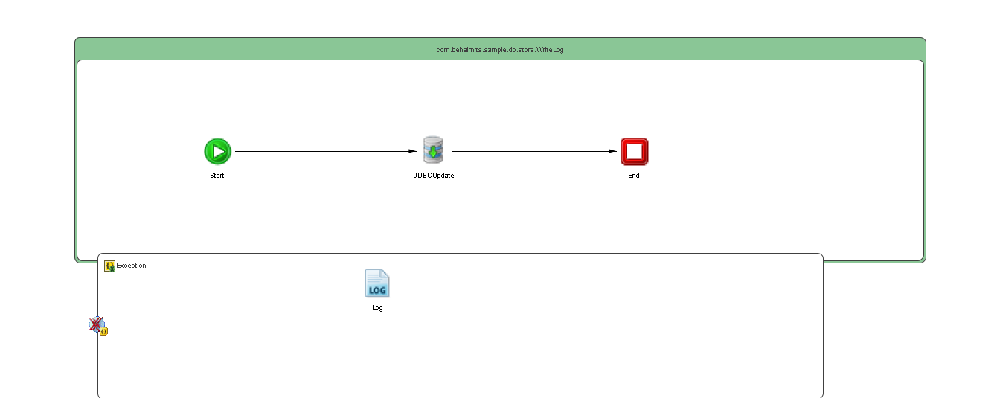

# WriteLog {#ProcessMain .concept}

License for TIBCO Software Use Only!

Section contains description of Process " WriteLog.bwp " .

**Parent topic:**[Processes](../../../../../../../../projects/com.behaimits.sample.http.requestor/common/process.md)

## Folder description: {#FolderDescription}

|Folder|Description|
|------|-----------|
| |No description|

## Process description: {#ProcessDescription}

|No description|

## Process definition: {#ProcessDefinition}

Full process path: com.behaimits.sample.db.store.WriteLog

## Diagram: {#Diagram}



## Process starter activity: {#Starter}

### Name: ***Start*** {#Start}

-   Create Instance: yes
-   Description:

## Process properties and variables {#ProcessVariables}

|Name|Type|Property Source|Default Value|
|----|----|---------------|-------------|
|\_processContext| | | |
|\_error| | | |
|jdbcProperty|xsd:string|JDBC\_CONNECTOR| |
|JDBC\_TIMEOUT|xsd:int|JDBC\_TIMEOUT| |
|Start| | | |
|JDBCUpdate-input| | | |
|JDBCUpdate| | | |
|\_error\_JDBCUpdate| | | |
|FaultName|xsd:string| | |
|FaultDetails| | | |
|Log-input| | | |

## Activities: {#Activities}

### Name: ***End*** {#End}

-   Description: *No description*
-   Type: bw.internal.end
-   *Input bindings:* No mapping

### Name: ***JDBCUpdate*** {#JDBCUpdate}

-   Description: *No description*
-   Type: bw.jdbc.update
-   JDBC Shared Resource: [JDBC\_CONNECTOR](#default:%20com.behaimits.sample.http.requestor.JDBCConnectionResource,%20UnixProfile:%20com.behaimits.sample.http.requestor.JDBCConnectionResource,%20WindowsProfile:%20com.behaimits.sample.http.requestor.JDBCConnectionResource,)
-   Timeout \(sec\): 10
-   Statement: *INSERT INTO LOG\_MESSAGE \(LOG\_LEVEL, LOG\_MESSAGE, OCCURED\) VALUES \(?,?,?\)*
-   Parameters:

    No parameters

-   Thread Pool Shared Resource:
-   Insert if record doesn't exist: *false*
-   Override Transaction Behavior: *false*
-   Interpret Empty String As Null: *false*
-   Results Use Schema: *false*
-   Batch Update: *false*
-   Input Variable: *JDBCUpdate-input*
-   Output Variable: *JDBCUpdate*
-   *Input bindings:*
    -   Mapping table

        |Target|Source|
        |------|------|
        |*/tns3:jdbcUpdateActivityInput/LOG\_LEVEL*|**\$Start/tns2:LOG\_LEVEL**|
        |*/tns3:jdbcUpdateActivityInput/LOG\_MESSAGE*|**\$Start/tns2:LOG\_MESSAGE**|
        |*/tns3:jdbcUpdateActivityInput/OCCURED*|**\$Start/tns2:OCCURED**|

    -   Mapping tree

        ```
        tns3:jdbcUpdateActivityInputLOG\_LEVEL = $Start/tns2:LOG_LEVELLOG\_MESSAGE = $Start/tns2:LOG_MESSAGEOCCURED = $Start/tns2:OCCURED
        ```

    -   Source code

        ```
        <?xml version="1.0" encoding="UTF-8"?>
        <xsl:stylesheet xmlns:xsl="http://www.w3.org/1999/XSL/Transform" xmlns:tns3="http://www.tibco.com/namespaces/tnt/plugins/jdbc+4e0c5b48-0434-4246-9dec-476740a40216+input" xmlns:tns2="http://www.example.com/namespaces/tns/1753776792422" version="2.0"><xsl:param name="Start"/><xsl:template name="JDBCUpdate-input" match="/"><tns3:jdbcUpdateActivityInput><LOG_LEVEL><xsl:value-of select="$Start/tns2:LOG_LEVEL"/></LOG_LEVEL><LOG_MESSAGE><xsl:value-of select="$Start/tns2:LOG_MESSAGE"/></LOG_MESSAGE><OCCURED><xsl:value-of select="$Start/tns2:OCCURED"/></OCCURED></tns3:jdbcUpdateActivityInput></xsl:template></xsl:stylesheet>
        ```


### Name: ***Log*** {#Log}

-   Description: *No description*
-   Type: bw.generalactivities.log
-   Logger Name:
-   Log level: *Info*
-   Suppress Job Info: *true*
-   Input Variable: *Log-input*
-   *Input bindings:*
    -   Mapping table

        |Target|Source|
        |------|------|
        |*/tns:ActivityInput/\[IF\] **\$\_error/MsgCode**/msgCode*|**\$\_error/MsgCode**|
        |*/tns:ActivityInput/logLevel*|**"Error"**|
        |*/tns:ActivityInput/message*|**\$\_error/Msg**|

    -   Mapping tree

        ```
        tns:ActivityInputxsl:if test="\$\_error/MsgCode"msgCode = $_error/MsgCodelogLevel = &quot;Error&quot;message = $_error/Msg
        ```

    -   Source code

        ```
        <?xml version="1.0" encoding="UTF-8"?>
        <xsl:stylesheet xmlns:xsl="http://www.w3.org/1999/XSL/Transform" xmlns:tns="http://www.tibco.com/pe/WriteToLogActivitySchema" version="2.0"><xsl:param name="_error"/><xsl:template name="Log-input" match="/"><tns:ActivityInput><xsl:if test="$_error/MsgCode"><msgCode><xsl:value-of select="$_error/MsgCode"/></msgCode></xsl:if><logLevel><xsl:value-of select="&quot;Error&quot;"/></logLevel><message><xsl:value-of select="$_error/Msg"/></message></tns:ActivityInput></xsl:template></xsl:stylesheet>
        ```


## Transitions: {#Transitions}

-   From: ***JDBCUpdate*** -To: ***End***
    -   Label: **
    -   Type: SUCCESS

-   From: ***Start*** -To: ***JDBCUpdate***
    -   Label: **
    -   Type: SUCCESS

