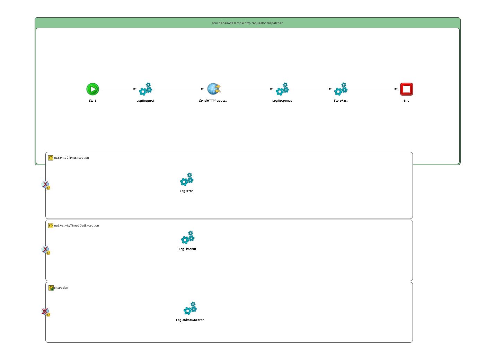

# Dispatcher {#ProcessMain .concept}

License for TIBCO Software Use Only!

Section contains description of Process " Dispatcher.bwp " .

**Parent topic:**[Processes](../../../../../../../../projects/com.behaimits.sample.http.requestor/common/process.md)

## Folder description: {#FolderDescription}

|Folder|Description|
|------|-----------|
| |No description|

## Process description: {#ProcessDescription}

|No description|

## Process definition: {#ProcessDefinition}

Full process path: com.behaimits.sample.http.requestor.Dispatcher

## Diagram: {#Diagram}



## Process starter activity: {#Starter}

### Name: ***Start*** {#Start}

-   Create Instance: yes
-   Description:

## Process properties and variables {#ProcessVariables}

|Name|Type|Property Source|Default Value|
|----|----|---------------|-------------|
|\_processContext| | | |
|LogRequest-input| | | |
|LogResponse-input| | | |
|httpClientResource|xsd:string|REQUESTING\_HTTP\_CONNECTION| |
|SendHTTPRequest-input| | | |
|SendHTTPRequest| | | |
|\_error\_SendHTTPRequest| | | |
|LogError-input| | | |
|FaultName|xsd:string| | |
|FaultDetails| | | |
|LogUn-input| | | |
|LogTimeout-input| | | |
|StoreFact-input| | | |
|End-input| | | |
|StoreFact| | | |

## Activities: {#Activities}

### Name: ***End*** {#End}

-   Description: *No description*
-   Type: bw.internal.end
-   Input Variable: *End-input*
-   *Input bindings:*
    -   Mapping table

        |Target|Source|
        |------|------|
        |**/tns3:AsciiContent****/tns3:asciiContent**|$StoreFact/tns3:asciiContent|

    -   Mapping tree

        ```
        **tns3:AsciiContenttns3:asciiContent = **$StoreFact/tns3:asciiContent
        ```

    -   Source code

        ```
        <?xml version="1.0" encoding="UTF-8"?>
        <xsl:stylesheet xmlns:xsl="http://www.w3.org/1999/XSL/Transform" xmlns:tns3="http://www.example.com/namespaces/tns/1753802312202" version="2.0"><xsl:param name="StoreFact"/><xsl:template name="End-input" match="/"><tns3:AsciiContent><tns3:asciiContent><xsl:value-of select="$StoreFact/tns3:asciiContent"/></tns3:asciiContent></tns3:AsciiContent></xsl:template></xsl:stylesheet>
        ```


### Name: ***LogError*** {#LogError}

-   Description: *No description*
-   Input Variable: *LogError-input*
-   *Input bindings:*
    -   Mapping table

        |Target|Source|
        |------|------|
        |**/tns:LogMessage****/tns:LOG\_LEVEL**|"Error"|
        |**/tns:LogMessage****/tns:LOG\_MESSAGE**|concat\("Calling cat facts failed: ",tib:render-xml\($\_error\_SendHTTPRequest/\*, true\(\), true\(\)\)\)|
        |**/tns:LogMessage****/tns:OCCURED**|current-dateTime\(\)|

    -   Mapping tree

        ```
        **tns:LogMessagetns:LOG\_LEVEL = **&quot;Error&quot;**tns:LOG\_MESSAGE = **concat(&quot;Calling cat facts failed: &quot;,tib:render-xml($_error_SendHTTPRequest/*, true(), true()))**tns:OCCURED = **current-dateTime()
        ```

    -   Source code

        ```
        <?xml version="1.0" encoding="UTF-8"?>
        <xsl:stylesheet xmlns:xsl="http://www.w3.org/1999/XSL/Transform" xmlns:tns="http://www.example.com/namespaces/tns/1753776792422" xmlns:tib="http://www.tibco.com/bw/xslt/custom-functions" version="2.0"><xsl:param name="_error_SendHTTPRequest"/><xsl:template name="LogError-input" match="/"><tns:LogMessage><tns:LOG_LEVEL><xsl:value-of select="&quot;Error&quot;"/></tns:LOG_LEVEL><tns:LOG_MESSAGE><xsl:value-of select="concat(&quot;Calling cat facts failed: &quot;,tib:render-xml($_error_SendHTTPRequest/*, true(), true()))"/></tns:LOG_MESSAGE><tns:OCCURED><xsl:value-of select="current-dateTime()"/></tns:OCCURED></tns:LogMessage></xsl:template></xsl:stylesheet>
        ```

-   Spawn: *false*
-   Subprocess: [com.behaimits.sample.http.requestor/Processes/com/behaimits/sample/jms/logging/Log.bwp](../../jms/logging/Log.bwp.md)

### Name: ***LogRequest*** {#LogRequest}

-   Description: *No description*
-   Input Variable: *LogRequest-input*
-   *Input bindings:*
    -   Mapping table

        |Target|Source|
        |------|------|
        |**/tns:LogMessage****/tns:LOG\_LEVEL**|"Info"|
        |**/tns:LogMessage****/tns:LOG\_MESSAGE**|"Calling cat facts"|
        |**/tns:LogMessage****/tns:OCCURED**|current-dateTime\(\)|

    -   Mapping tree

        ```
        **tns:LogMessagetns:LOG\_LEVEL = **&quot;Info&quot;**tns:LOG\_MESSAGE = **&quot;Calling cat facts&quot;**tns:OCCURED = **current-dateTime()
        ```

    -   Source code

        ```
        <?xml version="1.0" encoding="UTF-8"?>
        <xsl:stylesheet xmlns:xsl="http://www.w3.org/1999/XSL/Transform" xmlns:tns="http://www.example.com/namespaces/tns/1753776792422" version="2.0"><xsl:template name="LogRequest-input" match="/"><tns:LogMessage><tns:LOG_LEVEL><xsl:value-of select="&quot;Info&quot;"/></tns:LOG_LEVEL><tns:LOG_MESSAGE><xsl:value-of select="&quot;Calling cat facts&quot;"/></tns:LOG_MESSAGE><tns:OCCURED><xsl:value-of select="current-dateTime()"/></tns:OCCURED></tns:LogMessage></xsl:template></xsl:stylesheet>
        ```

-   Spawn: *false*
-   Subprocess: [com.behaimits.sample.http.requestor/Processes/com/behaimits/sample/jms/logging/Log.bwp](../../jms/logging/Log.bwp.md)

### Name: ***LogResponse*** {#LogResponse}

-   Description: *No description*
-   Input Variable: *LogResponse-input*
-   *Input bindings:*
    -   Mapping table

        |Target|Source|
        |------|------|
        |**/tns:LogMessage****/tns:LOG\_LEVEL**|"Info"|
        |**/tns:LogMessage****/tns:LOG\_MESSAGE**|"Response received."|
        |**/tns:LogMessage****/tns:OCCURED**|current-dateTime\(\)|

    -   Mapping tree

        ```
        **tns:LogMessagetns:LOG\_LEVEL = **&quot;Info&quot;**tns:LOG\_MESSAGE = **&quot;Response received.&quot;**tns:OCCURED = **current-dateTime()
        ```

    -   Source code

        ```
        <?xml version="1.0" encoding="UTF-8"?>
        <xsl:stylesheet xmlns:xsl="http://www.w3.org/1999/XSL/Transform" xmlns:tns="http://www.example.com/namespaces/tns/1753776792422" version="2.0"><xsl:template name="LogResponse-input" match="/"><tns:LogMessage><tns:LOG_LEVEL><xsl:value-of select="&quot;Info&quot;"/></tns:LOG_LEVEL><tns:LOG_MESSAGE><xsl:value-of select="&quot;Response received.&quot;"/></tns:LOG_MESSAGE><tns:OCCURED><xsl:value-of select="current-dateTime()"/></tns:OCCURED></tns:LogMessage></xsl:template></xsl:stylesheet>
        ```

-   Spawn: *false*
-   Subprocess: [com.behaimits.sample.http.requestor/Processes/com/behaimits/sample/jms/logging/Log.bwp](../../jms/logging/Log.bwp.md)

### Name: ***LogTimeout*** {#LogTimeout}

-   Description: *No description*
-   Input Variable: *LogTimeout-input*
-   *Input bindings:*
    -   Mapping table

        |Target|Source|
        |------|------|
        |**/tns:LogMessage****/tns:LOG\_LEVEL**|"Error"|
        |**/tns:LogMessage****/tns:LOG\_MESSAGE**|"Calling cat facts timed out. "|
        |**/tns:LogMessage****/tns:OCCURED**|current-dateTime\(\)|

    -   Mapping tree

        ```
        **tns:LogMessagetns:LOG\_LEVEL = **&quot;Error&quot;**tns:LOG\_MESSAGE = **&quot;Calling cat facts timed out. &quot;**tns:OCCURED = **current-dateTime()
        ```

    -   Source code

        ```
        <?xml version="1.0" encoding="UTF-8"?>
        <xsl:stylesheet xmlns:xsl="http://www.w3.org/1999/XSL/Transform" xmlns:tns="http://www.example.com/namespaces/tns/1753776792422" xmlns:tib="http://www.tibco.com/bw/xslt/custom-functions" version="2.0"><xsl:template name="LogTimeout-input" match="/"><tns:LogMessage><tns:LOG_LEVEL><xsl:value-of select="&quot;Error&quot;"/></tns:LOG_LEVEL><tns:LOG_MESSAGE><xsl:value-of select="&quot;Calling cat facts timed out. &quot;"/></tns:LOG_MESSAGE><tns:OCCURED><xsl:value-of select="current-dateTime()"/></tns:OCCURED></tns:LogMessage></xsl:template></xsl:stylesheet>
        ```

-   Spawn: *false*
-   Subprocess: [com.behaimits.sample.http.requestor/Processes/com/behaimits/sample/jms/logging/Log.bwp](../../jms/logging/Log.bwp.md)

### Name: ***LogUnknownError*** {#LogUnknownError}

-   Description: *No description*
-   Input Variable: *LogUn-input*
-   *Input bindings:*
    -   Mapping table

        |Target|Source|
        |------|------|
        |**/tns:LogMessage****/tns:LOG\_LEVEL**|"Error"|
        |**/tns:LogMessage****/tns:LOG\_MESSAGE**|concat\("Unknown error occured: ",tib:render-xml\($\_error\_SendHTTPRequest/\*, true\(\), true\(\)\)\)|
        |**/tns:LogMessage****/tns:OCCURED**|current-dateTime\(\)|

    -   Mapping tree

        ```
        **tns:LogMessagetns:LOG\_LEVEL = **&quot;Error&quot;**tns:LOG\_MESSAGE = **concat(&quot;Unknown error occured: &quot;,tib:render-xml($_error_SendHTTPRequest/*, true(), true()))**tns:OCCURED = **current-dateTime()
        ```

    -   Source code

        ```
        <?xml version="1.0" encoding="UTF-8"?>
        <xsl:stylesheet xmlns:xsl="http://www.w3.org/1999/XSL/Transform" xmlns:tns="http://www.example.com/namespaces/tns/1753776792422" xmlns:tib="http://www.tibco.com/bw/xslt/custom-functions" version="2.0"><xsl:param name="_error_SendHTTPRequest"/><xsl:template name="LogUn-input" match="/"><tns:LogMessage><tns:LOG_LEVEL><xsl:value-of select="&quot;Error&quot;"/></tns:LOG_LEVEL><tns:LOG_MESSAGE><xsl:value-of select="concat(&quot;Unknown error occured: &quot;,tib:render-xml($_error_SendHTTPRequest/*, true(), true()))"/></tns:LOG_MESSAGE><tns:OCCURED><xsl:value-of select="current-dateTime()"/></tns:OCCURED></tns:LogMessage></xsl:template></xsl:stylesheet>
        ```

-   Spawn: *false*
-   Subprocess: [com.behaimits.sample.http.requestor/Processes/com/behaimits/sample/jms/logging/Log.bwp](../../jms/logging/Log.bwp.md)

### Name: ***SendHTTPRequest*** {#SendHTTPRequest}

-   Description: *No description*
-   Type: bw.http.sendHTTPRequest
-   HTTP Client: [REQUESTING\_HTTP\_CONNECTION](#default:%20com.behaimits.sample.http.requestor.RequestingHTTPConnection,%20UnixProfile:%20com.behaimits.sample.http.requestor.RequestingHTTPConnection,%20WindowsProfile:%20com.behaimits.sample.http.requestor.RequestingHTTPConnection,)
-   Parameters:

    No Parameters

-   Write To File: *false*
-   Directory:
-   Create Non-Existing Directories: **
-   Threshold Data Size\(bytes\):
-   Input Variable: *SendHTTPRequest-input*
-   Output Variable: *SendHTTPRequest*
-   *Input bindings:*
    -   Mapping table

        |Target|Source|
        |------|------|
        |**/tns2:RequestActivityInput****/RequestURI**|"/fact"|
        |**/tns2:RequestActivityInput**|**/Headers**|

    -   Mapping tree

        ```
        **tns2:RequestActivityInputRequestURI = **&quot;/fact&quot;
        ```

    -   Source code

        ```
        <?xml version="1.0" encoding="UTF-8"?>
        <xsl:stylesheet xmlns:xsl="http://www.w3.org/1999/XSL/Transform" xmlns:tns2="http://tns.tibco.com/bw/activity/sendhttprequest/input+c3ecb818-e93b-4ce3-a1ce-b97d6d07a9f5+RequestActivityInput" version="2.0"><xsl:template name="SendHTTPRequest-input" match="/"><tns2:RequestActivityInput><RequestURI><xsl:value-of select="&quot;/fact&quot;"/></RequestURI><Headers/></tns2:RequestActivityInput></xsl:template></xsl:stylesheet>
        ```


### Name: ***StoreFact*** {#StoreFact}

-   Description: *No description*
-   Input Variable: *StoreFact-input*
-   Output Variable: *StoreFact*
-   *Input bindings:*
    -   Mapping table

        |Target|Source|
        |------|------|
        |**/tns3:AsciiContent****/tns3:asciiContent**|$SendHTTPRequest/asciiContent|

    -   Mapping tree

        ```
        **
                tns3:AsciiContent
                    tns3:asciiContent = **$SendHTTPRequest/asciiContent
        ```

    -   Source code

        ```
        <?xml version="1.0" encoding="UTF-8"?>
        <xsl:stylesheet xmlns:xsl="http://www.w3.org/1999/XSL/Transform" xmlns:tns3="http://www.example.com/namespaces/tns/1753802312202" version="2.0">
            <xsl:param name="SendHTTPRequest"/>
            <xsl:template name="StoreFact-input" match="/">
                <tns3:AsciiContent>
                    <tns3:asciiContent>
                        <xsl:value-of select="$SendHTTPRequest/asciiContent"/>
                    </tns3:asciiContent>
                </tns3:AsciiContent>
            </xsl:template>
        </xsl:stylesheet>
        ```

-   Spawn: *false*
-   Subprocess: [com.behaimits.sample.http.requestor/Processes/com/behaimits/sample/db/store/WriteFact.bwp](../../db/store/WriteFact.bwp.md)

## Transitions: {#Transitions}

-   From: ***Start*** -To: ***LogRequest***
    -   Label: **
    -   Type: SUCCESS

-   From: ***LogRequest*** -To: ***SendHTTPRequest***
    -   Label: **
    -   Type: SUCCESS

-   From: ***SendHTTPRequest*** -To: ***LogResponse***
    -   Label: **
    -   Type: SUCCESS

-   From: ***LogResponse*** -To: ***StoreFact***
    -   Label: **
    -   Type: SUCCESS

-   From: ***StoreFact*** -To: ***End***
    -   Label: **
    -   Type: SUCCESS

