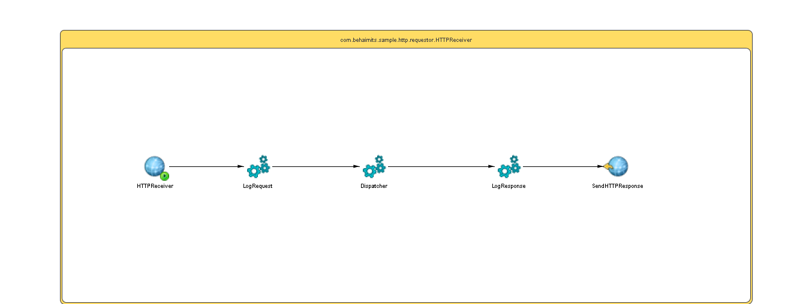

# HTTPReceiver {#ProcessMain .concept}

License for TIBCO Software Use Only!

Section contains description of Process " HTTPReceiver.bwp " .

**Parent topic:**[Processes](../../../../../../../../projects/com.behaimits.sample.http.requestor/common/process.md)

## Folder description: {#FolderDescription}

|Folder|Description|
|------|-----------|
| |No description|

## Process description: {#ProcessDescription}

|No description|

## Process definition: {#ProcessDefinition}

Full process path: com.behaimits.sample.http.requestor.HTTPReceiver

## Diagram: {#Diagram}



## Process starter activity: {#Starter}

### Name: ***HTTPReceiver*** {#HTTPReceiver}

-   HTTP Connection:
-   Context Path:
-   Path Spec:
-   Output Style: String
-   Parse Post Method Data: *false*
-   Expose Security Context: false
-   Default Encoding:
-   Write To File: false
-   Create Instance: yes
-   Description:

## Process properties and variables {#ProcessVariables}

|Name|Type|Property Source|Default Value|
|----|----|---------------|-------------|
|\_processContext| | | |
|httpConnectorResource|xsd:string|LISTENING\_HTTP\_CONNECTION| |
|HTTPReceiver| | | |
|SendHTTPResponse-input| | | |
|\_error\_SendHTTPResponse| | | |
|LogRequest-input| | | |
|Dispatcher| | | |
|LogResponse-input| | | |

## Activities: {#Activities}

### Name: ***Dispatcher*** {#Dispatcher}

-   Description: *No description*
-   Output Variable: *Dispatcher*
-   *Input bindings:* No mapping
-   Spawn: *false*
-   Subprocess: [com.behaimits.sample.http.requestor/Processes/com/behaimits/sample/http/requestor/Dispatcher.bwp](Dispatcher.bwp.md)

### Name: ***LogRequest*** {#LogRequest}

-   Description: *No description*
-   Input Variable: *LogRequest-input*
-   *Input bindings:*
    -   Mapping table

        |Target|Source|
        |------|------|
        |**/tns4:LogMessage****/tns4:LOG\_LEVEL**|"Info"|
        |**/tns4:LogMessage****/tns4:LOG\_MESSAGE**|concat\("Request received:" , $HTTPReceiver/RequestURI\)|
        |**/tns4:LogMessage****/tns4:OCCURED**|current-dateTime\(\)|

    -   Mapping tree

        ```
        **
                tns4:LogMessage
                    tns4:LOG\_LEVEL = **&quot;Info&quot;**
                    tns4:LOG\_MESSAGE = **concat(&quot;Request received:&quot; , $HTTPReceiver/RequestURI)**
                    tns4:OCCURED = **current-dateTime()
        ```

    -   Source code

        ```
        <?xml version="1.0" encoding="UTF-8"?>
        <xsl:stylesheet xmlns:xsl="http://www.w3.org/1999/XSL/Transform" xmlns:tns4="http://www.example.com/namespaces/tns/1753776792422" version="2.0">
            <xsl:param name="HTTPReceiver"/>
            <xsl:template name="LogRequest-input" match="/">
                <tns4:LogMessage>
                    <tns4:LOG_LEVEL>
                        <xsl:value-of select="&quot;Info&quot;"/>
                    </tns4:LOG_LEVEL>
                    <tns4:LOG_MESSAGE>
                        <xsl:value-of select="concat(&quot;Request received:&quot; , $HTTPReceiver/RequestURI)"/>
                    </tns4:LOG_MESSAGE>
                    <tns4:OCCURED>
                        <xsl:value-of select="current-dateTime()"/>
                    </tns4:OCCURED>
                </tns4:LogMessage>
            </xsl:template>
        </xsl:stylesheet>
        ```

-   Spawn: *false*
-   Subprocess: [com.behaimits.sample.http.requestor/Processes/com/behaimits/sample/jms/logging/Log.bwp](../../jms/logging/Log.bwp.md)

### Name: ***LogResponse*** {#LogResponse}

-   Description: *No description*
-   Input Variable: *LogResponse-input*
-   *Input bindings:*
    -   Mapping table

        |Target|Source|
        |------|------|
        |**/tns4:LogMessage****/tns4:LOG\_LEVEL**|"Info"|
        |**/tns4:LogMessage****/tns4:LOG\_MESSAGE**|concat\("Sending response to client:" , $Dispatcher/tns1:asciiContent\)|
        |**/tns4:LogMessage****/tns4:OCCURED**|current-dateTime\(\)|

    -   Mapping tree

        ```
        **tns4:LogMessagetns4:LOG\_LEVEL = **&quot;Info&quot;**tns4:LOG\_MESSAGE = **concat(&quot;Sending response to client:&quot; , $Dispatcher/tns1:asciiContent)**tns4:OCCURED = **current-dateTime()
        ```

    -   Source code

        ```
        <?xml version="1.0" encoding="UTF-8"?>
        <xsl:stylesheet xmlns:xsl="http://www.w3.org/1999/XSL/Transform" xmlns:tns4="http://www.example.com/namespaces/tns/1753776792422" xmlns:tns="http://www.example.com/namespaces/tns/1753776435241" xmlns:tns1="http://www.example.com/namespaces/tns/1753802312202" version="2.0"><xsl:param name="Dispatcher"/><xsl:template name="LogResponse-input" match="/"><tns4:LogMessage><tns4:LOG_LEVEL><xsl:value-of select="&quot;Info&quot;"/></tns4:LOG_LEVEL><tns4:LOG_MESSAGE><xsl:value-of select="concat(&quot;Sending response to client:&quot; , $Dispatcher/tns1:asciiContent)"/></tns4:LOG_MESSAGE><tns4:OCCURED><xsl:value-of select="current-dateTime()"/></tns4:OCCURED></tns4:LogMessage></xsl:template></xsl:stylesheet>
        ```

-   Spawn: *false*
-   Subprocess: [com.behaimits.sample.http.requestor/Processes/com/behaimits/sample/jms/logging/Log.bwp](../../jms/logging/Log.bwp.md)

### Name: ***SendHTTPResponse*** {#SendHTTPResponse}

-   Description: *No description*
-   Type: bw.http.sendHTTPResponse
-   Reply For: *HTTPReceiver*
-   Flush Response: *true*
-   Close connection: *true*
-   Input Variable: *SendHTTPResponse-input*
-   *Input bindings:*
    -   Mapping table

        |Target|Source|
        |------|------|
        |**/tns2:ResponseActivityInput****/asciiContent**|$Dispatcher/tns1:asciiContent|
        |**/tns2:ResponseActivityInput****/Headers****/Content-Type**|"text/plain"|

    -   Mapping tree

        ```
        **tns2:ResponseActivityInputasciiContent = **$Dispatcher/tns1:asciiContent**HeadersContent-Type = **&quot;text/plain&quot;
        ```

    -   Source code

        ```
        <?xml version="1.0" encoding="UTF-8"?>
        <xsl:stylesheet xmlns:xsl="http://www.w3.org/1999/XSL/Transform" xmlns:tns2="http://tns.tibco.com/bw/activity/sendhttpresponse/xsd/input+1c23a2dc-7d4b-43d4-8969-53d0b208cca7+ResponseActivityInput" xmlns:tns1="http://www.example.com/namespaces/tns/1753802312202" version="2.0"><xsl:param name="Dispatcher"/><xsl:template name="SendHTTPResponse-input" match="/"><tns2:ResponseActivityInput><asciiContent><xsl:value-of select="$Dispatcher/tns1:asciiContent"/></asciiContent><Headers><Content-Type><xsl:value-of select="&quot;text/plain&quot;"/></Content-Type></Headers></tns2:ResponseActivityInput></xsl:template></xsl:stylesheet>
        ```


## Transitions: {#Transitions}

-   From: ***LogRequest*** -To: ***Dispatcher***
    -   Label: **
    -   Type: SUCCESS

-   From: ***Dispatcher*** -To: ***LogResponse***
    -   Label: **
    -   Type: SUCCESS

-   From: ***LogResponse*** -To: ***SendHTTPResponse***
    -   Label: **
    -   Type: SUCCESS

-   From: ***HTTPReceiver*** -To: ***LogRequest***
    -   Label: **
    -   Type: SUCCESS

