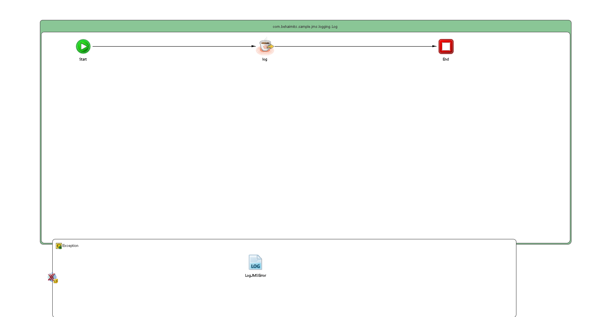

# Log {#ProcessMain .concept}

License for TIBCO Software Use Only!

Section contains description of Process " Log.bwp " .

**Parent topic:**[Processes](../../../../../../../../projects/com.behaimits.sample.http.requestor/common/process.md)

## Folder description: {#FolderDescription}

|Folder|Description|
|------|-----------|
| |No description|

## Process description: {#ProcessDescription}

|No description|

## Process definition: {#ProcessDefinition}

Full process path: com.behaimits.sample.jms.logging.Log

## Diagram: {#Diagram}



## Process starter activity: {#Starter}

### Name: ***Start*** {#Start}

-   Create Instance: yes
-   Description:

## Process properties and variables {#ProcessVariables}

|Name|Type|Property Source|Default Value|
|----|----|---------------|-------------|
|\_processContext| | | |
|log-input| | | |
|log| | | |
|\_error\_log| | | |
|\_error| | | |
|jmsConnection|xsd:string| |com.behaimits.sample.http.requestor.JMSConnectionResource|
|FaultName|xsd:string| | |
|FaultDetails| | | |
|LogJMSError-input| | | |
|LOGGING\_QUEUE|xsd:string|LOGGING\_QUEUE| |
|Start| | | |

## Activities: {#Activities}

### Name: ***End*** {#End}

-   Description: *No description*
-   Type: bw.internal.end
-   *Input bindings:* No mapping

### Name: ***log*** {#log}

-   Description: *No description*
-   Type: bw.jms.send
-   JMS Connection: [jmsConnection](../../../../../../Resources/com/behaimits/sample/http/requestor/JMSConnectionResource.jmsConnResource.md)
-   Messaging Style: *Queue*
-   Destination: [LOGGING\_QUEUE](#default:%20com.behaimits.sample.http.requestor.logging,%20UnixProfile:%20com.behaimits.sample.http.requestor.logging,%20WindowsProfile:%20com.behaimits.sample.http.requestor.logging,)
-   Message Type: *Text*
-   Reply To Destination:
-   Deliver Mode: **
-   JMS Expiration \(msec\): *0*
-   Priority: *4*
-   Type: **
-   Application Properties Type: **
-   Override Transaction Behavior: *false*
-   Input Variable: *log-input*
-   Output Variable: *log*
-   *Input bindings:*
    -   Mapping table

        |Target|Source|
        |------|------|
        |*/tns1:ActivityInput/Body*|**tib:render-xml\(\$Start\)**|

    -   Mapping tree

        ```
        tns1:ActivityInputBody = tib:render-xml($Start)
        ```

    -   Source code

        ```
        <?xml version="1.0" encoding="UTF-8"?>
        <xsl:stylesheet xmlns:xsl="http://www.w3.org/1999/XSL/Transform" xmlns:tns1="http://www.tibco.com/namespaces/tnt/plugins/jms+d4c34863-1f8e-43c9-b121-63507d08a04b+input" xmlns:tib="http://www.tibco.com/bw/xslt/custom-functions" version="2.0"><xsl:param name="Start"/><xsl:template name="log-input" match="/"><tns1:ActivityInput><Body><xsl:value-of select="tib:render-xml($Start)"/></Body></tns1:ActivityInput></xsl:template></xsl:stylesheet>
        ```


### Name: ***LogJMSError*** {#LogJMSError}

-   Description: *No description*
-   Type: bw.generalactivities.log
-   Logger Name:
-   Log level: *Info*
-   Suppress Job Info: *true*
-   Input Variable: *LogJMSError-input*
-   *Input bindings:*
    -   Mapping table

        |Target|Source|
        |------|------|
        |*/tns:ActivityInput/msgCode*|**\$FaultDetails/MsgCode**|
        |*/tns:ActivityInput/logLevel*|**"Error"**|
        |*/tns:ActivityInput/message*|**\$FaultDetails/Msg**|

    -   Mapping tree

        ```
        tns:ActivityInputmsgCode = $FaultDetails/MsgCodelogLevel = &quot;Error&quot;message = $FaultDetails/Msg
        ```

    -   Source code

        ```
        <?xml version="1.0" encoding="UTF-8"?>
        <xsl:stylesheet xmlns:xsl="http://www.w3.org/1999/XSL/Transform" xmlns:tns="http://www.tibco.com/pe/WriteToLogActivitySchema" version="2.0"><xsl:param name="FaultDetails"/><xsl:template name="Log-input" match="/"><tns:ActivityInput><msgCode><xsl:value-of select="$FaultDetails/MsgCode"/></msgCode><logLevel><xsl:value-of select="&quot;Error&quot;"/></logLevel><message><xsl:value-of select="$FaultDetails/Msg"/></message></tns:ActivityInput></xsl:template></xsl:stylesheet>
        ```


## Transitions: {#Transitions}

-   From: ***Start*** -To: ***log***
    -   Label: **
    -   Type: SUCCESS

-   From: ***log*** -To: ***End***
    -   Label: **
    -   Type: SUCCESS

